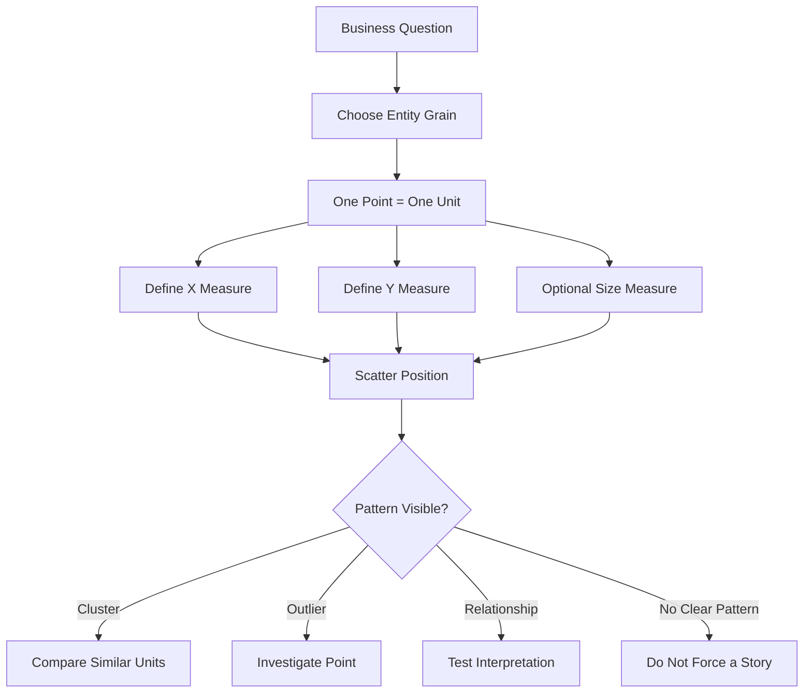

# A Scatter Chart Reveals What You Normally Cannot See

| Article Metadata | Details |
|---|---|
| **Article Level** | Complex |
| **Publication Date** | 03 July 2026 11:24pm |
| **Article Category** | Data Analytics; Power BI; Exploratory Data Analysis; Decision Support |
| **Target Audience** | Decision-makers, product managers, operations leaders, business analysts, data analysts, Power BI developers, and analytics governance teams |
| **Prepared by** | Ahmed Safwat Gawady |
| **Privacy Note** | The events, organization, characters, figures, and operational situations in this article are based on my experience to help the article deliver its value and are created only to explain the analytical concepts. They are not based on the author’s employer, colleagues, customers, systems, or actual projects. |

## Article Summary

Some business problems remain invisible not because the data is missing, but because we keep looking at one measure at a time. A ranking table can show the busiest unit. A card can show the overall exception rate. A bar chart can show which area has the highest total. Yet none of them necessarily reveals how two measures behave together. This article explores why scatter charts are unusually powerful for that job. Using an experience-inspired operational scenario, it moves from simple plotting to quadrants, outliers, clustering, bubble size, correlation, scale, sampling, and—most importantly—the decisions hidden inside the relationship between measures.

---

## The Table Looked Completely Normal

One of my tasks started with a report that, at first sight, did not appear to have a problem.

There were several operational units. Each unit had a transaction count, an exception count, an exception rate, and an amount requiring attention.

The report already had the things we normally expect: cards at the top, a ranked bar chart, and a detailed table underneath.

Nothing looked particularly strange.

The largest unit had the highest transaction volume. A few smaller units had higher exception rates. The overall rate remained within what the team considered a manageable range.

Then I started asking a different question.

Not *which unit has the highest volume?*

Not *which unit has the highest exception rate?*

I wanted to know:

> **What happens to the exception rate as transaction volume increases?**

That sounds like a small change in wording, but it completely changes the analysis.

A ranking chart studies one measure across categories.

A scatter chart studies the **relationship between two numerical measures**.

Microsoft describes scatter charts in Power BI in exactly that way: values are positioned on horizontal and vertical numerical axes so the relationship between the two measures can be examined. Microsoft also notes that scatter charts can reveal patterns such as clusters and outliers that may not be obvious from the numerical values alone. See Microsoft Learn, [Scatter charts, bubble charts, and dot plot charts in Power BI](https://learn.microsoft.com/en-us/power-bi/visuals/power-bi-visualization-scatter).

So I replaced the ranking view temporarily.

Transaction volume went to the X-axis.

Exception rate went to the Y-axis.

Each operational unit became one point.

And suddenly, the report was not normal anymore.

## One Point Can Carry a Small Story

Let’s assume one unit processes 12,000 transactions and has a 1.2% exception rate.

Another processes 12,500 transactions and has a 4.8% exception rate.

If I show only volume, they look nearly identical.

If I show only exception rate, the second unit looks worse, but I still do not know whether its workload is unusually high.

Put both measures on the same coordinate system and the difference becomes spatial.

The first unit sits to the right but low.

The second sits to the right and high.

The position itself starts communicating meaning.

That is the first thing I like about a scatter chart: **it converts two separate facts into one analytical position**.

A point is no longer merely “12,500 transactions” or “4.8% exceptions.”

It becomes:

> **High volume + high exception rate.**

That combination is usually more useful for a decision-maker than either number by itself.

## The Third Measure Changes the Picture Again

Now let’s assume I also know the financial amount inside the unresolved or exception transactions.

I can use bubble size for that third numerical measure.

In Power BI, a bubble chart extends a scatter chart by allowing the bubble size to represent another data dimension. Microsoft documents this as a third numerical dimension that can be used for evaluation. See [Scatter charts, bubble charts, and dot plot charts in Power BI](https://learn.microsoft.com/en-us/power-bi/visuals/power-bi-visualization-scatter).

Now one point can communicate X position as transaction volume, Y position as exception rate, and bubble size as financial exposure. I may still use color to distinguish a business category such as segment, region, platform, or service type.

That is already a very different analytical object from a traditional KPI card.

A card answers:

> What is the number?

A scatter or bubble chart can answer:

> Where is the entity positioned relative to several measures at the same time?

That is often where the hidden part begins to appear.


## The Four Quadrants Are Not Decoration

Once two meaningful benchmarks are added, the scatter chart becomes a decision map.

I assume several conditions here because the same visual can support very different business interpretations.

Let’s use transaction volume on X and exception rate on Y.

If I place a vertical reference line at the selected volume benchmark and a horizontal reference line at the selected exception-rate benchmark, four areas emerge.

```text
                         Exception Rate
                              HIGH
                               ↑
                               |
       Low Volume              |             High Volume
       High Exception          |             High Exception
       Investigate             |             Prioritize
                               |
-------------------------------+------------------------------→ Volume
                               |
       Low Volume              |             High Volume
       Low Exception           |             Low Exception
       Observe                 |             Healthy Scale
                               |
                              LOW
```

The upper-right quadrant is often the first place management looks because both workload and exception rate are high.

But that is not always the only important quadrant.

The upper-left can be equally interesting. A small unit with a very high exception rate may not create large total exposure today, but it may indicate a broken process, a training issue, a configuration problem, or a weak control that will become more serious if volume grows.

The lower-right is valuable for a different reason. These are high-volume units maintaining a low exception rate. Instead of treating them as “nothing to investigate,” I may want to understand what they are doing well.

This is where the chart shifts from monitoring to learning.

Power BI's Analytics pane supports reference lines for scatter charts, including X- and Y-axis constant lines as well as statistical reference lines such as minimum, maximum, average, median, and percentile lines. This can help turn a distribution into a more interpretable decision space. See Microsoft Learn, [Use the Analytics pane in Power BI](https://learn.microsoft.com/en-us/power-bi/transform-model/desktop-analytics-pane).

But there is an important governance question before drawing those lines:

> **What should the benchmark actually represent?**

## Average Is Easy. Useful Is Harder.

A common choice is to use the average.

That is convenient.

It is not automatically correct.

Suppose most units process between 2,000 and 10,000 transactions, but two very large units process more than 100,000.

The average volume can be pulled strongly toward those large units.

The median may better represent the centre of the population.

Or neither may be appropriate.

Management may already have a business threshold.

For example, above 25,000 transactions may be considered high-volume, while above 2.5% exceptions may require operational review.

In that case, business thresholds may be more actionable than statistical averages.

Think about the distinction.

A statistical line says:

> This point is unusual relative to the population.

A business threshold says:

> This point has crossed the level at which we agreed to act.

They are not the same question.

A complex analytical design sometimes needs both.

## The Model Must Give the Chart One Point Per Entity

One scatter-chart problem looks visual but is actually a semantic-model problem.

What exactly is one dot?

If the chart is supposed to compare operational units, each point should represent one operational unit in the current filter context.

If the data model instead produces multiple rows per unit and Power BI aggregates them unexpectedly, the chart may show fewer points, merged points, or values at the wrong grain.

Microsoft's current Power BI scatter-chart guidance notes that when individual points must remain distinct, the visual needs a field that uniquely identifies the point; the documentation describes using the **Values** field for an identifier such as a row number or ID. See [Scatter charts, bubble charts, and dot plot charts in Power BI](https://learn.microsoft.com/en-us/power-bi/visuals/power-bi-visualization-scatter).

From the model side, I prefer to make the analytical grain explicit.



The important part is at the beginning, not the end. Before interpreting clusters or outliers, define what one point means. Otherwise the chart may create a visually convincing pattern from an analytically inconsistent grain.

Microsoft's broader Power BI modeling guidance recommends star-schema principles because fact and dimension tables have different analytical roles and because the pattern supports semantic models optimized for usability and performance. See [Understand star schema and the importance for Power BI](https://learn.microsoft.com/en-us/power-bi/guidance/star-schema).

## Build the Measures Before You Build the Pattern

Let’s assume the semantic model contains a transaction fact table and a governed status dimension.

For this example, I want three business measures: transaction volume, exception rate, and exception financial exposure.

```DAX
M_Transaction Volume =
COUNTROWS ( FactTransaction )

M_Exception Transactions =
CALCULATE (
    [M_Transaction Volume],
    KEEPFILTERS ( DimStatus[IsException] = TRUE () )
)

M_Exception Rate =
DIVIDE (
    [M_Exception Transactions],
    [M_Transaction Volume]
)

M_Exception Exposure =
CALCULATE (
    SUM ( FactTransaction[Amount] ),
    KEEPFILTERS ( DimStatus[IsException] = TRUE () )
)
```

`M_Transaction Volume` becomes the X measure. `M_Exception Rate` becomes the Y measure. `M_Exception Exposure` can control bubble size. The key assumption is that `IsException` is a governed business rule and that the fact table is already at the correct transaction grain. `DIVIDE` is used because it returns an alternate result or `BLANK()` when the denominator is zero instead of producing an invalid division result; Microsoft documents this behavior in [DIVIDE function (DAX)](https://learn.microsoft.com/en-us/dax/divide-function-dax). If the business defines “exception” differently by product, lifecycle stage, or reporting period, that logic must be resolved before the visual is trusted.

The scatter chart can reveal something we normally cannot see.

But it can also reveal a relationship that should never have been calculated in the first place if the measures are weak.

Visual intelligence cannot repair semantic ambiguity.

## A Correlation Number Can Support the Picture

At Complex level, I usually want to separate two ideas: **visual relationship** and **statistical correlation**.

A scatter chart lets me inspect the shape directly.

A correlation coefficient can summarize the strength and direction of a linear relationship.

NIST describes the Pearson correlation coefficient as a measure of the strength of a usually linear relationship between two variables, ranging from -1 to +1. NIST also emphasizes that scatter plots help us inspect whether the relationship is linear, nonlinear, whether the spread changes, and whether outliers are present. See the NIST/SEMATECH e-Handbook sections [Scatter Plot](https://www.itl.nist.gov/div898/handbook/eda/section3/scatterp.htm) and [Correlation](https://www.itl.nist.gov/div898/software/dataplot/refman2/auxillar/correlat.htm).

If I want the correlation across the currently selected operational units, I can calculate it in DAX.

```DAX
M_Pearson Correlation =
VAR Points =
    FILTER (
        ADDCOLUMNS (
            ALLSELECTED ( DimUnit[UnitName] ),
            "@X", [M_Transaction Volume],
            "@Y", [M_Exception Rate]
        ),
        NOT ISBLANK ( [@X] )
            && NOT ISBLANK ( [@Y] )
    )
VAR MeanX =
    AVERAGEX ( Points, [@X] )
VAR MeanY =
    AVERAGEX ( Points, [@Y] )
VAR Sxy =
    SUMX (
        Points,
        ( [@X] - MeanX ) * ( [@Y] - MeanY )
    )
VAR Sxx =
    SUMX (
        Points,
        POWER ( [@X] - MeanX, 2 )
    )
VAR Syy =
    SUMX (
        Points,
        POWER ( [@Y] - MeanY, 2 )
    )
RETURN
    DIVIDE (
        Sxy,
        SQRT ( Sxx * Syy )
    )
```

This measure constructs one observation per visible unit, calculates the mean X and Y values, and then applies the Pearson correlation formula across those points. The important assumption is that each unit should receive equal analytical weight. A unit processing 500 transactions and a unit processing 500,000 transactions each contributes one observation. If the business question requires weighting by volume or another factor, this measure is not the correct answer without modification. It also describes linear association; a low correlation does not prove there is no meaningful nonlinear pattern.

That is exactly why I do not like using the coefficient without the chart.

Two datasets can have similar correlation values and very different shapes.

The scatter chart lets me see the shape.

The coefficient gives me one numerical summary of part of that shape.

They should support each other, not compete.

## Correlation Is Not the Decision

There is another risk.

Suppose volume and exceptions move together.

It is tempting to say:

> Higher volume causes more exceptions.

That conclusion may be wrong.

Perhaps larger units also handle more complex transactions.

Perhaps the channel mix is different.

Perhaps one product has both high volume and a stricter validation rule.

Perhaps the large units process activity during a different operational window.

The Australian Bureau of Statistics makes the distinction clearly: correlation describes the size and direction of a relationship, but correlation by itself does not mean that a change in one variable caused the change in another. See [Correlation and causation](https://www.abs.gov.au/statistics/understanding-statistics/statistical-terms-and-concepts/correlation-and-causation).

So when the chart shows a relationship, I treat it as a question generator:

> What could explain this pattern?

Not:

> I have proven the cause.

That one habit protects a lot of analytical credibility.

## Outliers Are Often Where the Conversation Starts

A scatter plot can reveal an outlier that looks ordinary in a table.

Imagine Unit H.

Its transaction volume ranks fourth.

Its exception rate ranks fifth.

Its exposure amount ranks third.

Nothing places it at the top of any single ranking.

But when those dimensions are combined, Unit H may sit far away from the main population.

That spatial separation is analytically important.

NIST's scatter-plot guidance explicitly includes outlier detection among the questions a scatter plot can help answer. Its examples show how one point can follow a different pattern from the majority and distort model interpretation if treated carelessly. See NIST, [Scatter Plot: Outlier](https://www.itl.nist.gov/div898/handbook/eda/section3/eda33ja.htm).

The next step is not to delete the point.

The next step is to ask why it is different.

Is it a data-quality issue?

A genuinely unusual business unit?

A different product mix?

A new operational condition?

A measurement problem?

A control failure?

Or simply a valid extreme case?

The chart reveals the question.

Investigation establishes the explanation.

## Clusters Can Be More Valuable Than the Outlier

Outliers attract attention because they are visually dramatic.

Clusters can be more useful.

Suppose the scatter contains three natural groups.

One group has low volume and low exceptions.

Another has high volume and low exceptions.

A third has medium volume and moderately high exceptions.

That may indicate three different operating profiles.

The high-volume, low-exception cluster is particularly interesting.

Instead of asking only why some units perform poorly, I can ask:

> What common operating conditions exist in the strong cluster?

Perhaps they use a specific process.

Perhaps they have more automation.

Perhaps their customer mix is different.

Perhaps their transactions are simpler.

Perhaps the apparent cluster disappears when I control for product type.

I suppose we have several conditions here, and that is the point.

A cluster is not the final answer.

It is a structured place to start comparing like with like.

## A Straight Line Is Only One Possible Shape

Business analysts sometimes see “scatter chart” and immediately think “correlation.”

That is too narrow.

The relationship can be nonlinear.

Imagine exception rate stays low while volume grows from 1,000 to 20,000 transactions.

Then, beyond 20,000, the rate starts increasing rapidly.

A single linear coefficient may understate the operational meaning.

The visual may be suggesting a capacity threshold.

Or perhaps the relationship forms a U-shape.

Very small units perform poorly because they lack specialization.

Medium units perform well.

Very large units perform poorly again because of workload pressure.

A linear summary can miss this completely.

NIST's scatter-plot guidance explicitly distinguishes linear and nonlinear relationships and includes examples of quadratic, exponential, and other shapes. See [Scatter Plot](https://www.itl.nist.gov/div898/handbook/eda/section3/scatterp.htm).

That is why the visual should be inspected before a story is forced onto the coefficient.

## The Spread Can Change Even When the Average Does Not

Another pattern is easy to miss.

Suppose low-volume units all have exception rates between 1.0% and 1.5%.

High-volume units range from 0.8% to 6.0%.

The average relationship may not look dramatic.

But the **variance** changes.

The operation becomes less predictable as volume increases.

In statistical language, the spread of Y may depend on X.

NIST includes this as one of the questions a scatter plot can help examine: whether the variation in Y changes depending on X. See [Scatter Plot](https://www.itl.nist.gov/div898/handbook/eda/section3/scatterp.htm).

From a business perspective, that may be more important than the average slope.

Management may not be facing a consistent deterioration.

It may be facing **increasing instability**.

Those are different problems.

## Scale Can Hide the Small Units

Scatter charts also have a visual problem of their own.

If one unit processes 2 million transactions and another processes 2,000, a normal linear X-axis compresses the smaller units into a narrow area.

Microsoft's scatter-chart documentation notes that scatter charts can use a logarithmic horizontal scale. See [Scatter charts, bubble charts, and dot plot charts in Power BI](https://learn.microsoft.com/en-us/power-bi/visuals/power-bi-visualization-scatter).

A log scale can make multiplicative differences easier to inspect when values span several orders of magnitude.

But I would not turn it on simply because it exists.

A management audience may interpret equal distances as equal absolute differences, which is not true on a logarithmic scale.

If I use one, I explain it.

If the visual becomes harder to understand than the insight it reveals, I use another design.

Technical sophistication should reduce confusion, not advertise itself.

## High-Density Sampling Has a Hidden Interpretation Risk

Now assume I am no longer plotting 20 operational units.

I am plotting thousands of customers, transactions, devices, or service events.

At that density, rendering every point can create performance and visibility problems.

Power BI has a high-density sampling algorithm for scatter charts. Microsoft's documentation explains that the algorithm is designed to preserve the overall shape of the data and important points such as outliers while maintaining responsiveness. It also warns about an interpretation detail: overlapping data may be represented in ways that mean visible circle density should not automatically be read as literal record density. See Microsoft Learn, [High-density sampling in Power BI scatter charts](https://learn.microsoft.com/en-us/power-bi/create-reports/desktop-high-density-scatter-charts).

That detail matters.

A dense-looking area is not automatically a precise frequency map.

If the analytical question is really:

> Where are most of the observations concentrated?

then a dedicated density technique, binning strategy, or other statistical visual may be more appropriate.

The scatter chart remains useful, but its rendering behavior must be understood.

Complex analysis is often less about adding another measure and more about understanding what the visual is *actually drawing*.

## Selecting the Wrong X and Y Can Manufacture a Story

There is a temptation to try many combinations until something looks interesting.

That can become dangerous.

If I have 30 measures, I can generate hundreds of X/Y combinations.

Some will appear correlated by chance.

So I prefer starting with a business hypothesis.

For example:

> Does higher workload appear to be associated with a higher exception rate?

That gives me:

X = workload.

Y = exception rate.

The direction is logical.

Then I inspect the pattern.

If I instead choose two measures simply because the shape looks impressive, I may be doing visual storytelling rather than analysis.

A strong scatter chart begins with a meaningful relationship question.

Not with the visual icon.

## Ratios Need Their Denominators Beside Them

Exception rate is particularly dangerous.

A unit with 2 exceptions out of 20 transactions has a 10% exception rate.

A unit with 5,000 exceptions out of 100,000 has a 5% exception rate.

If the scatter uses exception rate on Y, the smaller unit sits higher.

Is it more important?

Maybe.

Maybe not.

That depends on exposure, customer impact, materiality, repeatability, and the purpose of the analysis.

This is why bubble size can help.

The 10% point may be visually small if its exposure is limited.

The 5% point may become a very large bubble if the affected amount is substantial.

Now the decision-maker can see both **proportional weakness** and **absolute consequence**.

This is one of the places where the scatter chart becomes more than a statistical visual.

It becomes a prioritization surface.

## Cross-Filtering Turns the Point into an Investigation Door

Power BI visuals can interact through cross-filtering and cross-highlighting, so selecting a point in one visual can filter or highlight related information elsewhere on the report page. Microsoft documents these interactions in [Change how visuals interact in a Power BI report](https://learn.microsoft.com/en-us/power-bi/create-reports/service-reports-visual-interactions).

That means the scatter chart does not need to explain everything.

I can keep it analytical.

Select the unusual bubble.

A supporting table can show the related product mix.

A trend chart can show whether the condition is persistent.

A status breakdown can show which exception types dominate.

A card can show the affected amount.

A drill-through page can provide detailed investigation.

The scatter chart identifies **where to look**.

The surrounding report explains **what is happening there**.

That separation is important for clean report design.

## PL-300 Is Not Really About Choosing Pretty Visuals

By the way, this connects naturally to the PL-300 perspective.

Microsoft's current PL-300 study guide describes the Power BI data analyst as someone who should provide meaningful business value through easy-to-understand visualizations, while the assessed role includes preparing, modeling, visualizing, and analyzing data. See Microsoft Learn, [Study guide for Exam PL-300: Microsoft Power BI Data Analyst](https://learn.microsoft.com/en-us/credentials/certifications/resources/study-guides/pl-300).

I think the important word there is **analyze**.

Choosing a scatter chart because it looks advanced is not analysis.

Choosing it because the business question concerns the relationship between two quantitative measures is analysis.

The chart type follows the question.

Not the other way around.

## When the Scatter Chart Should Not Be Used

A scatter chart is not automatically the best answer because the data contains numbers.

If the primary question is “What changed over time?”, I probably need a line chart.

If the question is “Which unit has the highest value?”, a sorted bar chart may be faster to read.

If the question is “What exact value does each record have?”, a table may be better.

Power BI's visualization guidance groups scatter, bubble, and dot plots specifically under visuals for distributions and relationships, while other chart families serve comparison, trends, part-to-whole, and other tasks. See Microsoft Learn, [Overview of visualizations in Power BI](https://learn.microsoft.com/en-us/power-bi/visuals/power-bi-visualizations-overview).

The scatter chart is powerful because it is specialized.

Using it for the wrong question weakens that power.

## What I Would Validate Before Trusting the Pattern

Before I put a scatter chart in front of decision-makers, I validate four things in particular.

First, one point must represent the intended business entity.

Second, the X and Y measures must use compatible filters and reporting periods.

Third, unusual points must be reconciled against detail rather than accepted because they look interesting.

Fourth, any benchmark line must have a clear meaning: statistical centre, business threshold, target, or control limit.

There is one more check I consider essential.

If the pattern changes dramatically when one slicer is selected, I want to know why.

A relationship that exists only because different segments are mixed together may disappear when the population is separated.

Sometimes the overall scatter tells one story while each segment tells another.

That is not a visual error.

That is the analysis becoming more precise.

## What the Chart Revealed in My Situation

Back to the task I started with.

The ranking report had not been wrong.

It had simply been answering easier questions.

Once the units were plotted by volume and exception rate, a group of high-volume units appeared tightly together at a relatively low exception level.

One unit sat clearly above them.

Let’s assume its volume was not the highest and its exception rate was not the highest either.

But its combination of volume, rate, and exposure made it the most interesting point on the page.

That was the part the separate rankings had hidden.

We could then select the point and examine the underlying mix.

At that stage, the scatter chart had done its job.

It had not diagnosed the root cause.

It had revealed **where ordinary reporting was no longer enough**.

That is a very different kind of value.

## What the Scatter Chart Cannot Tell You

It cannot prove causation.

It cannot tell you whether an outlier is bad data or a genuine business condition.

It cannot decide which benchmark management should care about.

It cannot correct a model built at the wrong grain.

It cannot tell you whether a 5% rate on 100,000 transactions is more important than a 10% rate on 20 transactions unless additional business context is added.

It cannot tell you whether the apparent relationship is stable over time.

And it cannot replace domain knowledge.

Those limitations are not reasons to avoid the visual.

They are reasons to use it professionally.

## The Practical Lesson

Most dashboards are very good at answering questions about **magnitude**.

How many?

How much?

Which is highest?

Which is lowest?

What changed?

The scatter chart adds another class of question:

> **How do two measures behave together across the entities I manage?**

That question can reveal a relationship, a cluster, an outlier, a threshold effect, changing variability, a small but inefficient unit, a large but well-controlled unit, or a point whose combined position makes it important even though it never ranks first in any individual measure.

That is why I see the scatter chart less as a visualization and more as an **analytical lens**.

The points were already in the data.

The relationship was already there.

We simply had not arranged the numbers in a way that allowed us to see it.

> **Sometimes the insight is not hidden inside another metric. It is hidden in the space between two metrics.**
