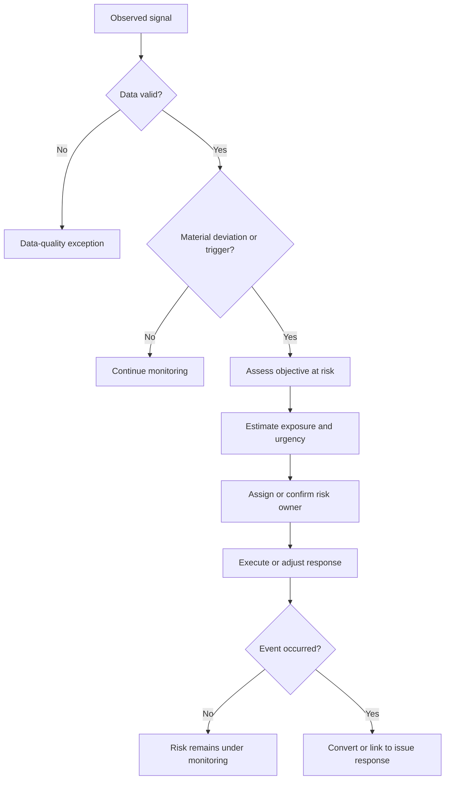
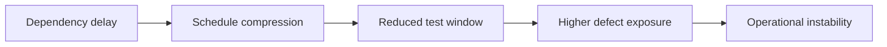
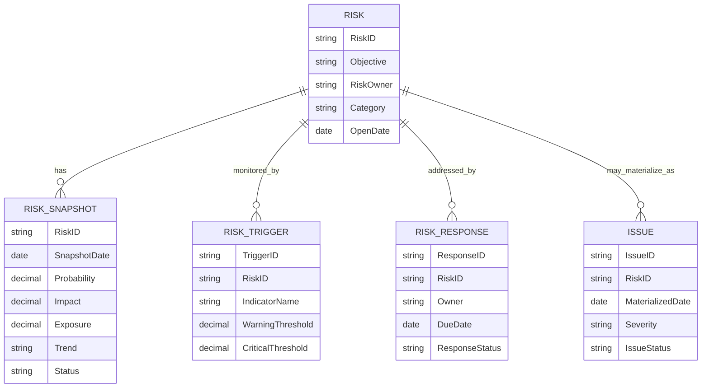

# Before Risk Becomes an Issue: The Analytical Manager’s Early-Warning Playbook

| Metadata | Details |
|---|---|
| **Article Level** | Complex |
| **Publication Date** | 21 February 2026, 10:43 PM |
| **Article Category** | Risk Analytics, Management Control, and Decision Intelligence |
| **Target Audience** | Senior managers, project and program managers, product managers, service managers, Scrum Masters, risk professionals, business analysts, and analytics professionals |
| **Prepared by** | Ahmed Safwat Gawady |
| **Estimated Reading Time** | 20 minutes |
| **Privacy Note** | The events, organization, characters, figures, and operational situations in this article are based on my experience to help the article deliver its value and are created only to explain the analytical concepts. They are not based on the author’s employer, colleagues, customers, systems, or actual projects. |

## Summary

Risks rarely become issues without leaving some trace first. The trace may be a trend, a threshold breach, an unstable denominator, repeated near-misses, dependency delay, capacity pressure, service event, or weak control signal. The manager’s challenge is to detect those signals early without turning every fluctuation into an alarm. This article builds a complex analytical model for risk monitoring: separate risk from issue, connect uncertainty to objectives, combine probability, impact, velocity, trend, and trigger evidence, distinguish leading from lagging indicators, govern thresholds, and assign ownership before escalation. It then connects the model to PMI risk practice, ITIL monitoring and incident management, Scrum empiricism, and practical dashboard implementation.

## The Issue Was Visible Only After It Happened

One of my situations began with a familiar management question:

> “Why did we not see this earlier?”

By the time the question was asked, the event had already happened.

The team had an issue log. The dashboard showed the impact. Owners were assigned. Recovery actions were being discussed.

Technically, the reporting process was working.

But it was working late.

When we reviewed the previous periods, the situation became more interesting. There had been small warning signs: a growing backlog, a repeated exception in one step, a dependency slipping more often, and a rising number of manual interventions.

None of those signals alone proved that a serious event would occur.

Together, however, they described increasing exposure.

That is where a manager’s analytical perspective changes the risk conversation.

The question is not:

> “Can we predict every future problem?”

We cannot.

The better question is:

> “Can we identify changing uncertainty early enough to improve our response before the uncertainty becomes an issue?”

That is a realistic management objective.

## Risk and Issue Are Not the Same Analytical State

A risk concerns uncertainty.

An issue concerns a condition that already exists and requires management.

PMI’s current risk guidance describes risk management as dealing with events or conditions that may occur and affect objectives, with proactive planning used to capture opportunities and limit threats. [PMI: Risk Management in Portfolios, Programs, and Projects](https://www.pmi.org/standards/risk-management)

For analytics, this difference matters because the two states require different evidence and different actions.

| Dimension | Risk | Issue |
|---|---|---|
| **Time state** | May occur | Has occurred or is occurring |
| **Core question** | What could happen? | What is happening now? |
| **Primary analytics** | Probability, exposure, trend, triggers, scenario | Impact, duration, recovery, root cause, backlog |
| **Management response** | Avoid, mitigate, transfer/share, accept, exploit/enhance as appropriate | Contain, resolve, recover, escalate |
| **Useful indicator type** | Leading and early-warning indicators | Lagging and current-state indicators |
| **Ownership focus** | Monitor and execute planned response | Resolve and restore/complete |

The table is a practical analytical interpretation, not a replacement for an organization’s formal methodology.

If a dashboard contains only issue counts, the organization is looking mainly backward.

If it contains only risk scores, it may still be too abstract.

The stronger management view connects **risk exposure**, **trigger evidence**, and **actual issues** so the manager can see how uncertainty is changing over time.

## The First Analytical Mistake Is Treating Every Warning as a Risk

Not every unusual number is a risk.

A metric can move because of normal variation, seasonality, data latency, population change, a one-time event, or a genuine emerging threat.

Think about it.

If a manager receives an alert every time a daily value moves by 5%, the alert system may become more sensitive but less useful. Teams start investigating noise. Real warnings compete with false positives. Eventually the dashboard loses authority.

A signal should therefore pass through an interpretation layer.



This is the important bridge between analytics and management. The data does not jump directly from “changed value” to “red risk.” It is validated, interpreted against an objective and threshold, then connected to ownership and response.

## Risk Analytics Starts with an Objective

Risk without an objective is vague.

A delay matters because it threatens a delivery date, service commitment, cost limit, regulatory obligation, customer outcome, revenue expectation, or another objective.

A failure-rate increase matters because it may threaten service quality or operational capacity.

A dependency warning matters because it may threaten a critical milestone.

PMI’s risk material emphasizes that uncertain events or conditions matter through their potential impact on objectives. [PMI: Risk Management in Portfolios, Programs, and Projects](https://www.pmi.org/standards/risk-management)

So the first analytical field in a risk model should not necessarily be probability.

It may be:

> **Objective at risk**

That single design choice improves interpretation because it prevents a risk register from becoming a list of abstract worries.

## Probability × Impact Is Useful, but It Is Not Enough

A common qualitative model combines probability and impact.

For a simple synthetic numerical illustration, suppose probability and impact are both expressed on normalized scales from 0 to 1:

$$
\text{Expected Exposure} = P(\text{event}) \times \text{Impact}
$$

If a risk has an estimated probability of 0.30 and a normalized impact of 0.80:

$$
\text{Expected Exposure} = 0.30 \times 0.80 = 0.24
$$

This can help compare risks under a consistent model.

But a manager can still make a poor decision if exposure is the only analytical dimension.

Consider two synthetic risks with the same exposure:

| Risk | Probability | Impact | Exposure |
|---|---:|---:|---:|
| A | 0.60 | 0.40 | 0.24 |
| B | 0.30 | 0.80 | 0.24 |

Their exposure is identical, but their management meaning may differ.

Risk B may be rarer but far more severe. Risk A may require frequent operational mitigation. If Risk B can materialize within hours while Risk A develops over months, their urgency is different again.

This is why complex risk analytics often needs more than a two-dimensional score.

## Add Velocity: How Fast Can the Risk Become Real?

Risk velocity is a practical management idea: once the triggering condition begins, how quickly can the impact arrive?

A slow-moving risk gives the organization more response time.

A fast-moving risk may require earlier thresholds, automated detection, or pre-authorized action.

For an internal analytical model, we can create a synthetic urgency factor. For example:

$$
\text{Analytical Priority} =
\text{Exposure} \times \text{Velocity Factor}
$$

Suppose the previous risk exposure is 0.24 and its velocity factor is 1.6:

$$
\text{Analytical Priority} = 0.24 \times 1.6 = 0.384
$$

This is **not a PMI formula** and should not be presented as one. It is an example of how an organization could extend a governed risk model when response time materially affects management priority.

The same rule applies to any scoring model: the mathematics should represent real decision logic, not create artificial precision.

## Then Add Trend: Is the Exposure Stable or Moving?

A risk score of 12 means little if we do not know whether it was 5, 11, or 14 last week.

Trend turns the risk register from a static inventory into a monitoring instrument.

Useful risk trend states may include:

- improving;
- stable;
- deteriorating;
- newly identified;
- trigger activated;
- response overdue; and
- issue materialized.

For a numerical measure:

$$
\text{Risk Change Rate} =
\frac{\text{Current Exposure} - \text{Previous Exposure}}
{\text{Previous Exposure}}
\times 100
$$

The formula needs edge-case handling. If the previous exposure is zero, the ratio is undefined. A newly identified risk should be shown as **new** rather than as an infinite percentage increase.

That small technical point matters. Risk dashboards can easily create dramatic but meaningless percentages when the baseline is zero or extremely small.

## Leading Indicators Matter More Than Perfect Explanations After the Event

A lagging indicator tells us what already happened.

An issue count, realized loss, missed milestone, failed transaction count, or outage duration is useful, but it is mainly evidence of realized performance.

A leading indicator attempts to detect conditions that may influence future performance.

Examples may include:

- backlog growth before SLA breach;
- repeated retries before failure;
- dependency slippage before milestone delay;
- capacity utilization before saturation;
- defect escape trend before customer impact;
- unresolved high-severity vulnerabilities before security incident;
- manual override frequency before control breakdown;
- age of unresolved actions before response failure.

Leading indicators are harder to govern because their relationship with outcomes is probabilistic, not certain.

That is why they should be tested.

An indicator is not valuable because it sounds predictive. It is valuable when historical or operational evidence shows that it gives useful warning with acceptable false positives and enough lead time for action.

## A Trigger Should Be Observable

A vague risk description often produces a vague response.

For example:

> “There is a risk that performance may deteriorate.”

What should the manager monitor?

A stronger risk statement is connected to observable triggers.

Let’s assume the threat is operational overload. Possible synthetic triggers could include:

- backlog growth above 12% for three consecutive periods;
- utilization above 85% while incoming demand continues to rise;
- median case age increasing for two periods;
- more than 5% of high-priority cases approaching their response limit.

These are examples, not universal thresholds.

The important property is observability.

PMI material on risk analysis has long emphasized documenting triggers as symptoms or warning signs that a risk has occurred or is about to occur, while ongoing risk monitoring checks whether risk conditions have been triggered and whether risks are becoming more critical. [PMI: Risk analysis and management](https://www.pmi.org/learning/library/risk-analysis-project-management-7070)

A trigger converts a general concern into something the organization can actually monitor.

## Thresholds Need Persistence, Severity, and Context

One threshold is rarely enough for complex risk monitoring.

Suppose a failure indicator exceeds 3%.

Should that automatically create a red risk?

Maybe.

But consider four contexts.

The first has a large population and a sustained upward trend.

The second has only ten observations.

The third is a critical control with zero tolerance.

The fourth is a known temporary event with an approved response already in progress.

The same 3% has different meaning.

A more mature warning rule may include:

$$
\text{Signal State} =
f(\text{Value}, \text{Persistence}, \text{Severity}, \text{Volume}, \text{Trend}, \text{Context})
$$

This is a conceptual function rather than a literal formula.

It tells us that the status should be based on several governed dimensions, not a color boundary alone.

## The Denominator Can Turn a Risk Signal into Noise

Rates are especially dangerous when the denominator is small or unstable.

Suppose one critical exception occurs among four cases.

The rate is 25%.

In another segment, 120 exceptions occur among 12,000 cases.

The rate is 1%.

Which is more concerning?

The first has high proportional exposure but weak statistical stability.

The second has a much larger absolute operational burden.

A manager may need both count and rate.

This is particularly important in early periods, newly launched services, small customer segments, or filtered dashboard views. A risk status should sometimes include a minimum-volume rule or a confidence note before it becomes actionable.

Otherwise the dashboard may escalate statistical noise.

## Correlated Risks Are More Dangerous Than a Flat Risk List Suggests

A risk register often treats each risk as an independent row.

Reality is not always independent.

A vendor delay may increase schedule risk.

The schedule delay may compress testing.

Compressed testing may increase quality risk.

Quality deterioration may increase operational incidents after release.

If each risk is scored separately, the dashboard may underestimate the combined exposure.

A simple relationship map can help.



The diagram does not prove causation. It helps management see a plausible dependency chain that deserves validation.

Complex risk management benefits from modeling not only **how severe each risk is**, but also **what other risks it can amplify**.

## The Risk Register Should Behave Like a Time Series

Many risk registers overwrite the current score.

That destroys analytical history.

If a risk was High, then Medium, then High again, the current row tells us only the latest state. We lose the trend and the response history.

For analytics, a stronger structure keeps snapshots or status events.

A simplified semantic model might include:



This model allows the report to answer more serious questions:

How has exposure changed?

Which risks are deteriorating despite active responses?

Which triggers activated before materialization?

Which risk owners have overdue mitigation actions?

Which risks repeatedly move between states?

Which issue types were preceded by detectable warnings?

That is much closer to decision intelligence than a static heat map.

## A Complex DAX Signal Should Fail Safely

Suppose a Power BI model contains a governed risk snapshot and trigger table.

The business problem is to create a risk signal that does not classify incomplete data as safe. The inputs are probability, impact, recent exposure change, trigger state, and configuration. The output is a management state for the current risk.

```DAX
Risk Signal State :=
VAR ProbabilityValue = [Risk Probability]
VAR ImpactValue = [Risk Impact]
VAR ExposureValue = ProbabilityValue * ImpactValue
VAR ExposureChange = [Exposure Change Rate]
VAR TriggerActive = [Active Critical Triggers]
VAR HasRequiredData =
    NOT ISBLANK(ProbabilityValue) &&
    NOT ISBLANK(ImpactValue)
RETURN
    SWITCH(
        TRUE(),
        NOT HasRequiredData, "Data Check",
        TriggerActive > 0, "Critical",
        ExposureValue >= 0.60, "Critical",
        ExposureValue >= 0.35 && ExposureChange > 0.15, "Escalating",
        ExposureValue >= 0.35, "Watch",
        ExposureChange > 0.25, "Watch",
        "Normal"
    )
```

The measure first checks whether the required inputs exist. It then gives active critical triggers priority over the composite exposure score. Moderate exposure with rapid deterioration becomes **Escalating**, while low current exposure with a sharp increase can still become **Watch**.

The thresholds are synthetic and should be replaced by governed values appropriate to the organization.

The important design assumption is that probability and impact are normalized consistently. If one team uses a 1–5 probability scale and another uses decimal probabilities, the same formula becomes invalid.

The limitation is even more important: this measure does not determine causality, correlation, risk appetite, financial exposure, or whether the response is appropriate. It is a triage signal, not an automated risk decision.

For production use, threshold values should preferably come from governed tables rather than being hardcoded in DAX.

## False Positives and False Negatives Need Governance

Every early-warning system makes two kinds of mistakes.

A **false positive** occurs when the system raises concern but the feared event does not materialize.

A **false negative** occurs when the system shows no concern but the event occurs.

Managers often focus on false positives because they create visible noise.

But false negatives can be more costly.

The correct balance depends on consequence.

For a low-impact operational inconvenience, frequent false alarms may waste more effort than they save.

For a high-impact compliance, security, safety, settlement, or business-continuity risk, the organization may deliberately accept more false positives to reduce the chance of missing a serious event.

This is not simply an analytics decision.

It reflects risk appetite, control design, response cost, and consequence.

## ITIL Shows the Boundary Between Warning Events and Incidents

ITIL provides a useful operational lens.

PeopleCert describes Monitoring and Event Management as systematically observing services and service components and recording, reporting, and responding to selected changes of state identified as events. [PeopleCert: ITIL 4 Practitioner — Monitoring and Event Management](https://www.peoplecert.org/browse-certifications/it-governance-and-service-management/ITIL-1/itil4-practices-monitoring-and-event-management-3686)

PeopleCert describes Incident Management as restoring normal service operation swiftly following disruptions and minimizing service downtime. [PeopleCert: ITIL 4 Practitioner — Incident Management](https://www.peoplecert.org/browse-certifications/it-governance-and-service-management/ITIL-1/itil4-practices-incident-management-3684)

That distinction maps cleanly to analytical risk thinking.

An event may be an observation.

A pattern of events may become a warning.

A validated warning may increase risk exposure.

If disruption occurs, incident management takes over.

Not every event should become an incident, and not every event should become a risk escalation. The analytical value comes from selecting which changes of state matter and defining the response before the service is already damaged.

## Scrum and PSM Thinking Reinforce Frequent Inspection

The Scrum Guide states that empiricism is based on transparency, inspection, and adaptation, and that artifacts and progress should be inspected frequently enough to detect undesirable variance or problems. [The 2020 Scrum Guide](https://scrumguides.org/scrum-guide.html)

This is highly relevant to risk.

A risk register updated once a month may be administratively complete but operationally late if the underlying environment changes every day.

The right inspection cadence depends on risk velocity.

Fast risks need faster inspection.

Slow strategic risks may need a different cadence.

PSM I and PSM II thinking also adds an important cultural point. Scrum.org describes PSM I as evidence of understanding Scrum and its application, while PSM II demonstrates a more advanced level of Scrum mastery and Scrum Master accountability. [Scrum.org: Professional Scrum Certifications](https://www.scrum.org/professional-scrum-certifications)

At the advanced level, a Scrum Master should help create transparency without turning metrics into fear-based control. Teams must be able to expose emerging problems early. If people hide weak signals because every amber indicator creates blame, the risk system becomes less accurate.

Good risk analytics depends on psychological and operational transparency as much as mathematical scoring.

## PMP Thinking Keeps the Risk Connected to Response Ownership

A risk score without a response is only classification.

PMI’s risk practice emphasizes proactively planning responses to uncertainty and monitoring changing exposure over time. Its risk material also highlights risk ownership and the need to track whether risk conditions have been triggered and whether responses remain effective. [PMI: Risk Management in Portfolios, Programs, and Projects](https://www.pmi.org/standards/risk-management) [PMI: Risk analysis and management](https://www.pmi.org/learning/library/risk-analysis-project-management-7070)

From a PMP-oriented management perspective, every material risk should answer practical questions:

Who owns it?

What response has been selected?

What trigger activates the response?

What evidence would show that the response is working?

When is the next review?

What condition closes or downgrades the risk?

The dashboard should support those questions rather than reduce the register to a heat map.

## Image Placeholder — Risk Before Issue

**Purpose:** Visualize how weak operational signals develop into validated risk exposure and, if unmanaged or unavoidable, into a realized issue.

**Image Prompt:** Create a sophisticated editorial business illustration showing a horizontal progression from weak early signals to emerging risk, active mitigation, and finally a realized issue. On the left, show subtle abstract indicators such as a rising backlog line, repeated small warning markers, a delayed dependency, and increasing capacity pressure. In the center, show a manager and team reviewing an analytical risk dashboard with probability, impact, trend, trigger, and owner. On the right, show two possible paths: one where mitigation reduces the risk and another where the risk materializes into an issue requiring incident or recovery response. Use synthetic abstract data and no real company interfaces.

**Aspect Ratio:** 16:9

**Required Labels:** “Weak Signals”, “Validated Risk”, “Response”, “Mitigated”, “Issue Materialized”

**Style Guidance:** Professional editorial infographic, clean white and gray background, restrained blue and amber accents, analytical rather than dramatic, clear directional flow, suitable for an advanced management and analytics article.

**Avoid:** Real logos, real dashboards, confidential data, disaster imagery, alarmist red overload, stock photography, or exaggerated futuristic AI graphics.

**Alt Text:** A progression from weak operational signals through validated risk and response, splitting into mitigated risk or a materialized issue.

**Suggested Caption:** The analytical objective is not perfect prediction; it is earlier recognition of changing exposure while response options still exist.

## What a Manager Should See on the Risk Dashboard

A mature risk dashboard does not need to show every field from the register.

The management layer should make the following visible:

| View | Why it matters |
|---|---|
| **Top exposure** | Shows where consequence and probability combine materially |
| **Fastest deterioration** | Finds risks becoming worse even if they are not yet the highest |
| **Active triggers** | Shows which warning conditions are currently present |
| **Overdue responses** | Exposes governance failure, not only risk severity |
| **High-velocity risks** | Highlights where response time is limited |
| **Risk-to-issue conversion** | Shows where uncertainty actually materialized |
| **Response effectiveness trend** | Tests whether mitigation is reducing exposure |
| **Data-quality exceptions** | Prevents incomplete evidence from being treated as safe |

This is a different philosophy from “show me the top ten risks.”

The top ten may stay the same for months.

Management also needs to know which risk changed the most, which response is not working, which trigger activated, and which new risk deserves attention before it reaches the top.

## What Improved, and What Remained Uncertain

Returning to the situation, the improvement did not come from pretending we could predict the future.

We began separating early signals from confirmed issues. We linked risk indicators to objectives. We preserved historical risk states. We added trend and response status. We reviewed whether triggers were observable and whether the owner could act before materialization.

The management discussion improved because the dashboard no longer asked only, “What is red?”

It asked:

> “What is changing?”

> “What could this affect?”

> “How fast can it become serious?”

> “What evidence do we have?”

> “Who owns the response?”

> “Is the response working?”

Several uncertainties remained.

Some risks had weak historical evidence. Probability estimates were subjective. Correlated risks were difficult to quantify. New processes lacked stable baselines. Some high-impact events had little warning. And thresholds still needed periodic review as operating conditions changed.

Those limitations did not make the model useless.

They made the model honest.

## The Professional Judgment

Managing risk before it becomes an issue is not about predicting every problem.

It is about improving the organization’s **lead time for judgment**.

PMI gives us the discipline of connecting uncertainty to objectives, ownership, response, and ongoing monitoring.

ITIL gives us the operational discipline of observing meaningful changes of state and responding before service disruption becomes larger.

Scrum and PSM thinking reinforce transparency, frequent inspection, and adaptation when new evidence emerges.

Analytics gives us the ability to preserve history, detect trend, compare exposure, govern triggers, visualize dependencies, and test whether the response is actually changing the risk.

Put those ideas together and the manager’s role becomes clearer.

Do not ask only:

> “What issues do we have?”

Ask earlier:

> “What is changing around us, what objective could it threaten, and what can we still do while it is only a risk?”
