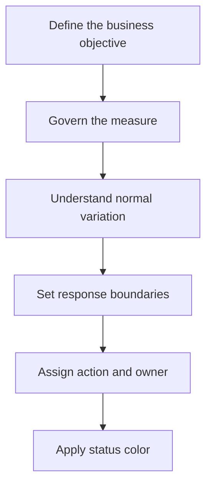

# Before the Dashboard Turns Red: How to Design Thresholds Managers Can Trust

| Metadata | Details |
|---|---|
| **Article Level** | Standard |
| **Publication Date** | 18 April 2026 07:50 PM |
| **Article Category** | Performance Management and Business Analytics |
| **Target Audience** | Managers, product managers, project managers, service managers, Scrum Masters, business analysts, and Power BI professionals |
| **Author** | Ahmed Safwat Gawady |
| **Estimated Reading Time** | 12 minutes |
| **Privacy Note** | The events, organization, characters, figures, and operational situations in this article are based on my experience to help the article deliver its value and are created only to explain the analytical concepts. They are not based on the author’s employer, colleagues, customers, systems, or actual projects. |

## Summary

Red, amber, and green indicators make dashboards easy to scan, but color can create false confidence when the underlying thresholds are arbitrary, outdated, or disconnected from action. A trustworthy threshold must reflect the measure’s direction, target, normal variation, business consequence, data quality, and response ownership. This article follows an experience-inspired situation in which a technically correct dashboard turned red too often and gradually lost management attention. It develops a practical method for separating targets from thresholds, designing meaningful tolerance bands, handling context and exceptions, and ensuring that every status color supports a clear management decision.


## The Dashboard Was Always Red

One of my situations started with a dashboard that seemed to be doing exactly what management had requested.

Each key measure had a traffic-light status. Green meant acceptable, amber meant attention, and red meant escalation. The logic was easy to understand, and the report looked decisive.

There was only one problem.

Too many indicators were red too often.

At first, every red card created a discussion. Then the discussions became repetitive. Some values returned to green without intervention. Others remained red for weeks even though no realistic action was available. A few measures turned red because the reporting population was unusually small.

Gradually, the color lost authority.

People still saw the red indicators, but they no longer treated every one as a meaningful signal. The dashboard had created alarm visibility without creating management focus.

The technical rules were functioning correctly. The thresholds were not governed well enough.

That distinction changed the design question. We stopped asking:

> “Which number should make this card red?”

We began asking:

> “Which condition genuinely requires a different management response?”

## A Threshold Is a Decision Boundary

A target and a threshold are related, but they are not the same thing.

A **target** expresses the desired level of performance.

A **threshold** defines the point at which the status, attention, ownership, or action should change.

Suppose the target success rate is 98%. Management may still consider results between 97% and 98% close enough for routine monitoring. A result below 97% may require investigation, while a result below 94% may require immediate escalation.

In that case, 98% is the target. The other values define tolerance and response boundaries.

This distinction matters because normal operations rarely match a target exactly. A dashboard that treats every small deviation as failure encourages overreaction. A dashboard that tolerates too much variation may hide deterioration until recovery becomes difficult.

PMI describes a project control system through four connected elements: baseline, measure, compare, and correct. Its guidance also explains that tolerances identify when a variance requires response, while tolerances that are too tight create unnecessary corrections and tolerances that are too loose delay action. [PMI: Earned Value—A Hands-on Simulation](https://www.pmi.org/learning/library/earned-value-simulation-integration-8069)

That principle extends beyond earned value. A threshold is useful when it separates ordinary variation from a condition that deserves a different decision.

## Color Is the Final Layer, Not the First

Dashboard tools make conditional formatting easy. Microsoft’s Power BI guidance explains that rules can color values according to defined ranges—for example, green above a target, yellow near it, and red below it. [Microsoft Learn: Apply Conditional Table Formatting](https://learn.microsoft.com/en-us/power-bi/create-reports/desktop-conditional-table-formatting)

The feature applies the rule. It does not decide whether the rule is professionally sound.

This is where dashboards sometimes reverse the proper sequence. A designer begins with three colors and then searches for values to place between them.

The stronger sequence is:



The color appears only after the objective, measure, variation, response, and ownership are defined. This makes the visual a compact expression of decision logic rather than a decorative interpretation of the current value.

## Start with the Measure’s Direction

Not every KPI follows the rule that higher is better.

For revenue, conversion, or completion rate, a higher value may be desirable. For defect rate, waiting time, cost variance, or failed transactions, a higher value may be worse.

Some measures are best within a range. Inventory that is too low can interrupt service, while inventory that is too high can increase cost and obsolescence. Processing time that is extremely low may appear positive but could indicate skipped controls or incomplete work.

Before defining colors, state the direction explicitly:

| Direction | Example | Typical status logic |
|---|---|---|
| **Higher is better** | Success rate | Lower values receive greater attention |
| **Lower is better** | Failure rate | Higher values receive greater attention |
| **Target range** | Capacity utilization | Values outside the acceptable band receive attention |
| **Directional change** | Month-over-month growth | Status depends on change, baseline, and business objective |

Microsoft’s KPI guidance makes the same practical distinction, noting that some measures improve when they rise while others, such as waiting time, improve when they fall. It also defines a KPI visual as a base measure evaluated against a target or goal. [Microsoft Learn: Create KPI Visualizations](https://learn.microsoft.com/en-us/power-bi/visuals/power-bi-visualization-kpi)

A reversed direction is a simple configuration error with a serious consequence: the dashboard rewards deterioration and warns about improvement.

## Define What Each Status Means

Green, amber, and red should describe management states, not emotional reactions.

A practical definition might be:

| Status | Meaning | Expected response |
|---|---|---|
| **Green** | Performance is within the agreed operating tolerance | Continue routine monitoring |
| **Amber** | Early deterioration or uncertainty requires attention | Validate the data, investigate the cause, and prepare action |
| **Red** | The agreed limit has been exceeded or a material risk exists | Escalate, assign ownership, and act within a defined time |

Notice that the color is connected to a response.

If an indicator is red but nobody knows who should act, the threshold is incomplete. If amber produces the same response as green, amber adds decoration rather than control. If every red condition leads to the same escalation regardless of severity, the system may overload management.

Think about it. A dashboard does not become actionable merely because it uses action colors.

The decision rule should identify:

- what condition changes the status;
- why the condition matters;
- who owns the first response;
- how quickly the response is expected; and
- when the status can return to normal.

This turns the threshold from a visual setting into a small operating agreement.

## Do Not Choose the Boundary by Convenience

A common threshold begins with a round number: 90%, 95%, or 100%. Sometimes that number is supported by a service commitment, regulatory rule, approved target, risk appetite, or historical operating range. Sometimes it is selected because it looks reasonable.

Round numbers are not automatically wrong. Unexplained numbers are the problem.

A threshold may come from several legitimate sources:

- an external obligation or service-level agreement;
- an approved business target and tolerance;
- customer-impact evidence;
- financial or operational exposure;
- historical process behavior;
- available response capacity;
- a risk appetite or control requirement; or
- an agreed improvement baseline.

The source should be visible in the measure definition or governance record.

If a threshold is based on historical performance, it should not automatically become the target. A process can be historically stable and still perform below customer or business expectations.

If a threshold is based only on aspiration, it may be impossible under the current operating design. The dashboard then remains red without helping anyone decide what to change.

The strongest approach distinguishes among three questions:

> What do we want?

> What variation is currently normal?

> At what point must our response change?

These answers may be different.

## Normal Variation Is Not Always a Problem

Operational measures naturally move. Daily volume, case mix, staffing, seasonality, system load, and customer behavior can all create variation.

If a threshold is placed inside normal fluctuation, the dashboard may alternate between colors even when the underlying process has not materially changed. This produces alert fatigue and reactive management.

Statistical process-control methods address a related question: whether observed movement is consistent with the established process or suggests a shift. NIST’s guidance on cumulative-sum control charts explains that an in-control process displays variation around its established center, while a sustained shift produces a developing signal. [NIST/SEMATECH: CUSUM Control Charts](https://www.itl.nist.gov/div898/handbook/pmc/section3/pmc323.htm)

A management dashboard does not always need a formal control chart. But the principle is useful: one unusual point and a sustained pattern are not the same kind of evidence.

Let’s assume a success rate normally moves between 96.5% and 98.5%. Setting the red threshold at 97.9% may generate frequent alarms. Setting it at 90% may allow serious deterioration before action begins.

The right boundary depends on business consequence and process behavior. Historical variation informs the decision; it does not make the decision alone.

## One Bad Day May Not Be a Red Trend

Thresholds should consider time as well as value.

A single-day breach may justify immediate escalation when the measure concerns security, compliance, safety, settlement, or another zero-tolerance condition.

For other measures, one-day movement may reflect small volume, delayed data, or a temporary operating event. Requiring two consecutive breaches, a rolling average, or confirmation from another measure may reduce false alarms.

This is sometimes called persistence logic. The threshold does not ask only whether the value crossed a boundary. It asks whether the evidence is strong enough to change the management state.

For example:

- Amber when the failure rate exceeds 2% once.
- Red when it exceeds 3% once, or remains above 2% for three reporting periods.
- Immediate red when a critical event occurs, regardless of the aggregate rate.

These are synthetic rules, not universal recommendations. Their purpose is to show that value, duration, and severity may all belong in the status logic.

A dashboard that reacts to every fluctuation may be sensitive but not trustworthy. A dashboard that waits too long may be stable but not useful.

## The Denominator Still Matters

A threshold applied to a percentage inherits every weakness in that percentage.

Suppose one failure occurs among five eligible cases. The failure rate is 20%, which may turn the indicator red. In a second area, 150 failures occur among 10,000 cases, producing a 1.5% rate and perhaps a green status.

The first area has the higher proportional result but very limited evidence. The second creates much greater failure workload and possibly broader customer impact.

A trustworthy threshold may therefore require a minimum denominator, a confidence note, or the simultaneous display of rate and count.

The same applies to partial periods. A monthly KPI viewed on the second day of the month may be based on too little activity for a stable status. If the report still shows a strong red indicator, users may compare an immature current period with a complete previous month.

The threshold should know whether the measure is ready to be judged.

## Different Segments May Need Different Thresholds

One enterprise-wide threshold is attractive because it is easy to explain. It can also be unfair or misleading when segments operate under genuinely different conditions.

A standard service and a complex specialist service may have different expected processing times. A new product may have a controlled stabilization period. High-value transactions may require additional validation that increases duration but reduces risk.

Segment-specific thresholds can improve relevance, but they introduce governance risk. Too many customized rules make performance difficult to compare and can allow weak results to be normalized.

The reason for each variation should therefore be documented and approved. The difference should reflect a real business condition, not a desire to keep the dashboard green.

The question is not whether every segment must share one number. It is whether every threshold has a defensible reason.

## A Simple Status Measure in Power BI

Suppose a Power BI model contains a governed issue-rate measure and a threshold table with warning and critical values for the selected KPI. The input is the current issue rate plus the applicable boundaries. The output is a text status that can drive labels, icons, or conditional color formatting.

```DAX
KPI Status :=
VAR CurrentValue = [Issue Rate]
VAR WarningLimit = SELECTEDVALUE(Thresholds[Warning Limit])
VAR CriticalLimit = SELECTEDVALUE(Thresholds[Critical Limit])
RETURN
    SWITCH(
        TRUE(),
        ISBLANK(CurrentValue), "No Data",
        ISBLANK(WarningLimit) || ISBLANK(CriticalLimit), "Not Configured",
        CurrentValue >= CriticalLimit, "Red",
        CurrentValue >= WarningLimit, "Amber",
        "Green"
    )
```

The measure checks data and configuration states before assigning a performance color. For a lower-is-better measure such as issue rate, values at or above the critical limit become red, while values at or above the warning limit become amber.

The important assumption is that one valid set of thresholds is selected for the current KPI, segment, and period. If the filter context returns several threshold rows, `SELECTEDVALUE` becomes blank and the measure reports “Not Configured.”

This logic does not determine whether the thresholds are appropriate. It only applies them consistently. Higher-is-better measures require reversed comparisons, and range-based measures require both lower and upper limits. Persistence, minimum-volume, and critical-event logic may require additional measures or model design.

By the way, this is where visual consistency becomes semantic-model governance. The report should read thresholds from an approved source rather than repeating hardcoded numbers across many visuals.

## Thresholds Need Ownership and Review

A threshold can become outdated even when it was well designed originally.

The product may change. Volume may grow. Automation may reduce normal processing time. Customer expectations may increase. A new control may change the eligible population. A service commitment may be revised.

Every governed threshold should therefore have:

- a business owner;
- an effective date;
- a definition of the measure and direction;
- a documented source or rationale;
- an expected response for each state; and
- a review trigger or review frequency.

Without ownership, a threshold becomes inherited configuration. People may know that the dashboard turns red at 95% without knowing who approved 95%, what it protects, or whether it still represents the operating reality.

This is not only a data-team responsibility. The business owns the consequence of the boundary. The technical team ensures that the agreed rule is implemented accurately and consistently.

## Inspection Must Lead to Adaptation

The Scrum connection is direct. The official Scrum Guide states that transparent information enables inspection, inspection enables adaptation, and a process should be adjusted when it moves outside acceptable limits or produces an unacceptable result. [The 2020 Scrum Guide](https://scrumguides.org/scrum-guide.html)

A threshold can help a Scrum Team recognize when evidence deserves attention, but the color should not replace the conversation.

During a Sprint Review or Retrospective, a red indicator may prompt questions about product outcomes, quality, workflow, or dependencies. The team still needs to inspect the context and decide what adaptation is appropriate. The status should not be used as an automatic judgment about individual performance.

If repeated red signals produce no learning or adjustment, the threshold is not supporting empiricism. It is only recording discomfort.

ITIL brings a similar service-management perspective. PeopleCert’s ITIL 4 Foundation guidance emphasizes continuous improvement and the definition and tracking of metrics and KPIs to understand service performance and effectiveness. [PeopleCert: ITIL 4 Foundation](https://www.peoplecert.org/browse-certifications/it-governance-and-service-management/ITIL-1/itil-4-foundation-2565)

The practical connection is value. A threshold should highlight a condition that matters to the service, customer, operation, or risk position. It should also support a proportional improvement response rather than encourage reaction to color alone.

## What Improved, and What Remained Open

Returning to the situation, we did not solve the problem by making the dashboard greener.

We reduced unnecessary alarms by separating targets from tolerances, clarifying measure direction, considering the reporting base, and defining the response behind each status. Some indicators kept strict boundaries because their consequences justified immediate action. Others used an amber investigation stage before escalation.

The most important improvement was trust. A red indicator became more likely to produce a focused discussion because users understood what it meant and what should happen next.

Several limitations remained.

Historical data could not prove the right business tolerance by itself. Segment-specific rules still required governance. New services had limited evidence. Some outcomes depended on external parties. And no threshold could establish causation; a breach still required investigation.

The dashboard became clearer, not infallible.

## A Practical Threshold Discipline

Before allowing a dashboard to turn red, I recommend a short review.

**Define the objective.** State which customer, operational, financial, delivery, or risk outcome the measure supports.

**Govern the measure.** Confirm its formula, population, period, direction, refresh point, and data-quality rules.

**Separate target and tolerance.** Distinguish the desired result from the boundary that changes management action.

**Understand variation.** Review historical behavior, seasonality, sample size, and temporary operating conditions.

**Define each state.** Explain what green, amber, red, “No Data,” and “Not Configured” mean.

**Connect status to action.** Assign ownership, expected response, timing, and escalation path.

**Test edge cases.** Check exact boundary values, blanks, zeros, partial periods, small denominators, and reversed direction.

**Review the rule.** Reassess thresholds after major process, product, volume, obligation, or strategy changes.

This discipline makes color less dramatic and more useful.

## Red Should Mean Something

A dashboard threshold is a small rule with a large consequence.

It can direct leadership attention, trigger investigation, influence resource allocation, and shape how people describe performance. If the rule is arbitrary, the dashboard converts uncertainty into confident color. If the rule is governed, the color becomes a compact and useful management signal.

The strongest threshold is not the one that produces the most alerts.

It is the one that answers three questions clearly:

> What changed?

> Why does it matter?

> What should happen now?

Before the dashboard turns red, the measure, target, tolerance, impact, and ownership should already be understood.

Then red does not simply mean that a number crossed a line.

It means the evidence has reached a point where management should respond differently.
