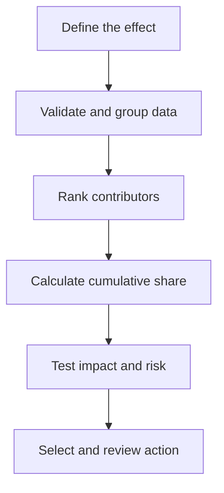

# Beyond the Biggest Number: How Pareto Thinking Helps Managers Focus on What Matters Most

| Metadata | Details |
|---|---|
| **Article Level** | Standard |
| **Publication Date** | 04 April 2026 08:30 PM |
| **Article Category** | Business Analytics and Decision Support |
| **Target Audience** | Managers, product managers, project managers, service managers, Scrum Masters, business analysts, and reporting professionals |
| **Author** | Ahmed Safwat Gawady |
| **Estimated Reading Time** | 10 minutes |
| **Privacy Note** | The events, organization, characters, figures, and operational situations in this article are based on my experience to help the article deliver its value and are created only to explain the analytical concepts. They are not based on the author’s employer, colleagues, customers, systems, or actual projects. |

## Summary

Managers rarely suffer from a shortage of problems. The harder challenge is deciding where limited attention, time, and capacity should go first. Pareto thinking helps by ranking contributors to a common effect and revealing whether a relatively small group accounts for a large share of the result. Yet it becomes dangerous when the familiar 80/20 phrase is treated as a fixed law or when the largest category is assumed to be the highest priority. This article explains how to use Pareto analysis as disciplined decision support: define the effect, verify the categories, calculate cumulative contribution, test materiality, and connect the evidence to a responsible action.

## Everything Looked Important

One of my situations started with a familiar management request:

> “We have too many recurring issues. Which one should we solve first?”

The report contained more than twenty categories. Each category had an owner, a short explanation, and a reason why it deserved attention. When the list was discussed in a meeting, almost every item became urgent.

That reaction was understandable. The people closest to each issue could see its consequences clearly. But the combined result was difficult: if everything remained a priority, the team had no real priority at all.

The initial proposal was to distribute improvement actions across all categories. It sounded fair. It also divided the available capacity into pieces too small to create meaningful progress anywhere.

So I changed the question.

Instead of asking which issues sounded important, I asked:

> “Which categories contribute most to the effect we are trying to reduce?”

That small change moved the discussion from advocacy to evidence.

We ranked the categories by their contribution and added a cumulative percentage. A visible concentration appeared near the top. A few categories accounted for much of the total, while many others contributed only small amounts individually.

The list had not become shorter. Our attention had become clearer.

## Pareto Thinking Is About Concentration

The Pareto principle is often summarized as the **80/20 rule**, but the useful idea is broader than that ratio. It asks whether a relatively small number of contributors account for a large part of a common effect.

The Juran Institute explains that Joseph Juran applied this pattern to quality management and used the language of the **vital few** and the **useful many**. Its guidance describes Pareto analysis as a ranked comparison that shows each contributor’s magnitude and the cumulative share of the total. [Juran Institute: Pareto Principle and Pareto Analysis](https://www.juran.com/blog/a-guide-to-the-pareto-principle-80-20-rule-pareto-analysis/)

The numbers do not have to equal exactly 80 and 20.

A real dataset may show 70% of the effect coming from 30% of the categories. Another may show 90% coming from 10%. Sometimes the distribution is relatively even and there is no clear breakpoint at all.

Think about it. If we force every dataset to confirm 80/20, we are no longer analyzing the evidence. We are decorating it with a familiar phrase.

Pareto thinking is therefore not a promise about a specific ratio. It is a disciplined search for concentration.

## Start by Defining the Effect

Before ranking categories, a manager must decide what the bars represent.

The same issue list can produce different priorities depending on the measure:

- Number of incidents
- Number of affected customers
- Total financial exposure
- Hours of operational effort
- Repeated failures after attempted resolution
- Cases outside a service threshold

Suppose Category A has the highest number of incidents, while Category B affects fewer cases but creates much greater financial or customer impact. A Pareto chart based on incident count will place Category A first. A chart based on exposure may place Category B first.

Both charts can be correct. They answer different questions.

This is the first management discipline behind Pareto analysis: define the effect before looking for its largest contributors.

“Top causes” has no stable meaning until we complete the sentence:

> Top causes of **what effect**, measured in **which way**, across **which population and period**?

Without that definition, a descending chart may look decisive while remaining analytically ambiguous.

## How the Ranking Works

Let’s assume a synthetic set of 200 recurring service issues.

| Category | Issue Count | Share of Total | Cumulative Share |
|---|---:|---:|---:|
| Access failures | 74 | 37% | 37% |
| Incorrect setup | 46 | 23% | 60% |
| Delayed approval | 30 | 15% | 75% |
| Missing information | 20 | 10% | 85% |
| Status mismatch | 14 | 7% | 92% |
| Other causes | 16 | 8% | 100% |

For each category, the share of total is:

\[
\text{Category share}
=
\frac{\text{Category contribution}}
{\text{Total contribution}}
\times 100
\]

The cumulative share adds each category’s percentage to the percentages of all categories ranked above it.

In this example, the first three categories account for 75% of the issues. The first four account for 85%. That concentration gives management a reasonable place to begin investigation.

It does not prove that all four categories should receive equal effort. It also does not prove that the lower categories should be ignored permanently. The result simply shows where most of the measured effect is currently concentrated.

Juran’s construction guidance follows the same logic: list contributors from largest to smallest, calculate their cumulative percentage, draw bars for magnitude, and use a line for the cumulative share. It also recommends looking for a breakpoint rather than assuming one. [Juran Institute: How to Construct a Pareto Diagram](https://www.juran.com/blog/how-to-construct-a-pareto-diagram/)

## From a Long List to a Focused Decision

The analytical flow is simple, but each step protects the quality of the final decision.

The chart does not sit at the end of the process. After concentration becomes visible, management still tests materiality, risk, feasibility, and ownership before selecting an action.

This matters because a Pareto chart is evidence of distribution, not a complete prioritization model.

## The Tallest Bar Is Not Always the First Action

Imagine that access failures form the largest category. The natural reaction is to launch an improvement initiative there immediately.

Now assume further investigation shows that most access failures are corrected automatically within seconds and have limited customer effect. At the same time, delayed approvals are smaller by count but cause contractual delays, repeated follow-up, and significant operational effort.

The largest bar still matters. It represents workload and recurrence. But the third bar may deserve the first management action because its consequences are more material.

A responsible priority decision normally considers at least four dimensions:

| Dimension | Management question |
|---|---|
| **Contribution** | How much of the measured effect comes from this category? |
| **Materiality** | What customer, financial, operational, delivery, or compliance consequence does it create? |
| **Actionability** | Can the underlying cause be influenced through a realistic intervention? |
| **Confidence** | Is the category definition and supporting data reliable enough to act on? |

Pareto analysis is strongest on the first dimension. Management judgment must supply the others.

This is why I prefer the phrase **focus the investigation** rather than **automatically select the solution**.

## Categories Can Hide the Real Cause

A Pareto chart can only be as useful as its categories.

Broad labels such as “system issue,” “other,” or “user problem” may absorb many different causes. A large bar under a vague category tells management that a concentration exists, but it does not reveal a useful intervention.

The opposite problem also occurs. If analysts create dozens of slightly different labels for the same underlying issue, one important cause may be fragmented across many small bars. The concentration disappears because the classification logic divided it.

For example, “password expired,” “password reset failed,” “locked account,” and “credentials rejected” may belong together for one management question but require separation for another.

By the way, this is where data preparation becomes governance. Category definitions should be mutually understandable, consistently applied, and aligned with the decision being supported.

Before trusting the ranking, I normally check whether:

- one event can appear in more than one category;
- the “other” category is becoming too large;
- categories describe symptoms while the decision requires causes;
- the reporting period contains an unusual one-time event; and
- the same issue is fragmented through inconsistent wording.

These are not minor cleaning details. They can change which contributors appear vital.

## Count, Cost, and Risk May Need Separate Views

One Pareto chart should normally use one clearly defined effect. Trying to combine frequency, cost, severity, and risk into the same bar often creates a measure that nobody can explain confidently.

A better approach is to use a small set of connected views.

The first view may rank categories by frequency to show recurring workload. A second may rank them by financial impact or time consumed. A short risk note can then identify categories that require attention regardless of volume.

If the same categories appear near the top across several measures, management confidence increases. If the rankings differ, that difference is useful. It reveals that the operation has more than one valid meaning of importance.

For example:

- High count and high impact suggest an immediate improvement candidate.
- High count and low impact suggest an automation or efficiency opportunity.
- Low count and high impact suggest risk control, prevention, or escalation.
- Low count and low impact may justify monitoring rather than immediate intervention.

The purpose is not to make the dashboard heavier. It is to stop one measure from pretending to answer every management question.

## Focus Does Not Mean Neglect

The phrase “vital few” can create an unintended message: that everything outside the selected group is unimportant.

Juran’s later language of the **useful many** is more constructive. Lower-ranked categories may still matter. Some may be legally mandatory, safety-related, strategically sensitive, or simple to correct. Others may become more important after the first concentration is reduced.

Pareto priorities are therefore temporary and contextual.

Once an intervention changes the process, the distribution should be recalculated. A previously dominant category may shrink. Another may become visible. The data may also show that the original classification was too broad.

This creates a cycle rather than a one-time chart:

> Measure → Focus → Investigate → Act → Re-measure

In Scrum, this logic aligns naturally with empiricism. The official Scrum Guide says that knowledge comes from experience and decisions should be based on what is observed. It also connects transparency with inspection and adaptation, warning that low transparency can lead to decisions that reduce value and increase risk. [The 2020 Scrum Guide](https://scrumguides.org/scrum-guide.html)

The connection is practical. A team may use a Pareto view during a retrospective or improvement discussion to focus attention, select one manageable change, and inspect whether the distribution changes afterward. The chart supports learning; it should not be used to assign blame to individuals.

## The Project and Service-Management Connection

From a project-management perspective, Pareto thinking helps when demand exceeds available capacity. Project and portfolio decisions require prioritization because resources are limited and initiatives have different strategic value, risk, and dependencies. PMI describes portfolio management as identifying, prioritizing, authorizing, and controlling work to achieve strategic objectives, while considering factors such as scarce resources, risk, and expected return. [PMI: Project Portfolio Management Techniques](https://www.pmi.org/learning/library/project-portfolio-management-techniques-7624)

Pareto analysis can strengthen the evidence behind that discussion, especially when many defects, risks, requests, or improvement opportunities compete for attention. But it should remain an input to prioritization, not a substitute for the business case, dependency analysis, stakeholder impact, or professional judgment.

The ITIL connection is equally direct. ITIL’s guiding principle **focus on value** asks service-management decisions to remain connected to useful outcomes. PeopleCert’s official ITIL guidance also emphasizes using data and feedback for continuous improvement and aligning services with customer expectations. [PeopleCert: ITIL 4 Create, Deliver and Support](https://www.peoplecert.org/browse-certifications/it-governance-and-service-management/ITIL-1/itil-4-specialist-create-deliver-and-support-2693)

This changes how a service manager reads a Pareto chart. The question is not only, “Where are most tickets?” It is also, “Which concentration most affects service value, customer experience, operational flow, or risk?”

The chart finds concentration. The framework keeps the response connected to value.

## What Improved in the Conversation

Returning to the situation, the most useful outcome was not the chart itself.

The improvement was that the team stopped trying to solve every category simultaneously. The ranked evidence created a shared starting point. We could discuss whether the largest contributors were clearly defined, whether their impact was material, and whether a realistic intervention existed.

The top categories became investigation themes rather than automatic conclusions. Owners could test causes, validate assumptions, and propose focused actions. Lower-ranked categories remained visible for monitoring and later review.

This created better decision clarity without claiming that one chart had solved the operational problem.

Several matters remained open. The categories still depended on consistent classification. The selected period might not represent seasonal behavior. Frequency did not fully represent severity. Some improvements required dependencies outside the immediate team. And the distribution would need to be recalculated after any material process change.

Those limitations were important. They kept the Pareto view in its proper role: a strong method for focusing attention, but not proof of causation or guaranteed value.

## A Practical Reading Discipline

When I review a Pareto analysis, I use a short sequence.

**Define the effect.** Confirm whether the ranking concerns incidents, customers, cost, duration, risk exposure, or another measure.

**Check the population.** Make the time period, scope, inclusion rules, and data source visible.

**Validate the categories.** Look for duplication, fragmentation, vague labels, and an oversized “other” group.

**Read the concentration.** Identify the leading contributors and the cumulative share without forcing an exact 80/20 pattern.

**Test materiality.** Ask whether the highest contributors also create the greatest business, customer, operational, delivery, or risk consequence.

**Select a realistic action.** Decide what can be investigated or changed with clear ownership and available capacity.

**Measure again.** Rebuild the view after the action to determine whether the distribution changed and whether another priority has emerged.

This sequence creates a professional pause between ranking and deciding.

## Focus Is a Management Choice

Pareto thinking is powerful because it accepts a difficult truth: limited capacity cannot be spread equally across unlimited demands.

The method helps managers see whether a small group of contributors accounts for much of a defined effect. It replaces an undifferentiated problem list with evidence about concentration.

But the chart cannot decide alone.

The biggest category may represent the best improvement opportunity, or it may represent frequent events with low consequence. A smaller category may carry greater risk, customer impact, or strategic importance. The data may also contain unclear categories, unstable periods, or a distribution with no meaningful breakpoint.

So the strongest management conclusion is not:

> “Twenty percent of our causes create eighty percent of our problems, so we will fix the first bars.”

It is:

> “Our evidence shows where the effect is concentrated. Now we will test impact, risk, and actionability before choosing where to intervene.”

That is the real value of Pareto thinking.

It does not remove judgment from management. It gives judgment a better place to begin.
