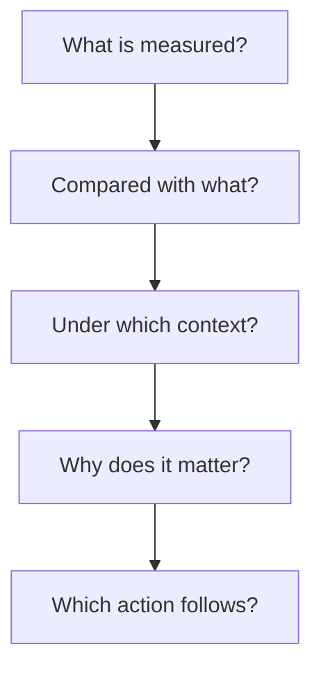

# Beyond the Tallest Bar: How Managers Read Bar Charts for Better Decisions

| Metadata                   | Details                                                      |
| -------------------------- | ------------------------------------------------------------ |
| **Article Level**          | Intermediate                                                 |
| **Publication Date**       | 08 May 2026, 10:30 PM                                        |
| **Article Category**       | Business Analytics and Decision Support                      |
| **Target Audience**        | Managers, product managers, project managers, service managers, Scrum Masters, business analysts, and Power BI professionals |
| **Prepared by**            | Ahmed Safwat Gawady                                          |
| **Estimated Reading Time** | 11 minutes                                                   |
| **Privacy Note**           | The events, organization, characters, figures, and operational situations in this article are based on my experience to help the article deliver its value and are created only to explain the analytical concepts. They are not based on the author’s employer, colleagues, customers, systems, or actual projects. |

## Summary

A bar chart appears simple: compare the bars and identify the largest one. Yet the tallest bar does not automatically represent the greatest risk, the highest priority, or the best management action. A manager must read beyond visual height and examine the measure, denominator, target, time window, filters, and business consequence behind each category. This article follows an experience-inspired situation in which a technically correct chart initially encouraged the wrong operational response. It then develops a practical method for turning bar charts from passive reporting objects into disciplined decision instruments, supported by sound measurement, transparent assumptions, and professional judgment.


## The Chart Looked Obvious

One of my situations started with a very ordinary management question:

> “Which operational area needs attention first?”

A bar chart had been prepared to answer it. Five service categories appeared on the screen, sorted from the highest number of issues to the lowest. The first category had a much longer bar than the others.

The initial reaction was immediate.

“Category A is clearly the problem. Let’s move additional capacity there.”

Technically, nothing was wrong with the chart. The data had been refreshed, the calculations reconciled with the source, and the categories were correctly sorted. If the question had been, “Which category recorded the greatest number of issues?” the chart would have answered it accurately.

But that was not the management question.

The actual question concerned priority. Priority involves more than volume. It may involve exposure, customer effect, target deviation, recurrence, recoverability, cost, or strategic importance.

The chart showed where the most issues existed. It did not yet show where management attention would create the most value.

That distinction changed the entire conversation.

## A Bar Is a Comparison, Not a Conclusion

A bar chart encodes a quantitative value through length. Its strength is that it lets readers compare categories quickly. Its weakness is that this speed can create premature confidence.

The eye recognizes the longest bar before the mind examines the measure behind it.

Microsoft’s current Power BI guidance recommends using titles, labels, consistent scales, intentional sorting, and sufficient context to make visuals easier to interpret. It also warns against distorted scales and inconsistent time frames. These are not merely formatting preferences; they protect the meaning of the comparison. [Microsoft Learn: Tips and tricks for creating Power BI reports](https://learn.microsoft.com/en-us/power-bi/create-reports/desktop-tips-and-tricks-for-creating-reports)

A manager should therefore treat the first visual impression as the beginning of interpretation, not the end.

Think with me for a moment. When one bar is longer than another, we know only this:

> Under the current filters and calculation, the represented value is larger.

We do not automatically know that the category is more dangerous, less efficient, more valuable, or more deserving of investment.

Those conclusions require business context.

## The Five Questions Behind Every Bar

Before acting on a bar chart, I now try to answer five connected questions.




The sequence prevents the decision from jumping directly from visual size to managerial action. A bar becomes decision-useful only after its definition, comparison basis, analytical context, consequence, and possible response are understood.

### What is actually being measured?

A label such as **Issues by Category** may represent several different calculations:

- Total issue records
- Distinct cases
- Affected customers
- Failed transactions
- Reopened cases
- Unresolved cases
- Issue value or financial exposure

These measures are not interchangeable.

Suppose one customer contacts support five times about the same unresolved event. A count of messages produces five. A count of distinct cases produces one. A count of affected customers also produces one.

All three numbers can be technically correct. Each answers a different question.

This is why the business definition of the measure matters more than the visual type.

### Compared with what?

A large number without a comparison basis provides limited direction.

Managers may need to compare the bar with:

- Other categories
- A defined target
- The previous period
- Normal operating capacity
- Transaction or customer volume
- A service commitment
- The category’s historical range

If Category A records 180 issues and Category B records 60, Category A appears worse by count. But suppose Category A processed 18,000 cases while Category B processed only 1,000.

Their issue rates become:

```math
\begin{aligned}
\text{Category A issue rate} &= \frac{180}{18{,}000} = 1\% \\
\text{Category B issue rate} &= \frac{60}{1{,}000} = 6\%
\end{aligned}
```

Now the management interpretation changes. Category A produces more issues, but Category B has the higher proportional failure.

Neither view should automatically replace the other. The count describes workload. The rate describes relative performance. A serious decision may need both.

### Under which context?

Every bar exists inside a filter context, even when that context is not obvious.

The chart may reflect:

- A selected month rather than the full year
- One region rather than the whole operation
- Open cases rather than all cases
- The latest status rather than every historical status
- One product, channel, platform, or customer segment
- A partial reporting period
- Only records that passed a data-quality rule

By the way, this is where a report-design issue becomes a governance issue. If the user cannot see the active period, population, or status rule, the visual may be accurate while its interpretation remains unsafe.

The title should therefore describe the active business question as closely as possible. **Issue Count by Category** is better than **Issues**, but **Open Issue Count by Category — Current Month** is better still when that is the real filter context.

### Why does the difference matter?

A manager is rarely interested in difference for its own sake. The real concern is consequence.

A shorter bar may represent a category with:

- Greater financial exposure
- More severe customer impact
- A regulatory or contractual implication
- A repeated control failure
- A dependency affecting several downstream services
- Limited recovery options
- A strategic product or critical milestone

This means magnitude and materiality must be read separately.

Magnitude asks, “How much?”

Materiality asks, “So what?”

A well-designed chart supports the first question. Management judgment must connect it to the second.

### Which action can follow?

The final test is actionability.

If a manager sees that Category B has the highest issue rate, what can be done differently?

Perhaps the team should investigate its process design. Perhaps the denominator is too small for a stable conclusion. Perhaps a recent release introduced a concentrated defect. Perhaps the issue is external and requires supplier escalation. Perhaps no immediate intervention is justified because the number represents only two events.

A chart should not force an action. It should make the logic for selecting an action visible.

## When Volume and Rate Tell Different Stories

Let’s assume the following synthetic operating picture:

| Category | Total Cases | Issue Cases | Issue Rate | Target Rate | Critical Cases |
| -------- | ----------- | ----------- | ---------- | ----------- | -------------- |
| A        | 18,000      | 180         | 1.0%       | 1.5%        | 2              |
| B        | 1,000       | 60          | 6.0%       | 2.0%        | 12             |
| C        | 5,000       | 100         | 2.0%       | 2.0%        | 4              |
| D        | 800         | 32          | 4.0%       | 5.0%        | 1              |
| E        | 12,000      | 120         | 1.0%       | 1.0%        | 3              |

If the chart displays **Issue Cases**, Category A has the tallest bar.

If it displays **Issue Rate**, Category B becomes the tallest.

If it displays **Variance from Target**, Category B remains the most significant negative deviation, while Category D is performing within its assumed threshold despite its relatively high rate.

If it displays **Critical Cases**, Category B again requires attention.

The charts are not contradicting one another. They are answering different questions:

- Count indicates operational workload.
- Rate indicates proportional performance.
- Target variance indicates control performance.
- Critical count indicates severity concentration.

The management error occurs when one of these meanings is used as though it represented all four.

## The Denominator Is Often the Hidden Decision

Managers frequently receive numerators because numerators are easy to count: incidents, delays, failures, complaints, defects, or rejected requests.

But the denominator explains the operating opportunity in which those events occurred.

An increase from 100 to 130 issues appears negative. Yet the interpretation depends on what happened to total activity.

If volume increased from 10,000 to 20,000 cases, the rate fell from 1.0% to 0.65%. Workload increased, but proportional quality improved.

If volume fell from 10,000 to 5,000 cases, the rate rose from 1.0% to 2.6%. Both the count and the rate now indicate deterioration.

Think about it: the same numerator can support different decisions depending on its denominator.

This is also why percentages should not stand alone. A 50% increase could mean a movement from two cases to three. It may deserve investigation, but its absolute scale and practical consequence must remain visible.

## Making the Measure Explicit in Power BI

For an Intermediate article, the essential technical point is not how to draw the bar. It is how to ensure the bar expresses the intended business measure.

Suppose a Power BI model contains an `Operations` fact table with one row per processed case and an `Outcome` column identifying issue cases. We want a reusable issue-rate measure that responds to the category, date, product, and region filters applied to the report.

The input is the filtered set of operational cases. The output is a decimal rate representing issue cases divided by all eligible cases within the same filter context.

```
Issue Cases :=
CALCULATE(
    COUNTROWS(Operations),
    Operations[Outcome] = "Issue"
)

Total Eligible Cases :=
CALCULATE(
    COUNTROWS(Operations),
    Operations[IsEligible] = TRUE()
)

Issue Rate :=
DIVIDE(
    [Issue Cases],
    [Total Eligible Cases]
)
```

`Issue Cases` counts records classified as issues. `Total Eligible Cases` defines the denominator according to the agreed eligibility rule. `Issue Rate` divides the two measures while safely returning a blank when the denominator is zero.

This matters because the category placed on the bar-chart axis filters both the numerator and denominator consistently. The rate is therefore calculated for each category rather than dividing each category’s issues by an unrelated overall total.

The important assumption is that each eligible row represents one comparable case. If the table contains status history, duplicate events, or multiple records for one business case, `COUNTROWS` may overstate both measures. The model may instead require a distinct business key, latest-status logic, or a separate case-level fact table.

That limitation cannot be repaired through chart formatting. It belongs to the semantic model and its measurement governance.

## Sorting Changes the Question

Sorting is not a cosmetic decision. It directs attention.

A descending sort by value answers:

> Which categories are highest or lowest?

An alphabetical sort answers:

> Where can I quickly find a known category?

A chronological sort answers:

> How did performance move through time?

Microsoft’s Power BI documentation confirms that report visuals can be sorted alphabetically, numerically, and, in some cases, by multiple fields. It also notes that saved reading-view changes can preserve a user’s altered sorting and filters. [Microsoft Learn: Change how a chart is sorted](https://learn.microsoft.com/en-us/power-bi/explore-reports/end-user-change-sort)

This creates a subtle interpretation risk. Two managers may open the same report but see different personalized views.

For management reporting, the designed default should therefore reflect the primary decision. If the purpose is exception identification, descending variance may be appropriate. If the categories follow a business lifecycle, process order may be more meaningful than value order.

The chart title, sort logic, and active filters should work together. Otherwise, the visual asks one question while its layout suggests another.

## Start the Scale Honestly

For conventional bar charts, a non-zero baseline can visually exaggerate small differences because bar length itself represents magnitude.

Suppose two values are 96 and 100. Starting the axis at 95 makes one bar appear several times longer than the other, even though the actual difference is only four units.

Microsoft explicitly cautions report designers about charts that distort reality, including charts that do not start at zero, and recommends consistency in scales, ordering, and colors. [Microsoft Learn: Power BI report-design guidance](https://learn.microsoft.com/en-us/power-bi/create-reports/desktop-tips-and-tricks-for-creating-reports)

There are analytical situations where a narrowed scale may reveal a meaningful small variation. But when bar length is the primary comparison mechanism, the safer default is zero. If a different baseline is genuinely necessary, it should be conspicuous and justified.

The rule is not “never zoom.” The rule is “never let visual amplification silently replace analytical significance.”

## From Reporting to Professional Control

The project-management connection is direct.

PMI’s Measurement Performance Domain describes measurement as assessing project performance and taking appropriate action to maintain acceptable performance. It also emphasizes timely, accurate information about delivery and variance so that teams can learn and decide how to respond. [PMI: Project Performance Domains](https://www.pmi.org/-/media/pmi/documents/public/pdf/pmbok-standards/pmi-project-performance-domains.pdf)

This means a project manager should not treat a bar chart as a reporting decoration. The chart should connect observed variance with an appropriate response.

Still, measurement alone is not control. Control requires:

- An agreed baseline or target
- A defined tolerance
- A reliable observation
- Interpretation of cause and consequence
- Ownership of the response
- Follow-up to determine whether the response helped

In Scrum, the same logic appears through empiricism. The official Scrum Guide explains that important decisions depend on transparent information and that inspection should lead to adaptation. It warns that low transparency can produce decisions that reduce value and increase risk. [The 2020 Scrum Guide](https://scrumguides.org/scrum-guide.html)

A chart can support transparency, but displaying data is not automatically the same as creating transparency. The measure must be understood consistently by the people inspecting it. Otherwise, the chart makes the data visible while leaving its meaning unclear.

ITIL adds a useful service-management perspective: **focus on value**. Current PeopleCert guidance connects ITIL practices with service-performance metrics, continuous improvement, customer experience, and value-focused decisions. [PeopleCert: ITIL 4 Create, Deliver and Support](https://www.peoplecert.org/browse-certifications/it-governance-and-service-management/ITIL-1/itil-4-specialist-create-deliver-and-support-2693)

Together, these perspectives point toward a practical principle:

> Measure accurately, make the context transparent, and connect the result to value before choosing an action.

## A Better Management Conversation

Returning to the situation, the original chart was not discarded. It was reframed.

The count view remained useful because it explained workload. A rate view was added to show proportional performance. Target variance was made visible, and critical cases were separated from ordinary volume. The reporting period and active population were placed clearly near the chart.

More importantly, the management conversation changed.

Instead of asking only, “Which bar is tallest?” the group began asking:

> “Which category is outside tolerance?”

> “Is the difference caused by volume, rate, or severity?”

> “What decision can we responsibly make from this evidence?”

> “Which assumption should we validate before allocating capacity?”

The improvement was not a perfect prioritization formula. No single visual could provide that. The improvement was greater consistency in how the evidence was interpreted.

That is a credible result because it concerns decision clarity and governance rather than an invented claim about savings or performance improvement.

## What the Chart Still Cannot Tell Us

A bar chart cannot reliably explain causation.

It may show that one category has a higher failure rate, but it does not prove why. The reason may involve process design, customer behavior, system changes, staffing, seasonality, data quality, or a temporary external event.

The chart also cannot determine materiality without business rules. A manager still needs information about severity, exposure, obligations, dependencies, and recovery options.

Small populations remain another limitation. A category with one failure from ten cases has a 10% rate, but the sample may be too limited for a broad conclusion. Counts and denominators should therefore remain accessible beside rates.

Finally, targets can be misleading when they are outdated, politically negotiated, or defined differently across categories. Comparing performance with a target is useful only when the target itself is governed.

These limitations do not weaken the chart. They define its proper role.

## A Practical Reading Discipline

When a bar chart appears in a management meeting, I recommend a short mental sequence:

**Name the measure.** Confirm whether the bars represent count, value, rate, duration, variance, or another calculation.

**Expose the context.** Identify the period, population, filters, inclusion rules, and refresh point.

**Choose the comparison.** Determine whether the decision depends on ranking, target variance, historical change, or proportional performance.

**Test materiality.** Connect the difference with customer, financial, operational, delivery, service, or risk consequences.

**Separate observation from explanation.** Treat the bar as evidence of what happened, not automatic proof of why it happened.

**Define the next action.** Decide whether the evidence supports intervention, deeper investigation, continued observation, or no immediate change.

This is not a complicated analytical framework. It is a professional pause between seeing and deciding.

## The Tallest Bar Is Only the Beginning

A bar chart is powerful because it simplifies comparison. It becomes dangerous only when that simplicity is mistaken for completeness.

Managers do not need to become visualization engineers. They do, however, need to recognize what the visual can and cannot establish.

The strongest reading is rarely:

> “This is the largest bar, so this is our priority.”

A more responsible judgment is:

> “This is the largest value under the current definition and context. Now let us determine whether it also represents the most material variance and the most valuable place to act.”

That small change in language creates space for better questions, clearer ownership, and more defensible decisions.

The chart still performs its job. It shows the comparison.

Management performs the next one: giving that comparison meaning.
