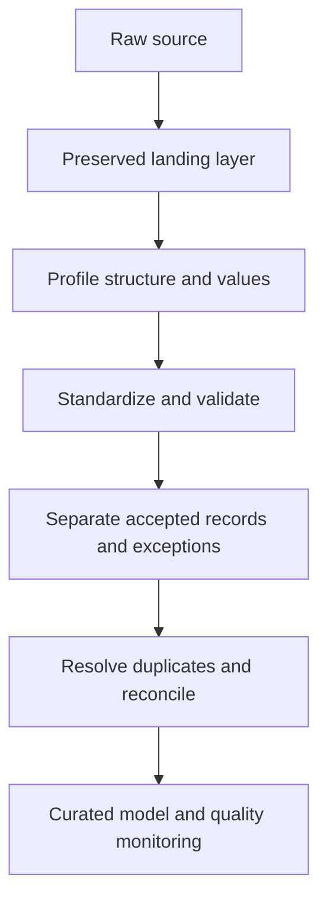

# Clean Before You Calculate: A Practical Data-Cleaning Strategy for Reliable Analytics

| Metadata | Details |
|---|---|
| **Article Level** | Intermediate |
| **Publication Date** | 06 March 2026, 10:25 PM |
| **Article Category** | Data Analytics, Data Quality, and Power BI |
| **Target Audience** | Power BI practitioners, data analysts, project professionals, service-management practitioners, Scrum Masters, and reporting owners |
| **Prepared by** | Ahmed Safwat Gawady |
| **Privacy Note** | The events, organization, characters, figures, and operational situations in this article are based on my experience to help the article deliver its value and are created only to explain the analytical concepts. They are not based on my employer, colleagues, customers, systems, or actual projects. |

## Article Summary

Data cleaning should not begin with deleting blanks or removing duplicates. It should begin with a decision: what must the data represent, at what grain, and under which business rules? This article follows an experience-inspired reporting situation in which technically valid transformations still produced an unreliable management view. It develops a practical sequence for preserving raw evidence, profiling the source, standardizing values, validating rules, resolving duplicates deterministically, reconciling totals, and monitoring exceptions. A Power Query example shows how to separate curated records from rejected ones without concealing uncertainty. The wider lesson applies equally to analytics, project controls, IT service management, and Scrum delivery: trustworthy decisions require visible quality criteria and repeatable controls.


## The Dashboard Was Not the First Problem

I remember one situation where a reporting request looked straightforward. A team wanted a Power BI view of operational cases: how many were open, how much value was attached to them, and how long they had remained unresolved. The source was a workbook assembled from several extracts. Its columns appeared familiar, the rows loaded successfully, and the first visuals were easy to build.

Then the questions started.

Why did the case count change when a status slicer was applied? Why did a total exceed the control figure maintained by the process owner? Why did two spellings of the same status appear? Most importantly, which row should represent a case when the same identifier occurred more than once?

The visible problem was a dashboard discrepancy. The deeper problem was that the dataset had no declared grain, no explicit acceptance rules, and no reproducible way to distinguish a duplicate from a legitimate history record. A quick sequence of “remove blanks,” “replace errors,” and “remove duplicates” could make the table look cleaner while destroying evidence.

That distinction matters. Clean-looking data is not necessarily reliable data. Data integrity means that the information remains fit for its intended use: complete enough, valid against agreed rules, consistent across representations, traceable to its source, and protected from uncontrolled alteration. Those dimensions are a practical working model, not a universal scoring standard. The business context decides which dimensions matter most.

## Start With Meaning, Not Transformation

Before opening Power Query, write one sentence that defines the analytical unit. For example:

> One row in the curated table represents the latest accepted state of one operational case as of the extract time.

That sentence immediately exposes the questions that a generic cleaning checklist cannot answer. Is `CaseID` mandatory? Which timestamp determines “latest”? Are two rows with the same timestamp possible? Is a cancelled case included? Is a missing amount an error, a true zero, or not applicable? Which source is authoritative when systems disagree?

This is where data preparation connects naturally to project management. PMI material on project benefit decisions notes that decision-makers need reliable information about cost, duration, risk, and expected benefits; the quality of the information affects the quality of the decision ([Project Management Institute](https://www.pmi.org/learning/library/project-benefit-management-8957)). A PMP practitioner should therefore treat the data definition as part of requirements and quality planning, not as an invisible technical preference.

The same discipline applies to service management. ITIL's continual-improvement guidance emphasizes using information, technology, monitoring, and analysis to identify and prioritize improvements ([PeopleCert](https://www.peoplecert.org/browse-certifications/it-governance-and-service-management/ITIL-1/itil-4-practitioner-continual-improvement-3871)). If a report supports incident, request, or service-level decisions, its cleaning rules are controls within the value stream. They need ownership and feedback, not just automation.

## A Governed Cleaning Sequence

The most reliable strategy is a sequence in which each stage has a clear purpose and produces evidence for the next stage.



The diagram separates preservation from correction. The landing layer retains what arrived. Profiling discovers patterns before rules change them. Standardization makes comparable values comparable; validation tests business meaning. Exceptions remain visible, while accepted rows proceed to deterministic duplicate resolution and reconciliation. Monitoring then checks whether the source or its quality pattern has changed.

This order is more than neat engineering. It prevents a correction from erasing the evidence needed to understand why the source failed.

## Preserve the Raw Evidence

Create a landing query that connects to the source and performs only the minimum steps required to read it. Disable load if appropriate, then reference it from downstream queries. Do not overwrite the original extract, manually repair cells in place, or mix business corrections with source acquisition.

Preservation supports three needs. First, it provides traceability: a reviewer can compare a curated value with what arrived. Second, it supports repeatability: the same rules can be rerun against the same input. Third, it allows rule changes without asking the source owner to reconstruct yesterday's file.

Preservation does not mean retaining sensitive data indefinitely. Access, retention, masking, and deletion still need to follow organizational policy. The principle is to keep controlled evidence for as long as it is legitimately required—not to create an unmanaged archive.

## Profile Before You Repair

Power Query provides Column quality, Column distribution, and Column profile views. Microsoft describes these as tools for examining valid, error, and empty values, value frequency, distinctness, uniqueness, and column statistics ([Microsoft Learn](https://learn.microsoft.com/en-us/power-query/data-profiling-tools)). Profiling is valuable because it turns assumptions into questions.

Look for structural and semantic signals:

- unexpected nulls in required keys;

- values that differ only by spaces, capitalization, or punctuation;

- numbers stored as text or dates interpreted under the wrong locale;

- categories outside the approved reference list;

- unusually frequent values that may represent defaults;

- duplicate keys and duplicate key–timestamp combinations;

- minimum, maximum, and distribution patterns that do not fit the process.

Power Query's desktop profiling can initially be based on the preview rather than the entire dataset, so the analyst should deliberately switch to whole-dataset profiling when that is necessary. Microsoft also warns that automatic type inference can be wrong because it may infer types from the first 200 rows ([Microsoft Learn](https://learn.microsoft.com/en-us/power-query/common-issues)). For important fields, assign and test types deliberately.

Profiling does not prove accuracy. A date can be syntactically valid and still refer to the wrong event. An amount can fall inside a reasonable range and still be attached to the wrong case. Accuracy usually requires reconciliation with an authoritative control, source owner, or business process.

## Translate Observations Into Explicit Rules

A useful rule names the field, condition, action, and owner. “Clean the status column” is not a rule. “Trim surrounding spaces, map approved source variants to the controlled status list, and route any remaining value to the exception table owned by Operations” is a rule.

For the simulated case dataset, suppose the agreed rules are:

| Field or condition | Acceptance rule | Treatment when the rule fails |
|---|---|---|
| `CaseID` | Non-blank after trimming; compared in uppercase | Route to exceptions; never invent an identifier |
| `Status` | Must map to `Open`, `Pending`, `Resolved`, or `Cancelled` | Route unmapped values to exceptions |
| `UpdatedAt` | Must convert to a datetime using the agreed locale | Route to exceptions |
| `Amount` | Must convert to a number when supplied | Route malformed values to exceptions; preserve genuine nulls |
| Duplicate `CaseID` | Latest `UpdatedAt` wins; `SourceSequence` breaks timestamp ties | Retain the documented winner and monitor duplicate frequency |

These are synthetic rules for explanation, not claims about a real organization. A different process may require every historical state, prohibit tie-breaking, or treat a blank amount as zero. That is why rules must come from the reporting purpose and accountable business owners.

## Standardize, Validate, and Keep Exceptions Visible

Standardization changes representation without deciding whether the underlying fact is correct. Trimming `" open "` and converting it to `"Open"` is standardization. Checking whether `Open` is an allowed status is validation. Replacing an unknown status with `Open` merely to prevent an error is neither; it manufactures certainty.

An exception table is therefore a first-class output. It should retain the source fields, the failed rule, and enough lineage to support investigation. It also creates a measurable feedback loop: the team can inspect recurring failure types and improve the source rather than repeatedly absorbing defects downstream.

This resembles Scrum's empirical logic. The Scrum Guide defines transparency, inspection, and adaptation as the pillars of empiricism and says the Definition of Done creates a shared understanding of completed work ([The Scrum Guide](https://scrumguides.org/scrum-guide.html)). For a data product, a practical Definition of Done might require documented grain, passing validation rules, reconciled control totals, reviewed exceptions, and refresh tests. This is not a new Scrum rule; it is a sensible product-specific quality standard. At PSM I level, the connection is transparency and inspection. At PSM II level, the deeper coaching question is whether the system makes quality visible and enables the team to improve it, rather than relying on one analyst's hidden cleanup knowledge.

## A Deterministic Power Query Pattern

The following Power Query M example demonstrates the core pattern. Its input is a synthetic query named `RawCases` with columns `CaseID`, `Status`, `UpdatedAt`, `Amount`, and `SourceSequence`. The business goal is to produce one latest accepted record per case while retaining rejected rows separately. `SourceSequence` is assumed to be a stable, source-provided tie-breaker; without one, equal timestamps remain ambiguous.

The query returns a record containing two tables rather than silently discarding failures. In production, create two referenced queries using `= CaseCleaning[Clean]` and `= CaseCleaning[Exceptions]`.

```powerquery-m
let
    Source = RawCases,

    TextStandardized = Table.TransformColumns(
        Source,
        {
            {
                "CaseID",
                each if _ = null then null else Text.Upper(Text.Trim(Text.From(_))),
                type nullable text
            },
            {
                "Status",
                each if _ = null then null else Text.Proper(Text.Trim(Text.From(_))),
                type nullable text
            }
        }
    ),

    ParsedDate = Table.AddColumn(
        TextStandardized,
        "ParsedUpdatedAt",
        each try DateTime.From([UpdatedAt]) otherwise null,
        type nullable datetime
    ),

    ParsedAmount = Table.AddColumn(
        ParsedDate,
        "ParsedAmount",
        each
            if [Amount] = null or Text.Trim(Text.From([Amount])) = "" then null
            else try Number.FromText(Text.From([Amount]), "en-US") otherwise null,
        type nullable number
    ),

    WithIssue = Table.AddColumn(
        ParsedAmount,
        "QualityIssue",
        each
            if [CaseID] = null or [CaseID] = "" then "Missing CaseID"
            else if [ParsedUpdatedAt] = null then "Missing or invalid UpdatedAt"
            else if [Amount] <> null
                and Text.Trim(Text.From([Amount])) <> ""
                and [ParsedAmount] = null then "Invalid Amount"
            else if not List.Contains(
                {"Open", "Pending", "Resolved", "Cancelled"},
                [Status]
            ) then "Unmapped Status"
            else null,
        type nullable text
    ),

    Exceptions = Table.SelectRows(
        WithIssue,
        each [QualityIssue] <> null
    ),

    Accepted = Table.SelectRows(
        WithIssue,
        each [QualityIssue] = null
    ),

    LatestPerCase = Table.Group(
        Accepted,
        {"CaseID"},
        {
            {
                "LatestRecord",
                each Table.First(
                    Table.Sort(
                        _,
                        {
                            {"ParsedUpdatedAt", Order.Descending},
                            {"SourceSequence", Order.Descending}
                        }
                    )
                ),
                type record
            }
        }
    ),

    Clean = Table.ExpandRecordColumn(
        LatestPerCase,
        "LatestRecord",
        {"Status", "ParsedUpdatedAt", "ParsedAmount", "SourceSequence"},
        {"Status", "UpdatedAt", "Amount", "SourceSequence"}
    )
in
    [Clean = Clean, Exceptions = Exceptions]
```

The first transformation normalizes the two text fields while preserving nulls. The next two steps parse the timestamp and amount into new columns, so the original values remain available for investigation. `WithIssue` applies the synthetic acceptance rules and records the first detected problem. The query then separates accepted rows from exceptions.

For accepted rows, `Table.Group` creates one group per `CaseID`; within each group, sorting by descending timestamp and then descending source sequence makes the selected row reproducible. This is safer than assuming that a generic “remove duplicates” action will preserve the row the business intends. Microsoft's M documentation states that `Table.Group` groups rows by key and that `Table.Max` can return the largest row by comparison criteria; the explicit sort shown here makes the chosen priority easier to read and extend ([Microsoft Learn: table functions](https://learn.microsoft.com/en-us/powerquery-m/table-functions), [Microsoft Learn: `Table.Max`](https://learn.microsoft.com/en-us/powerquery-m/table-max)).

Several assumptions need adaptation. `DateTime.From` follows the incoming value and environment; ambiguous text dates should be parsed with an explicitly agreed culture or, preferably, delivered in an unambiguous source format. The `en-US` amount culture is illustrative and must match the source convention. `SourceSequence` must be stable and unique enough to resolve ties. The code records only the first failing rule per row; a richer implementation may return a list of all failures. Finally, grouping and sorting may have performance consequences, especially if query folding is unavailable, so test the approach against the real source volume and connector.

## Reconcile Before You Declare Success

A query that refreshes without errors has only passed a technical test. Reconciliation asks whether the curated result still agrees with controlled business evidence.

Useful checks include source row count, accepted row count, exception row count, distinct key count, duplicate-key count, amount totals before and after each justified exclusion, and counts by critical status or period. The equation should balance conceptually:

$$
\text{Source rows} = \text{Accepted candidate rows} + \text{Exception rows}
$$

After deduplication, the clean row count will usually be lower than accepted candidate rows. That difference must equal the rows intentionally removed by the documented winner rule. A total may also change because duplicate historical states carried repeated amounts. The point is not to force equality where the business definition requires a difference; it is to explain every material movement.

This is directly relevant to PMP-style monitoring and control. A baseline or control total has value only if its definition matches the measure being compared. Comparing a latest-state table with a transaction-history total will create a false variance even when both datasets are internally correct. The analyst must reconcile like with like and record the scope, period, filters, and grain.

## Make Quality Part of the Operating Model

Data quality work fails when it lives only inside one PBIX file. A sustainable design assigns ownership across the flow:

- source owners correct recurring capture defects;

- data practitioners maintain transparent transformation and validation rules;

- business owners approve definitions and exception treatments;

- report owners monitor refreshes, reconciliations, and user-impacting changes;

- governance or assurance roles review access, retention, lineage, and control evidence where required.

From an ITIL perspective, this forms a continual-improvement loop. Start with the existing process and evidence, focus controls on outcomes that matter, improve in manageable steps, and automate only after the rule is understood. Automation should reduce repeat effort; it should not institutionalize an unexamined assumption.

From a Scrum perspective, quality rules can be refined in the Product Backlog and incorporated into the Definition of Done for relevant increments. A Sprint Review can inspect whether the data product supports its intended decisions, while the Sprint Retrospective can address recurring process weaknesses such as late extracts, undocumented schema changes, or slow exception ownership. The Scrum Master helps the team improve transparency and effectiveness; the role does not become the owner of data correctness.

## What Success Looks Like—Without Inventing Results

Because the scenario and data are simulated, no real percentage improvement, time saving, or defect reduction is claimed. The expected deliverables are observable controls rather than manufactured outcomes:

- a preserved landing query and documented curated grain;

- explicit field-level acceptance and tie-break rules;

- separate clean and exception outputs;

- reproducible duplicate resolution;

- reconciliation checks whose differences are explainable;

- a quality log that can show trends after real operational data accumulates.

Only measured production evidence can establish whether these controls reduce rework, improve refresh reliability, or accelerate decisions. Baseline the current condition first, then measure changes using stable definitions.

## Limitations and Judgment Calls

No cleaning strategy can repair facts that were never captured. It cannot confirm real-world accuracy without an authoritative comparator, and it cannot resolve conflicting business definitions by technical logic alone. Fuzzy matching can identify possible duplicates but may merge different entities; use thresholds, review queues, and false-match testing. Imputation can support statistical analysis but may be inappropriate for operational or financial reporting unless the method and uncertainty are disclosed.

Power Query profiling is exploratory, not a substitute for governed data-observability controls across large platforms. A Power BI model is also not always the right place for enterprise-wide remediation. If several products consume the same source, shared quality rules may belong upstream in a data platform or governed data product. Push work to the earliest responsible layer while preserving lineage and consumer-specific logic.

Privacy and security remain constraints throughout the pipeline. Exception tables can be more sensitive than curated outputs because they preserve raw values and error context. Apply least privilege, retention limits, masking, and secure review procedures.


## Final Professional Judgment

The best data-cleaning strategy is not the longest list of transformations. It is the shortest governed path from raw evidence to information that is fit for a defined decision.

Preserve what arrived. Profile before assuming. Standardize representation without inventing facts. Validate against owned business rules. Keep exceptions visible. Resolve duplicates with a deterministic rule. Reconcile at the correct grain. Monitor the process and improve the source.

For Power BI practitioners, this creates a model that can be explained as well as refreshed. For PMP professionals, it protects the evidence used to monitor performance and make decisions. For ITIL practitioners, it turns quality failures into inputs for continual improvement. For Scrum Masters and PSM practitioners, it strengthens transparency, inspection, adaptation, and a meaningful Definition of Done.

The dashboard is the final expression. Trust is built much earlier.
