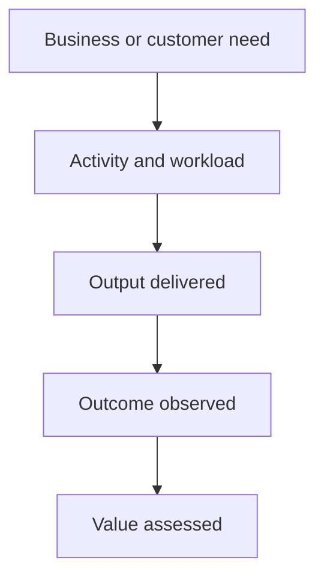

# From Activity to Outcome: How to Separate Workload, Performance, and Business Value

| Metadata | Details |
|---|---|
| **Article Level** | Standard |
| **Publication Date** | 25 April 2026 08:40 PM |
| **Article Category** | Performance Management and Business Analytics |
| **Target Audience** | Managers, product managers, project managers, service managers, Scrum Masters, business analysts, and Power BI professionals |
| **Author** | Ahmed Safwat Gawady |
| **Estimated Reading Time** | 12 minutes |
| **Privacy Note** | The events, organization, characters, figures, and operational situations in this article are based on my experience to help the article deliver its value and are created only to explain the analytical concepts. They are not based on the author’s employer, colleagues, customers, systems, or actual projects. |

## Summary

A busy team can process more work without improving the customer or business result. High activity shows effort, workload shows demand, and performance shows how efficiently or reliably a process operates. None of these automatically proves that the intended outcome was achieved or that meaningful value was created. This article follows an experience-inspired situation in which an impressive operational report could not answer a simple management question: “What became better?” It develops a practical measurement chain linking need, activity, output, outcome, and value, helping managers build dashboards that respect operational reality while keeping attention connected to strategic purpose.

## The Report Proved We Were Busy

One of my situations started with a monthly performance report that looked strong.

The team had processed thousands of requests. Completion volume had increased. Response time was within the agreed target. Several improvement actions had been closed, and the dashboard was mostly green.

The operational story was positive.

Then one manager asked a simple question:

> “What became better for the customer or the business?”

The report could not answer clearly.

It showed how much work entered the operation, how much work left it, and how quickly the team moved. It did not show whether repeat demand had reduced, whether customers completed their intended journeys more successfully, whether the underlying cause had improved, or whether the effort supported an important business objective.

The numbers were not wrong. The measurement story was incomplete.

That moment reminded me of an important distinction: operational activity is necessary evidence, but it is not the same as business value.

The team needed activity measures to manage daily work. Leadership needed outcome measures to understand whether the work was changing anything that mattered.

Both perspectives were valid. They belonged to different layers of the same story.

## Activity Is Not a Weak Measure

Activity measures often receive criticism because they do not prove results. That criticism can go too far.

Managers still need to know:

- how many requests arrived;
- how many transactions were processed;
- how many reviews were completed;
- how many cases required manual intervention;
- how much effort the operation consumed; and
- where demand is increasing or decreasing.

These measures describe workload and operating pressure. They support staffing, scheduling, queue management, capacity planning, and control.

Suppose a support operation receives 10,000 requests this month and 16,000 next month. Even if its success rate remains stable, the additional volume may create a real capacity requirement.

The mistake is not measuring activity.

The mistake is using activity as proof of outcome.

Completing 500 training sessions does not establish that people changed their behavior. Sending 20,000 notifications does not establish that customers understood them. Closing 2,000 incidents does not establish that the service became more reliable.

Activity tells us what the organization did. It does not automatically tell us what changed because of it.

## Workload and Performance Answer Different Questions

Workload describes the volume, effort, complexity, or demand passing through a process.

Performance describes how well the process handled that workload against an agreed expectation.

Consider this synthetic example:

| Measure | April | May | Initial interpretation |
|---|---:|---:|---|
| Requests received | 8,000 | 12,000 | Workload increased |
| Requests completed | 7,600 | 11,100 | Output increased |
| Completion rate | 95.0% | 92.5% | Proportional performance declined |
| Average processing time | 18 min | 17 min | Speed improved |
| Open backlog at month end | 400 | 1,300 | Unfinished demand increased |

The team completed far more work in May and became slightly faster on average. Yet the completion rate declined and the backlog grew.

Was performance better or worse?

The honest answer is: it depends on which dimension the decision concerns.

Throughput improved. Speed improved. Demand increased more quickly than completion capacity. Backlog control weakened.

One card cannot represent all four truths.

This is why managers should resist labels such as **Overall Performance** unless the calculation and business meaning are genuinely clear. A combined score may simplify the page while hiding the trade-off that management needs to see.

## Output Is What the Work Produced

An output is the direct deliverable created by an activity.

If the activity is reviewing applications, the output may be reviewed applications. If the activity is developing a feature, the output may be a usable feature. If the activity is resolving incidents, the output may be restored services or closed records, depending on the business definition.

Outputs are important because they move the measurement beyond effort.

Hours worked are activity. Completed reviews are output.

Meetings held are activity. Approved decisions are output.

Code written is activity. A usable, verified product Increment is output.

But output still does not automatically prove outcome.

A new feature may be delivered without being adopted. A case may be closed while the customer returns with the same problem. A report may be published without changing a decision. A process may become faster while producing more rework downstream.

By the way, this is where a productive team can appear successful while the wider system remains unchanged.

## Outcome Is the Change We Wanted

An outcome describes the change experienced by a customer, user, process, service, stakeholder, or business after the output becomes available and is used.

Examples might include:

- customers complete a journey with less assistance;
- repeat incidents decline;
- decisions are made earlier with clearer evidence;
- failed handoffs between teams decrease;
- service availability becomes more reliable;
- financial leakage reduces; or
- adoption of a useful capability increases.

These examples should not be treated as universal success measures. The right outcome depends on the original need.

If the business problem concerns delayed decisions, a faster report refresh may be a useful output. The outcome is not the refresh itself. The outcome may be that decision makers receive trusted information early enough to act.

If the problem concerns repeated customer contact, closing more tickets may be a necessary output. The desired outcome may be fewer customers needing to contact support again for the same reason.

The outcome makes the purpose visible.

## Value Is Outcome in Context

Even a positive outcome does not have the same value in every situation.

Value depends on who benefits, what need is addressed, what cost or risk is involved, and which trade-offs appear elsewhere.

Suppose automation reduces processing time. That is a positive operational outcome. But if customers abandon the journey because the automated interaction is confusing, the wider value may be weak.

Suppose a team reduces backlog by closing old cases. That improves one measure. If many cases are closed without resolving the underlying need, the customer outcome may deteriorate.

Think about it. A measure becomes dangerous when improvement in the measure can be achieved without improvement in the purpose behind it.

Value therefore asks a wider question:

> “Was the outcome useful, material, sustainable, and worth the resources and consequences involved?”

This question cannot always be answered by one number. It may require customer evidence, financial context, risk information, strategic alignment, and professional judgment.

## The Measurement Chain

A useful dashboard connects operational measures to the reason the work exists.

The chain does not imply that every outcome was caused by one activity. It creates a transparent hypothesis: this work is expected to produce an output, the output is expected to support a change, and the change is expected to create value for defined stakeholders.

That hypothesis should be inspected rather than assumed.

## A Practical Measurement Map

Let’s assume a service team wants to reduce repeated customer contact about one process.

The measurement map might look like this:

| Layer | Management question | Synthetic example |
|---|---|---|
| **Need** | What problem matters? | Customers repeatedly contact support about the same journey |
| **Activity** | What work are we doing? | Analyze contacts, correct guidance, improve the process |
| **Workload** | How much demand or effort exists? | Contacts received, cases handled, hours consumed |
| **Output** | What did the work directly produce? | Updated guidance and a corrected journey step |
| **Performance** | How well is the operation functioning? | Response time, completion rate, backlog, quality checks |
| **Outcome** | What changed for the stakeholder? | Fewer repeat contacts for the same reason |
| **Value** | Why does the change matter? | Lower customer effort and less avoidable operational demand |

This structure protects two important truths.

First, the team still needs operational measures. If workload increases or backlog becomes unsafe, management must know.

Second, operational success is not the final purpose. The report should eventually show whether the repeated-contact problem changed.

## Do Not Force Every Outcome into a Monthly Card

Activities and outputs are often available quickly. Outcomes may take longer.

A feature can be released today, but adoption may require several weeks. A process change can be completed this month, while customer behavior changes gradually. A training program can finish on schedule, but capability and performance may emerge later.

This creates a timing problem in dashboards.

If leadership expects an immediate outcome measure, the team may choose an easy proxy and present it as final evidence. For example, attendance becomes evidence of learning, or feature release becomes evidence of customer value.

Proxies are not necessarily wrong. They should be labeled honestly.

A good report may show:

- immediate activity and output measures;
- early indicators suggesting whether adoption or behavior is moving;
- later outcome measures when enough evidence exists; and
- limitations explaining what cannot yet be concluded.

The reporting cadence should follow the natural time required for the result to appear.

## Leading and Lagging Measures Need Each Other

Some measures provide early evidence that a desired outcome may be developing. Others confirm the result after it has occurred.

For example, completion of process changes may be a leading indicator. Reduction in repeat demand may be a lagging outcome.

A leading measure can support early management action, but it does not guarantee the final result. A lagging measure provides stronger confirmation but may arrive too late to guide the work in progress.

The two belong together.

A dashboard that contains only lagging outcomes can become slow and passive. A dashboard that contains only leading activity can mistake motion for success.

The practical goal is not to classify every metric perfectly. It is to make clear which measures describe current work, which indicate developing change, and which confirm a meaningful result.

## Efficiency and Effectiveness Are Not the Same

Efficiency concerns the relationship between resources and output: how much work was produced with the time, effort, cost, or capacity used.

Effectiveness concerns whether the intended result was achieved.

A process can be efficient but ineffective.

Imagine a team that closes requests very quickly, but many customers return because the response did not resolve the real issue. Closure speed may be strong. Resolution effectiveness may be weak.

A process can also be effective but inefficient. It may achieve the intended outcome while consuming more effort than necessary.

Management needs both views because the improvement actions differ.

If effectiveness is weak, the work may need better design, clearer requirements, stronger quality, or a different solution. If effectiveness is strong but efficiency is weak, the focus may move toward automation, simplification, handoffs, or capacity.

This is why **faster** should not automatically be translated into **better**.

## The Power BI Visual Is Not the KPI Definition

Microsoft describes a KPI visual as a cue that communicates progress toward a measurable goal. The visual requires a base measure and a target or goal against which the current status is evaluated. [Microsoft Learn: Create KPI Visualizations](https://learn.microsoft.com/en-us/power-bi/visuals/power-bi-visualization-kpi)

That capability is useful, but the tool cannot decide which goal represents value.

Before building the visual, the semantic model and business definition should establish:

- the measure’s purpose;
- its calculation grain and population;
- whether it represents workload, performance, output, or outcome;
- the target and time horizon;
- the owner and response; and
- the limitation on interpretation.

Power BI scorecards can also organize goals against key business objectives and promote accountability, alignment, and visibility. [Microsoft Learn: Get Started with Goals in Power BI](https://learn.microsoft.com/en-us/power-bi/create-reports/service-goals-introduction)

The important word is **against**. A goal should connect to a business objective rather than exist as an isolated number that happens to be easy to refresh.

## A Dashboard Needs More Than One Altitude

Operational teams and executives do not need the same level of detail.

An operational page may show queue volume, aging, completion, failure reasons, and workload by category. These measures help people control the current process.

A management page may show the relationship between demand, service performance, outcome movement, and material business impact.

An executive page may show whether the intended strategic outcome is moving, what risks remain, and where intervention is required.

These views should not contradict one another. They should connect at different altitudes.

For example:

> **Activity:** 1,200 cases reviewed.

> **Output:** 950 eligible cases completed with verified results.

> **Outcome:** repeat contact declined within the targeted journey.

> **Value:** avoidable customer effort and operational demand reduced.

The final two statements require evidence. If evidence is not yet available, the dashboard should say so rather than infer value from completion volume.

## The Project-Management Connection

Project management naturally tracks activity, deliverables, schedule, budget, quality, risk, and performance. These remain essential controls.

But delivering the plan does not automatically prove that the project produced the intended organizational result.

PMI’s 2025 Pulse of the Profession frames business acumen as a shift from tactical troubleshooting toward strategic value creation and explicitly positions project success beyond scope, budget, and schedule. [PMI: Pulse Report 2025—Boosting Business Acumen](https://www.pmi.org/learning/thought-leadership/boosting-business-acumen)

For a project manager, this means the measurement conversation should connect delivery performance with the business case, expected benefits, stakeholder outcomes, and changing context.

A project may be on time and on budget while the original need has changed. Another may experience controlled delivery variance while still protecting the most valuable outcome.

This does not weaken delivery discipline. It places delivery discipline inside a wider definition of success.

## The Scrum Connection

Scrum makes a useful distinction between work and value without prescribing one universal outcome metric.

The official Scrum Guide describes Scrum as a framework for generating value through adaptive solutions. It makes the Product Owner accountable for maximizing product value, describes the Product Goal as a future product state, and defines the Sprint Review as an opportunity to inspect the Sprint outcome and determine future adaptations. [The 2020 Scrum Guide](https://scrumguides.org/scrum-guide.html)

This means a Sprint Review should not be limited to a list of completed items.

Completed Product Backlog items and usable Increments matter. They provide concrete evidence of delivery. The wider discussion asks whether the product is moving toward the Product Goal and what stakeholders learned from the result.

A Scrum Team may still use workload measures such as work-item count, cycle time, or capacity for planning and improvement. These measures should support the team, not become substitutes for product value or tools for evaluating individuals.

The question changes from:

> “How much did we finish?”

to:

> “What did we learn from what we finished, and what should we adapt to increase value?”

## The ITIL Connection

Service management needs operational evidence because services must be monitored, supported, controlled, and improved.

PeopleCert’s ITIL 4 Foundation guidance emphasizes defining and tracking metrics and KPIs to understand both the performance and effectiveness of IT services. It also places continual improvement at the center of adapting processes and services. [PeopleCert: ITIL 4 Foundation](https://www.peoplecert.org/browse-certifications/it-governance-and-service-management/ITIL-1/itil-4-foundation-2565)

The two words—performance and effectiveness—are important.

Performance measures may show that the service desk responds quickly, the platform remains available, or requests are processed within expectation. Effectiveness asks whether the service supports the outcome customers and the organization need.

An ITIL-informed dashboard should therefore keep service operations visible while preventing ticket closure, availability, or SLA achievement from becoming the whole value story.

## What Improved, and What Remained Open

Returning to the situation, we did not remove the operational measures.

The team still needed volume, completion, response time, backlog, and quality information. Those measures explained workload and supported daily control.

We added a clearer measurement chain. Outputs were separated from activities. The intended outcome was stated in plain language. Early indicators and later outcome evidence were labeled differently. The report also made clear where value could not yet be confirmed.

The improvement was not a new universal score. It was greater clarity about what each number could and could not establish.

Several limitations remained.

Outcomes could be influenced by other teams, market conditions, customer behavior, or external events. Some value appeared later than the reporting period. Attribution remained uncertain. Financial effects could not always be isolated. And a positive customer outcome might still involve an operational trade-off.

These limitations did not reduce the usefulness of the dashboard. They prevented it from claiming more certainty than the evidence supported.

## A Practical Measurement Discipline

When designing a management report, I recommend a short sequence.

**Start with the need.** State the problem, opportunity, or stakeholder condition that justifies the work.

**Measure the workload.** Show the volume, effort, complexity, and demand the operation must absorb.

**Define the output.** Identify what the activities directly produce and what quality makes the output usable.

**Assess performance.** Measure speed, reliability, completion, cost, quality, capacity, or other relevant operating dimensions.

**Name the outcome.** Describe the change expected for the customer, user, process, service, or business.

**Explain the value.** Connect the outcome to stakeholder benefit, strategy, risk, financial effect, or customer experience.

**Respect the time horizon.** Separate immediate delivery evidence from outcomes that need time to emerge.

**State attribution carefully.** Distinguish what the work plausibly contributed to from what it independently caused.

**Keep limitations visible.** Explain what the current measures cannot prove and which dependencies remain.

This sequence does not make the report academic. It makes the measurement story honest.

## The Better Question Is “What Changed?”

Workload matters because teams need capacity to handle demand.

Activity matters because nothing improves without work.

Outputs matter because effort must produce something usable.

Performance matters because the process should be reliable, efficient, and controlled.

Outcomes matter because work should change a condition that matters.

Value matters because not every change is equally useful, sustainable, or aligned with stakeholder need.

The strongest dashboard does not choose one layer and ignore the others. It connects them.

So when a report shows that the team completed more work, the next question should not be dismissive. It should be curious:

> “What did that work produce, what changed because of it, and why does that change matter?”

That question respects operational effort without mistaking motion for success.

It moves the conversation from being busy to becoming useful.
