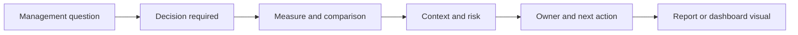

# From Dashboard to Decision: How Great Managers Read Reports and Dashboards

| Metadata | Details |
|---|---|
| **Article Level** | Intermediate |
| **Publication Date** | 13 February 2026, 8:17 PM |
| **Article Category** | Management Analytics and Decision Support |
| **Target Audience** | Managers, project managers, product managers, service managers, Scrum Masters, business analysts, and Power BI professionals |
| **Prepared by** | Ahmed Safwat Gawady |
| **Estimated Reading Time** | 14 minutes |
| **Privacy Note** | The events, organization, characters, figures, and operational situations in this article are based on my experience to help the article deliver its value and are created only to explain the analytical concepts. They are not based on the author’s employer, colleagues, customers, systems, or actual projects. |

## Summary

A manager does not become better by receiving more reports. The advantage comes from knowing which information deserves attention, what changed, why it changed, what decision is required, and what should happen next. This article follows an experience-inspired situation in which a technically correct dashboard created more discussion than clarity. It develops a practical model for management-ready reporting: start with the decision, show a governed measure, reveal movement and context, expose risk and ownership, and make the next action visible. It also connects this reporting discipline to project management, ITIL service management, Scrum empiricism, and practical Power BI dashboard design.

## The Report Was Correct, but the Meeting Was Still Confusing

One of my situations started with a report that looked good.

The numbers were accurate. The charts were clean. The calculations had been checked. Several pages were available for anyone who wanted to explore the detail.

Then the management meeting started.

Within a few minutes, the conversation moved in several directions. One person asked whether the current value was good or bad. Another wanted to know what had changed since the previous period. Someone else asked which team owned the deterioration. A fourth person wanted to understand whether the movement was temporary or part of a trend.

The dashboard had data, but the meeting still needed interpretation.

That is an important distinction.

A report can be technically ready and still not be **management-ready**.

The first condition means the data has been processed and visualized correctly. The second means a manager can use the information to understand the situation, focus attention, ask better questions, and make a proportionate decision.

This changed the question for me. Instead of asking, “How do I put more useful information on the dashboard?” I started asking:

> “What does a manager need to know before this screen can support a decision?”

That question produces a very different report.

## Great Managers Do Not Read Every Number Equally

Managers work under limited attention.

A dashboard may contain ten KPIs, twenty charts, several tables, and hundreds of underlying records. The manager’s job is not to inspect every element with equal intensity. The job is to identify what deserves attention now.

Microsoft’s Power BI guidance makes a similar design point: a dashboard is an overview for monitoring the current state, and the most important information should stand out while unnecessary detail should be removed. It also recommends designing for the audience and the key metrics they need to make decisions. [Microsoft Learn: Tips for designing a great Power BI dashboard](https://learn.microsoft.com/en-us/power-bi/create-reports/service-dashboards-design-tips)

Think with me for a moment.

If a dashboard contains fifty indicators and every one is visually urgent, the manager effectively has no prioritization. If every visual has equal size, equal color, and equal prominence, the design is quietly saying that everything matters equally.

Operational reality is rarely like that.

A strong management report distinguishes between what is stable, what is changing, what is outside tolerance, what is uncertain, and what requires a decision.

That is why the most useful dashboard does not necessarily contain the most information. It contains the most **decision-relevant information**.

## Start with the Decision, Not the Visual

A common reporting workflow begins with available data.

We have transactions, so we create a transaction chart. We have status values, so we create a status donut. We have dates, so we add a trend. We have categories, so we add a bar chart.

Nothing is technically wrong with that approach. The problem is that the dashboard structure is being driven by columns rather than management questions.

A stronger sequence starts elsewhere.

The visual comes last. First comes the question, then the decision, then the evidence required to support it.

This principle also fits project management practice. PMI material on project monitoring describes the practical challenge as translating execution information into actionable knowledge, not merely collecting status. [PMI: How do you know the status of your project?](https://www.pmi.org/learning/library/know-status-project-monitoring-controlling-5982)

From a PMP-oriented perspective, that is the difference between reporting activity and supporting monitoring and control. The manager needs enough information to understand current status, developing variance, risk, and whether corrective action is required.

## A Management-Ready KPI Needs More Than a Current Value

Suppose a card says:

> Success Rate: **94.8%**

Is that good?

We cannot answer yet.

We need at least some context. What is the target? What was the previous result? Is the denominator large enough? Is 94.8% a normal fluctuation or a sustained decline? Does the measure include the whole population? What happens operationally if it stays at that level?

A KPI becomes useful when its value is surrounded by meaning.

Microsoft defines a KPI visual as a way to evaluate a current measure against a target or goal. [Microsoft Learn: KPI visualizations](https://learn.microsoft.com/en-us/power-bi/visuals/power-bi-visualization-kpi)

For management reporting, I would extend that idea. A decision-ready KPI should normally make five things easy to discover:

| Element | Management question |
|---|---|
| **Current value** | Where are we now? |
| **Reference** | Compared with what target, baseline, or prior period? |
| **Movement** | Are we improving, deteriorating, or stable? |
| **Meaning** | Why does the difference matter? |
| **Response** | Who needs to do what next? |

Not every KPI card must display all five elements directly. But the report should make them available without forcing the manager to reconstruct the story manually.

## Smart Reporting Shows Change, Not Only State

A current value is a snapshot. Management usually needs movement.

Let’s assume the monthly number is 4,600.

If last month was 4,550, the movement is small.

If last month was 2,900, the same current number tells a very different story.

If the target was 6,000, the current result may still be below expectation despite strong growth.

This is why absolute and relative measures work better together.

For a simple change ratio:

$$
\text{Change Rate} = \frac{\text{Current Value} - \text{Previous Value}}{\text{Previous Value}} \times 100
$$

If the previous value is 2,900 and the current value is 4,600:

$$
\text{Change Rate} = \frac{4{,}600 - 2{,}900}{2{,}900} \times 100 \approx 58.6\%
$$

The current value tells us scale. The change rate tells us movement.

But the ratio still needs interpretation. A 58.6% increase may be positive for completed sales and negative for failed transactions. If the previous value was unusually low, the percentage can also exaggerate the practical meaning.

The manager therefore needs the number, the direction, and the business meaning together.

## The Best Dashboard Question Is Often “Compared with What?”

Numbers become managerial evidence through comparison.

A report can compare actual with target, current with previous period, one segment with another, actual with forecast, performance with tolerance, or current workload with capacity.

The choice of comparison should be intentional.

A project manager may care about planned versus actual progress. A service manager may care about current service performance against an agreed target. A product manager may care about adoption trend and customer outcome. A Scrum Team may inspect progress toward a Product Goal rather than merely count completed activity.

The reporting mistake is to use whatever comparison is technically easy instead of the comparison that answers the business question.

PMI has long emphasized that meaningful metrics should help management identify status and areas of concern early enough to take remedial action. [PMI: Defining an effective program metric](https://www.pmi.org/learning/library/defining-effective-program-metric-1041)

The word **early** matters. A report that explains failure perfectly after the decision window has closed is analytically interesting but operationally weak.

## The Manager Needs Exceptions Before Detail

Imagine a report with 500 rows.

A manager usually does not need to read 500 rows. The manager needs to know which rows require attention and why.

That is where exception-based reporting becomes powerful.

Instead of presenting every record with equal weight, the report can surface:

- items outside agreed tolerance;
- material changes from the previous period;
- unresolved high-impact risks or issues;
- repeated failures;
- missing or suspicious data;
- overdue actions; and
- unusual concentrations by category, owner, customer segment, product, or process stage.

This does not mean hiding detail. It means separating **monitoring** from **investigation**.

The overview tells the manager where to look. The detail allows the analyst or owner to investigate.

That structure reflects Microsoft’s guidance that dashboards should provide the at-a-glance overview while underlying reports carry deeper detail. [Microsoft Learn: Tips for designing a great Power BI dashboard](https://learn.microsoft.com/en-us/power-bi/create-reports/service-dashboards-design-tips)

## The Dashboard Should Tell Me What Changed

One of the fastest ways to improve a management report is to add a deliberate change layer.

For each important KPI, ask:

> What changed since the last meaningful comparison point?

The answer may be a number, a rate, a rank change, a threshold transition, a new risk state, a category concentration, or a forecast movement.

A useful management view might show:

| KPI | Current | Previous | Movement | Status | Management note |
|---|---:|---:|---:|---|---|
| Completion rate | 96.2% | 97.5% | -1.3 pp | Amber | Decline concentrated in one segment |
| Open cases | 1,240 | 1,080 | +14.8% | Amber | Growth is faster than closure capacity |
| Critical exceptions | 7 | 3 | +4 | Red | Two are overdue and require owner action |

These values are synthetic examples only.

Notice the first row uses **percentage points**, not percent, because the comparison is between two percentages. The second uses a relative change rate. The third uses an absolute change because the count itself is more meaningful.

A smart report does not force every measure into the same mathematical treatment.

## Reports Should Separate Facts, Interpretation, and Action

A management dashboard becomes dangerous when these three layers are mixed.

The **fact** is what the governed data shows.

The **interpretation** is what we believe the pattern means.

The **action** is what someone decides to do.

For example:

> Fact: failure rate increased from 1.8% to 2.6%.

> Interpretation: the increase is concentrated after a recent process change.

> Action: validate the affected step, assign an owner, and review the result at the next checkpoint.

The first statement should be reproducible from data.

The second may be an analytical inference and should be presented with appropriate confidence.

The third is a management decision.

Keeping those layers separate improves governance. It also reduces the risk that a dashboard visually presents an assumption as though it were a confirmed fact.

## A Great Manager Questions Data Quality Without Becoming the Data Team

Managers should not rebuild the model in the meeting.

But they should know when to challenge the evidence.

Some useful questions are simple:

> What population does this number represent?

> Is the current period complete?

> Is the denominator stable?

> Has the business definition changed?

> Are duplicates possible?

> Is this based on event date, processing date, or reporting date?

> Are missing records treated as zero, blank, or excluded?

These questions are managerial because poor data quality changes the decision.

If the report says a failure rate is 5% but half the expected transactions have not arrived yet, the issue is not just technical completeness. The management conclusion may be premature.

That is why a trusted report needs visible data freshness, clear definitions, and controlled calculation logic.

## ITIL Adds a Service-Management Test: Does the Measure Help Us Manage the Service?

ITIL is useful here because it prevents reporting from becoming a purely visual exercise.

PeopleCert’s ITIL material on measurement and reporting describes defining, reporting, and analyzing metrics and KPIs as part of managing services, while its Monitoring and Event Management practice focuses on systematically observing services and responding to selected changes of state. [PeopleCert: ITIL 4 How to Implement](https://www.peoplecert.org/browse-certifications/it-governance-and-service-management/ITIL-1/itil-4-how-to-implement-3880) [PeopleCert: ITIL 4 Practitioner — Monitoring and Event Management](https://www.peoplecert.org/browse-certifications/it-governance-and-service-management/ITIL-1/itil4-practices-monitoring-and-event-management-3686)

From an ITIL 4 perspective, the management question is not simply, “Can we measure it?”

The stronger question is:

> “Does this measure help us understand service health, value, risk, experience, or required action?”

A beautiful metric with no operational meaning is reporting overhead.

A simple metric that detects deterioration early and connects to a response may be far more valuable.

## Scrum Adds Another Test: Does the Report Support Inspection and Adaptation?

The Scrum Guide is very clear about the logic of empiricism: transparency enables inspection, and inspection should lead to adaptation when evidence shows that the work or process has moved outside acceptable limits. [The 2020 Scrum Guide](https://scrumguides.org/scrum-guide.html)

That gives managers and Scrum Masters a useful way to judge dashboards.

A report should improve transparency.

It should make inspection easier.

And when the evidence changes, it should support adaptation rather than defend the original plan.

This is especially relevant to PSM I and PSM II thinking. Scrum.org describes PSM I as demonstrating understanding of Scrum and its application, while PSM II represents a more advanced level of Scrum mastery and Scrum Master accountability. [Scrum.org: Professional Scrum Certifications](https://www.scrum.org/professional-scrum-certifications)

At the more mature level, the report is not a tool for controlling individuals. It is a tool for making the system and its outcomes visible enough for better conversations and better adaptation.

## A Dashboard Is Not a Replacement for Management Judgment

This is one of the most important limits.

A dashboard can tell us that a value changed. It can show where the change is concentrated. It can highlight an exception. It can estimate a trend. It can compare actual with target.

It cannot automatically understand every operational context.

A red KPI may be serious, or it may be caused by an incomplete reporting period. A positive growth rate may indicate success, or it may indicate uncontrolled demand. A lower processing time may indicate efficiency, or it may indicate that a control step was skipped.

The manager still needs professional judgment.

The goal of reporting is not to remove judgment. The goal is to make judgment better informed.

## A Practical Review Before You Send the Report

Before a report goes to management, I like to test it with a short sequence of questions.

Can the reader identify the current state within a few seconds?

Can the reader see what changed and compared with what?

Can the reader distinguish a material exception from normal movement?

Can the reader understand whether the data is complete and current?

Can the reader find the likely owner or next action?

Can the reader drill into detail without cluttering the overview?

Can the same KPI definition be reproduced next month?

If the answer to several of these questions is no, the report may still be technically correct. It is simply not ready for the management conversation yet.

## What Improved, and What Did Not

Returning to the situation, the biggest improvement did not come from adding more visuals.

We reduced the number of equally prominent measures. We added clearer comparison points. We surfaced exceptions. We separated fact from interpretation. We made data freshness easier to see. We connected several high-attention indicators to an owner and next action.

The meetings became easier to structure because the report carried more of the analytical context.

But the dashboard did not solve everything.

Some causes still required investigation outside the model. Several actions depended on other teams. A KPI could still be correct while the target itself was poorly designed. And no visual could replace a difficult management conversation when performance genuinely required intervention.

Those limitations are healthy. A dashboard should support management, not pretend to automate it.

## The Professional Judgment

A great manager is not the person who asks for the most reports.

A great manager knows what question needs an answer, what evidence is strong enough to support it, what comparison gives the number meaning, and when a change deserves action.

From the PMP perspective, reporting supports monitoring, control, stakeholder understanding, and timely corrective action.

From the ITIL perspective, measurement is valuable when it helps manage service performance, events, risk, and improvement.

From the Scrum and PSM perspective, information should increase transparency, make inspection meaningful, and enable adaptation.

And from the Power BI perspective, the technical design should make the most important information easy to see without drowning the reader in detail.

Put those ideas together and the principle becomes simple:

> A smart report does not end with a number. It prepares the manager for the next decision.
