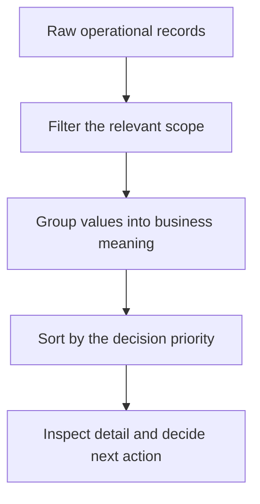

# From Data Clutter to Clear Insight: How Sorting, Filtering, and Grouping Reveal What Matters in Power BI

| Metadata | Details |
|---|---|
| **Article Level** | Standard |
| **Publication Date** | 27 February 2026, 06:20 PM |
| **Article Category** | Power BI and Business Analytics |
| **Target Audience** | Managers, project managers, service managers, Scrum Masters, business analysts, and Power BI users |
| **Prepared by** | Ahmed Safwat Gawady |
| **Estimated Reading Time** | 9 minutes |
| **Privacy Note** | The events, organization, characters, figures, and operational situations in this article are based on my experience to help the article deliver its value and are created only to explain the analytical concepts. They do not reproduce my employer, colleagues, customers, systems, or actual projects. |

## Summary

A Power BI report can contain accurate data and still feel difficult to understand. The problem is often not the number of visuals but the absence of a clear analytical path. Sorting determines what receives attention first. Filtering defines which part of the data belongs to the current question. Grouping converts scattered values into categories that people can interpret. Through an experience-inspired situation, this article explains how these three simple capabilities can turn a crowded dataset into a useful management conversation—while preserving context, transparency, and the detail needed for responsible decisions.

## The Dataset Was Complete, but the Story Was Missing

One of my situations started with a report that was technically complete.

The data had been loaded correctly. The totals reconciled with the source. The page contained cards, charts, tables, and slicers. Yet the first management question was very simple:

> “What should I look at first?”

The report could answer many questions, but it did not guide the reader toward any of them.

Think with me for a moment. Let’s assume the dataset contains 48,000 synthetic service records across six months, fourteen detailed request types, four channels, and several operational statuses. Nothing is wrong with that amount of data. The difficulty appears when every category, month, and status competes for attention on the same page.

At first, the temptation is usually to add another visual. Perhaps a larger chart, another card, or a new color will make the meaning clearer.

Often, it will not.

The better starting point is to organize the analytical question through three separate actions:

- **Sort** the values to control the order of attention.
- **Filter** the data to define the relevant scope.
- **Group** detailed values into business meanings that people can discuss.

These actions sound basic. In practice, they shape how a manager discovers the dataset.

## Sorting Is an Attention Decision

Sorting changes the order in which information reaches the reader.

If a chart is sorted alphabetically, it helps someone locate a known category. If it is sorted by volume from highest to lowest, it highlights workload concentration. If it follows a month or process sequence, it preserves time or operational flow.

The values have not changed, but the question has.

Microsoft explains that Power BI report visuals can be sorted alphabetically or numerically and, for some visual types, by more than one field. It also notes that not every visual supports sorting. [Microsoft Learn: Change how a chart is sorted](https://learn.microsoft.com/en-us/power-bi/explore-reports/end-user-change-sort)

This is why descending value should not become an automatic design habit.

Let’s assume the fourteen request types are sorted by count. The tallest category immediately explains where most of the work exists. That may be useful for capacity planning. However, if the management question concerns the customer journey, the categories may need to follow the actual process sequence instead. If the question concerns control, sorting by variance from target may be more useful than sorting by raw volume.

Before choosing the sort order, ask:

> “Which question should the first item help the reader answer?”

There is also a subtle governance point. Power BI can retain a reader’s sorting, filters, slicers, and other data-view changes, depending on the report configuration. A returning reader may therefore see a personalized view rather than the designer’s default until the report is reset. The current context should remain visible so that two people do not discuss different views as if they were identical.

## Filtering Defines the Question’s Boundary

Filtering is not merely hiding rows. It defines which population belongs to the current question.

Suppose the complete dataset contains six months of activity, but management wants to understand the most recent month. A time filter does not claim that earlier months are unimportant. It establishes the scope of the current review.

Power BI supports filters at the visual, page, and report levels. A visual-level filter affects one visual, a page-level filter affects the visuals on one page, and a report-level filter applies across the report. [Microsoft Learn: Add a filter to a Power BI report](https://learn.microsoft.com/en-us/power-bi/create-reports/power-bi-report-add-filter)

This distinction matters because a report can look consistent while its visuals are calculated over different scopes.

Imagine that one chart shows the current month, another shows the latest quarter, and a card shows all available history. Each calculation may be correct. The page can still mislead because the reader naturally assumes that nearby visuals describe the same population.

A useful report makes important filters easy to recognize. The period, channel, region, customer segment, and status should not be hidden when they materially change the interpretation.

Slicers can help readers control this scope directly. The Filters pane can support more detailed design and governance. The best choice depends on whether the condition is part of the main business conversation or a background rule that should remain controlled.

The professional habit is simple:

> Filter deliberately, display the important context, and never let a narrower view pretend to be the whole population.

## Grouping Converts Detail into Meaning

Sorting arranges values. Filtering narrows them. Grouping does something different: it creates a business structure.

Suppose a source system contains fourteen detailed statuses. Management may not need to discuss every technical status separately. Several could represent successful completion, others could indicate processing, and a smaller set could represent cases requiring attention.

A controlled grouping might produce three business categories:

| Detailed source values | Management group | Business interpretation |
|---|---|---|
| Completed, Confirmed, Settled | Completed | The process reached its intended end state |
| Created, Queued, Processing | In Progress | Work is active and not yet final |
| Rejected, Failed, Expired | Attention Required | Review, correction, or escalation may be needed |

This table is a synthetic example. The correct group definitions must come from the actual process and agreed business rules.

Power BI Desktop allows users to create groups from field values and to create bins for numeric or time fields. Microsoft notes that bins can be created for calculated columns but not for measures. [Microsoft Learn: Use grouping and binning in Power BI Desktop](https://learn.microsoft.com/en-us/power-bi/create-reports/desktop-grouping-and-binning)

Grouping can make a complex report easier to read, but it also introduces responsibility. A category such as **Other** may become a hiding place for new or poorly understood values. A broad **Success** group may conceal a condition that is operationally complete but financially unreconciled. A duration bin such as **0–10 days** may combine cases with very different service expectations.

Therefore, every important group needs a clear definition, an owner, and a route back to detail.

## The Order Creates a Discovery Path

The three actions work best when they form a deliberate analytical path.

Filtering first defines which records are eligible for the question. Grouping then gives those records a consistent business meaning. Sorting finally places the most decision-relevant result where the reader will see it. Detail remains available for validation and follow-up.

Returning to the situation, the report did not need a dramatic redesign.

The review period was made visible. Detailed statuses were mapped into a small number of governed business groups. The primary chart was sorted by the measure linked to the meeting’s purpose, while a supporting table preserved the detailed categories.

The page became easier to discuss because the reader could move naturally from scope, to meaning, to priority, and then back to evidence.

## When Simple Power BI Features Become Management Controls

These capabilities are often introduced as report features, but their real value appears in professional control.

PMI’s Measurement Performance Domain connects measurement with assessing performance and choosing an appropriate response. It emphasizes that timely, accurate information helps a team learn and determine what action to take when performance differs from the desired state. [PMI: Project Performance Domains](https://www.pmi.org/-/media/pmi/documents/public/pdf/pmbok-standards/pmi-project-performance-domains.pdf)

From a PMP perspective, the Power BI design should therefore support a decision, not simply display completed work. Sorting can direct attention toward material variance. Filtering can align the view with the agreed reporting period or scope. Grouping can translate technical details into categories that stakeholders understand consistently.

ITIL adds a service-value perspective. PeopleCert’s current ITIL 4 guidance highlights principles including **Focus on Value**, **Start Where You Are**, and **Optimise and Automate**, while connecting data and feedback with service improvement. [PeopleCert: ITIL 4 Create, Deliver and Support](https://www.peoplecert.org/browse-certifications/it-governance-and-service-management/ITIL-1/itil-4-specialist-create-deliver-and-support-2693)

Applied to reporting, this means we should not group or filter data simply because the feature is available. We begin with the existing process, identify which information contributes to service outcomes, and improve the view without removing the evidence required for control.

Scrum brings another useful discipline: empiricism. The official Scrum Guide states that the Scrum Team and stakeholders inspect results and adjust what happens next. It also positions the Scrum Master as someone who helps establish the environment in which Scrum can work effectively. [The 2020 Scrum Guide](https://scrumguides.org/scrum-guide.html)

For Scrum Master practice—whether someone is building foundational PSM I understanding or deeper PSM II judgment—the lesson is not to make the chart decide for the team. The lesson is to create enough transparency for meaningful inspection, facilitate a shared interpretation, and help the team adapt based on evidence.

## A Small Review Routine Before You Share the Page

Before presenting a Power BI discovery page, I recommend a short review.

First, state the question the page is designed to answer. Then confirm that the sort order supports that question. Check whether all nearby visuals use compatible filters, and make material differences visible. Review every management group against its detailed members. Finally, keep a path to the underlying detail so that unusual values can be investigated rather than explained away.

This review does not require advanced DAX. It requires clarity about meaning.

If the page is for recurring use, also check what happens when new values arrive. A new status may remain ungrouped. A new category may fall into **Other**. A reader’s personalized view may retain an old sort or filter. Data discovery is not finished when the first report is published; it continues as the data and business questions change.

## What These Features Cannot Solve

Sorting cannot determine importance by itself. The highest count may not carry the highest risk, cost, customer effect, or strategic value.

Filtering cannot correct a poorly defined population. If eligibility rules are wrong, a precise filter will produce a precisely wrong answer.

Grouping cannot repair inconsistent source values. It may make inconsistency less visible while leaving the underlying data-quality issue unresolved.

None of the three can prove causation. A filtered and grouped chart may reveal that one category is different, but it does not establish why. Investigation may still require process knowledge, source validation, stakeholder discussion, and record-level evidence.

These limitations do not reduce the value of Power BI. They define the boundary between organizing information and making professional judgment.

## Clear Discovery Is a Designed Experience

A strong report does not force the reader to fight through the dataset before discovering what matters.

It creates a calm sequence.

The filter says, “This is the population we are discussing.”

The group says, “This is how the business understands the detail.”

The sort says, “This is the order in which we should examine it.”

Then management, the project team, or the Scrum Team performs the part that no report feature can complete: interpreting the evidence, challenging assumptions, and selecting the next action.

Power BI can make complex data easier to explore. The real professional skill is ensuring that the path to clarity remains accurate, visible, and connected to value.
