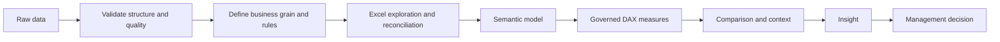
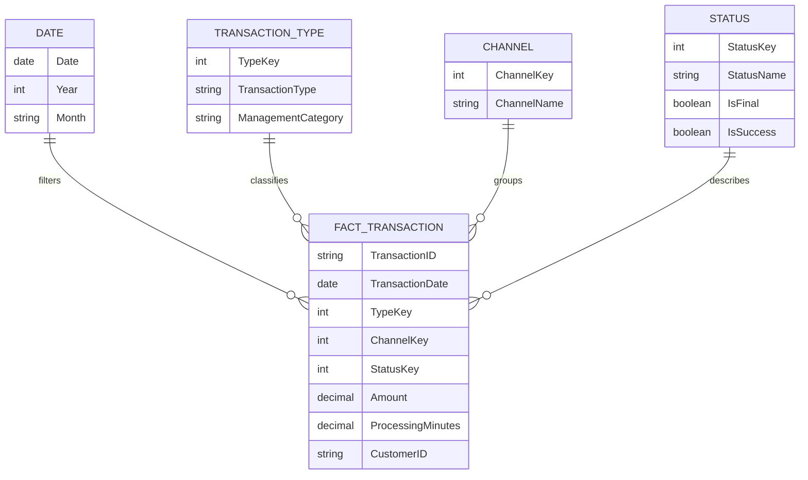

# From Raw Data to Decisions: A Practical Analytical Path with Standard DAX and Excel Formulas

| Metadata | Details |
|---|---|
| **Article Level** | Complex |
| **Publication Date** | 23 January 2026, 11:07 PM |
| **Article Category** | Business Analytics, DAX, Excel, Semantic Modeling, and Decision Support |
| **Target Audience** | Managers, business analysts, project and product managers, service managers, Scrum Masters, Power BI professionals, and advanced Excel users |
| **Prepared by** | Ahmed Safwat Gawady |
| **Estimated Reading Time** | 22 minutes |
| **Privacy Note** | The events, organization, characters, figures, and operational situations in this article are based on my experience to help the article deliver its value and are created only to explain the analytical concepts. They are not based on the author’s employer, colleagues, customers, systems, or actual projects. |

## Summary

Raw data does not become useful merely because it has been loaded into Excel or Power BI. Decision value appears only after the analyst defines the business question, validates the source, establishes the correct grain and denominator, creates governed measures, introduces comparison and context, and explains what the result means. This article follows that path using standard Excel formulas and standard DAX rather than advanced or exotic techniques. It shows where `SUMIFS`, `COUNTIFS`, `XLOOKUP`, `CALCULATE`, `DIVIDE`, aggregation functions, and time comparisons fit; why Excel and DAX can return different-looking results from the same data; how a star-schema model improves reliability; and how to move from calculation to management judgment without confusing a formula with a decision.

## Fifty Thousand Rows and One Management Question

One of my situations started with a large export.

It contained dates, transaction types, statuses, amounts, processing times, customer identifiers, and several descriptive fields.

The file was not unusual.

The question was:

> “What changed, and should we do anything about it?”

That question was much harder than opening the file.

The dataset had more than enough detail. What it did not have was an analytical structure.

We could calculate totals immediately. We could create a PivotTable. We could load the file into Power BI and add charts.

But none of those actions automatically answered the management question.

The real work was to transform raw rows into **governed evidence** and then transform governed evidence into **decision context**.

That distinction is the center of this article.

## Raw Data Is Not Yet Information

Let’s assume our synthetic dataset contains the following fields:

| Field | Meaning |
|---|---|
| `TransactionID` | Unique transaction identifier |
| `TransactionDate` | Business event date |
| `Channel` | Source or service channel |
| `TransactionType` | Business category |
| `Status` | Success, Fail, Pending |
| `Amount` | Monetary value |
| `ProcessingMinutes` | Processing duration |
| `CustomerID` | Synthetic customer identifier |

Even this simple structure raises questions.

Is `TransactionID` truly unique?

Does `TransactionDate` represent submission, processing, or settlement?

Does `Amount` include failed transactions?

Is a pending transaction included in the denominator of success rate?

Can one customer create many transactions?

Are blank statuses errors or legitimate states?

These questions are not technical decoration. They determine what the formulas mean.

A formula can be perfectly correct and still calculate the wrong business concept.

## The Analytical Path Has Several Layers

A useful way to think about the transformation is:



Notice that the formula is in the middle, not at the end.

The formula produces a result.

The decision requires interpretation.

## Start with the Grain

The grain describes what one row represents.

In our synthetic table, assume one row represents one transaction event.

That seems obvious until duplicates appear.

If the source later contains one row per transaction status update, `TransactionID` may repeat. A simple row count would then measure status events, not transactions.

This is one of the most common analytical errors: the measure changes because the row grain changed, while the report title stays the same.

Before writing formulas, state the grain in plain language:

> One row equals one transaction.

Or:

> One row equals one status event for a transaction.

The choice determines whether `COUNTROWS`, `COUNTIFS`, or distinct-count logic is appropriate.

## Use Excel First as a Reconciliation Surface

Excel remains valuable because it lets an analyst inspect raw records, test business rules quickly, and reconcile calculations with visible ranges.

Microsoft describes Excel formulas as expressions using built-in functions to perform calculations and solve problems, and its function library includes standard tools such as `SUMIFS`, `COUNTIFS`, `IF`, and `XLOOKUP`. [Microsoft Support: Overview of formulas in Excel](https://support.microsoft.com/en-us/Excel/get-started/overview-of-formulas-in-excel) [Microsoft Support: Excel functions by category](https://support.microsoft.com/en-us/excel/excel-functions-by-category)

For a complex workflow, Excel is not necessarily the final reporting layer. It can be the **validation layer** before the semantic model is trusted.

## A Standard `SUMIFS` Can Answer a Serious Business Question

Suppose the business question is:

> “What is the total successful amount for each transaction type?”

The input is a structured Excel table named `Transactions`, with `Amount`, `Status`, and `TransactionType` columns. The output should sum only rows that match both the required status and the selected transaction type.

```excel
=SUMIFS(
    Transactions[Amount],
    Transactions[Status], "Success",
    Transactions[TransactionType], $B2
)
```

Microsoft documents `SUMIFS` as a function that sums values meeting multiple criteria. [Microsoft Support: SUMIFS function](https://support.microsoft.com/en-us/office/sumifs-function-c9e748f5-7ea7-455d-9406-611cebce642b)

The formula uses `Transactions[Amount]` as the sum range, then applies two criteria: `Status = Success` and `TransactionType = the value in B2`.

The business assumption is important: a successful transaction amount is meaningful and failed or pending rows should be excluded from this specific measure.

The limitation is equally important. If one transaction appears multiple times because the source grain is status history, `SUMIFS` can double-count the amount. The formula cannot know that the business key is duplicated unless the analyst validates the grain first.

## Count the Numerator and Denominator Separately

Now suppose management asks for success rate.

The tempting approach is to jump directly to the percentage.

A stronger analytical approach calculates numerator and denominator first.

For successful transactions by type:

```excel
=COUNTIFS(
    Transactions[TransactionType], $B2,
    Transactions[Status], "Success"
)
```

For all eligible transactions by type:

```excel
=COUNTIFS(
    Transactions[TransactionType], $B2,
    Transactions[Status], "<>Pending"
)
```

Then the rate can be calculated from the two result cells:

```excel
=IFERROR(C2/D2,0)
```

This structure is easier to audit than embedding everything in one long formula.

The key decision is the denominator. In this synthetic example, pending transactions are excluded because they are not yet final. Another business process may require them to remain in the denominator. That rule must be agreed, not guessed.

When a percentage looks surprising, inspect the numerator and denominator before changing the formula.

## `XLOOKUP` Can Turn Raw Labels into Governed Categories

Raw files often contain inconsistent or technical labels.

Suppose a mapping table named `CategoryMap` contains `RawType` and `ManagementCategory`.

The problem is to translate a raw transaction label into the governed category used in reports. The input is `TransactionType`; the output is a management-friendly category.

```excel
=XLOOKUP(
    [@TransactionType],
    CategoryMap[RawType],
    CategoryMap[ManagementCategory],
    "Unmapped"
)
```

Microsoft documents `XLOOKUP` as a function that searches a range or array and returns the corresponding item from another range. [Microsoft Support: XLOOKUP function](https://support.microsoft.com/office/xlookup-function-b7fd680e-6d10-43e6-84f9-88eae8bf5929)

The formula returns the governed category when a match exists and the text `Unmapped` when it does not.

That last output is more important than it looks.

If the formula silently returns blank, unmapped data may disappear into report logic. By making the exception visible, the analyst creates a data-quality control.

The limitation is that a mapping table still requires governance. If two stakeholders classify the same raw type differently, `XLOOKUP` cannot resolve the policy disagreement.

## Excel Is Excellent for Validation, but Repeated Reporting Needs a Model

A workbook can become difficult to maintain when the same business logic is copied across many sheets, formulas, PivotTables, and files.

Power BI’s semantic model changes the architecture.

Microsoft’s star-schema guidance explains that dimension tables describe business entities while fact tables store observations or events, and that star-schema design is relevant to Power BI models optimized for usability and performance. [Microsoft Learn: Understand star schema and the importance for Power BI](https://learn.microsoft.com/en-us/power-bi/guidance/star-schema)

For our example, the raw table can be modeled into something like this:



The model moves classification and descriptive logic into dimensions and keeps measurable transaction events in the fact table.

That creates a stronger foundation for reusable DAX measures.

## DAX Looks Familiar, but Context Changes Everything

Microsoft describes DAX as a formula language used in Power BI, Analysis Services, and Power Pivot. DAX measures are dynamic calculations whose results change according to context, including report filters, slicers, and relationships. [Microsoft Learn: DAX overview](https://learn.microsoft.com/en-us/dax/dax-overview)

That is the major difference from ordinary worksheet thinking.

In Excel, a formula is normally written in a cell and references ranges or table columns.

In a DAX measure, the same measure can return a different result for each month, channel, transaction type, or management category because the report changes the filter context.

The measure should therefore define a business rule once and allow the model context to reuse it.

## Build the Base Measures First

The business problem is to create a small governed calculation layer that can support many report views. The inputs are rows and numeric columns from the transaction fact table. The outputs are reusable measures for count, amount, and processing time.

```DAX
Total Transactions :=
COUNTROWS(FactTransaction)

Total Amount :=
SUM(FactTransaction[Amount])

Average Processing Minutes :=
AVERAGE(FactTransaction[ProcessingMinutes])
```

`COUNTROWS` counts the rows in the table under the current filter context. `SUM` aggregates amount, and `AVERAGE` returns the arithmetic mean of the selected numeric column. Microsoft’s DAX documentation groups these as standard aggregation patterns and emphasizes that measures respond to context. [Microsoft Learn: DAX aggregation functions](https://learn.microsoft.com/en-us/dax/aggregation-functions-dax)

These measures are intentionally boring.

That is a strength.

A reliable analytical model should start with simple measures that are easy to reconcile before adding more complex logic.

The assumption is still that one fact row equals one transaction. If the model contains event history instead, `COUNTROWS` becomes an event count and a different transaction measure may require `DISTINCTCOUNT(TransactionID)`.

## Use `CALCULATE` to Change the Business Slice

Now the business asks:

> “How many successful transactions do we have?”

The input is the base measure `[Total Transactions]`. The rule is to evaluate it only where the governed status is `Success`.

```DAX
Successful Transactions :=
CALCULATE(
    [Total Transactions],
    Status[StatusName] = "Success"
)
```

Microsoft describes `CALCULATE` as evaluating an expression in a modified filter context. [Microsoft Learn: CALCULATE function](https://learn.microsoft.com/en-us/dax/calculate-function-dax)

The measure reuses the base count and adds a status filter.

If the report is already filtered to January and one transaction type, the measure returns successful transactions for that existing context plus the added success condition.

The important assumption is that `Status` is correctly related to the fact table.

The limitation is that a text label may not be the best production rule if the status taxonomy changes. A more governed model could filter on a Boolean attribute such as `Status[IsSuccess] = TRUE()`.

## `DIVIDE` Makes the Denominator Behavior Explicit

The next question is success rate.

The business meaning is successful final transactions divided by eligible final transactions.

First, create the denominator:

```DAX
Final Transactions :=
CALCULATE(
    [Total Transactions],
    Status[IsFinal] = TRUE()
)
```

Then calculate the rate:

```DAX
Success Rate :=
DIVIDE(
    [Successful Transactions],
    [Final Transactions]
)
```

Microsoft documents `DIVIDE` as a DAX function that performs division and returns an alternate result or `BLANK()` when the denominator is zero. [Microsoft Learn: DIVIDE function](https://learn.microsoft.com/en-us/dax/divide-function-dax)

This behavior is useful because a blank rate can honestly communicate that no eligible denominator exists.

Returning zero instead might imply that performance was 0%, which is a very different business statement.

That is a good example of how error handling becomes decision semantics.

## A Percentage Without the Count Can Mislead

Let’s assume two categories:

| Category | Success | Final Transactions | Success Rate |
|---|---:|---:|---:|
| A | 9 | 10 | 90.0% |
| B | 9,000 | 10,000 | 90.0% |

The percentage is identical.

The evidence is not.

Category A is based on ten transactions.

Category B is based on ten thousand.

A management dashboard should often display both the rate and the denominator, especially when filters can reduce the population dramatically.

This is one of the most practical lessons when moving from raw data to decisions:

> Never let a percentage hide the size of the evidence behind it.

## Use Time Comparison to Answer “What Changed?”

A current value becomes more useful when compared with a meaningful reference period.

Assume the semantic model has a proper Date table related to `FactTransaction[TransactionDate]`.

The business problem is to compare the current transaction count with the previous month under the same non-date filters. The input is `[Total Transactions]` and the current date context. The output is a previous-period measure and a change rate.

```DAX
Previous Month Transactions :=
CALCULATE(
    [Total Transactions],
    DATEADD('Date'[Date], -1, MONTH)
)

Transaction Change Rate :=
DIVIDE(
    [Total Transactions] - [Previous Month Transactions],
    [Previous Month Transactions]
)
```

Microsoft documents `DATEADD` as returning dates shifted forward or backward by a specified interval in the current context. [Microsoft Learn: DATEADD function](https://learn.microsoft.com/en-us/dax/dateadd-function-dax)

The measure preserves the business filters and shifts the date context by one month.

The important assumption is that the Date table is valid for time intelligence and the selected date interval supports the comparison.

The edge case is the previous value being zero or blank. `DIVIDE` prevents an uncontrolled divide-by-zero result, but the dashboard still needs to label a genuinely new activity as **new** rather than letting users interpret a blank change rate as missing data.

## Absolute Change and Relative Change Should Appear Together

Suppose monthly transactions increase from 200 to 300.

Absolute change:

$$
300 - 200 = 100
$$

Relative change:

$$
\frac{300 - 200}{200} \times 100 = 50\%
$$

Now suppose another category increases from 20,000 to 20,100.

The absolute increase is also 100, but the relative increase is only:

$$
\frac{20{,}100 - 20{,}000}{20{,}000} \times 100 = 0.5\%
$$

The same absolute movement has very different proportional meaning.

A serious management report may need both.

The count shows scale.

The ratio shows movement relative to the starting point.

Neither should automatically replace the other.

## `SUMX` Is Useful When the Row Expression Matters

Suppose the raw data does not contain a final amount column. Instead it contains `Quantity` and `UnitValue`.

The business question is to calculate the total row-level value under the current filter context. The input is every transaction row. The output is the sum of `Quantity × UnitValue` across those rows.

```DAX
Calculated Transaction Value :=
SUMX(
    FactTransaction,
    FactTransaction[Quantity] * FactTransaction[UnitValue]
)
```

Microsoft documents `SUMX` as an iterator that evaluates an expression for each row of a table and then sums the results. [Microsoft Learn: SUMX function](https://learn.microsoft.com/en-us/dax/sumx-function-dax)

The measure is appropriate when the business value must be calculated row by row before aggregation.

The assumption is that quantity and unit value belong at the same transaction grain.

The limitation is performance and model design. If the calculated amount can be reliably prepared upstream and stored at the correct grain, repeatedly computing an expensive row expression may be unnecessary. Complex DAX should not be used simply because DAX can do it.

## Do Not Copy Excel Logic into DAX Without Rethinking the Model

A common migration mistake is to reproduce every Excel helper column as a DAX calculated column.

Some logic belongs in the source system.

Some belongs in Power Query or data engineering.

Some belongs in dimensions.

Some belongs in measures.

The decision depends on whether the logic is static per row, dynamic under filters, reusable across reports, expensive to calculate, or governed centrally.

For example, a permanent mapping from raw transaction type to management category may fit better in a dimension table than in dozens of `IF` statements.

A success rate that must respond dynamically to slicers belongs naturally as a measure.

A raw date parsing problem should normally be solved before the analytical measure layer.

The model should make the calculation simpler, not force DAX to compensate for weak structure.

## Reconcile Excel and Power BI Before Trusting Either

When the same dataset is analyzed in Excel and Power BI, use reconciliation deliberately.

For a selected period and category, compare:

| Check | Excel | Power BI |
|---|---|---|
| Row count | PivotTable or `ROWS`/count logic | `[Total Transactions]` |
| Successful count | `COUNTIFS` | `[Successful Transactions]` |
| Eligible denominator | `COUNTIFS` with agreed rule | `[Final Transactions]` |
| Total amount | `SUMIFS` | `[Total Amount]` |
| Success rate | Numerator / denominator | `[Success Rate]` |

If results differ, do not immediately assume one tool is wrong.

Check filters.

Check duplicates.

Check blank handling.

Check whether Excel includes hidden rows or manual exclusions.

Check whether the Power BI model relationship changes the population.

Check date boundaries and time zones if timestamps are involved.

Check whether one side is counting rows and the other is counting distinct transactions.

The reconciliation process is where many semantic errors are discovered.

## The Decision Layer Needs More Than a Chart

Suppose the final dashboard shows:

> Success Rate: 93.4%

That is still not a decision.

The manager may need to know:

What is the target?

What was the previous rate?

How many transactions are behind the percentage?

Where is the deterioration concentrated?

Is the current period complete?

Is the movement statistically or operationally meaningful?

What consequence is appearing?

Who owns the response?

Microsoft’s Power BI design guidance recommends emphasizing important information, providing context, and keeping dashboard overviews focused on what the audience needs to make decisions. [Microsoft Learn: Tips for designing a great Power BI dashboard](https://learn.microsoft.com/en-us/power-bi/create-reports/service-dashboards-design-tips)

The analytical layer should therefore connect the measure to a comparison, threshold or target, explanation, and next action.

## A Small Decision Table Can Be More Useful Than Another Visual

Let’s assume the dashboard identifies three categories with deterioration.

A management table might show:

| Category | Current Rate | Change | Final Transactions | Main Pattern | Decision |
|---|---:|---:|---:|---|---|
| A | 91.2% | -2.4 pp | 18,400 | Failure concentrated in one channel | Investigate channel process |
| B | 96.8% | -0.3 pp | 840 | Small movement, stable trend | Continue monitoring |
| C | 88.0% | -6.0 pp | 25 | Very small population | Validate evidence before escalation |

These are synthetic values.

The table demonstrates three different decisions from three superficially negative results.

Category A has scale and concentration.

Category B is moving only slightly.

Category C looks severe proportionally but has very limited evidence.

This is what “turning raw data into decisions” actually means.

The final layer is judgment.

## Frameworks Help When They Clarify the Management Behavior

From a PMP perspective, the analytical workflow supports monitoring and control by translating execution data into knowledge that can guide corrective action. PMI’s project-monitoring material explicitly frames monitoring as comparing actual progress with expectations and deciding whether change is required. [PMI: How do you know the status of your project?](https://www.pmi.org/learning/library/know-status-project-monitoring-controlling-5982)

From an ITIL perspective, the value of measurement is connected to observing service states, detecting meaningful events, and supporting response. PeopleCert’s Monitoring and Event Management material describes systematic observation, reporting, and response to selected changes of state. [PeopleCert: ITIL 4 Practitioner — Monitoring and Event Management](https://www.peoplecert.org/browse-certifications/it-governance-and-service-management/ITIL-1/itil4-practices-monitoring-and-event-management-3686)

From a Scrum perspective, the logic is empirical. The Scrum Guide says important decisions are based on the perceived state of transparent artifacts, which are inspected so adaptation can occur when evidence requires change. [The 2020 Scrum Guide](https://scrumguides.org/scrum-guide.html)

Scrum.org describes PSM I as demonstrating fundamental Scrum mastery and PSM II as demonstrating advanced Scrum mastery and understanding of Scrum Master accountability and team functioning. [Scrum.org: Professional Scrum Certifications](https://www.scrum.org/professional-scrum-certifications)

The connection is not that every Excel formula is “PMP” or “Scrum.”

The connection is that reliable evidence improves inspection, management judgment, adaptation, and governance across these professional disciplines.

## Data Quality Must Be Visible as a First-Class Result

A sophisticated dashboard should not hide weak inputs.

Consider adding explicit data-quality measures such as:

- source row count;
- duplicate transaction IDs;
- blank mandatory statuses;
- unmapped transaction types;
- records outside the expected date range;
- missing amount values;
- late-arriving records; and
- source-versus-model reconciliation difference.

A management dashboard should sometimes show **Data Check** instead of a performance color.

That is more professional than presenting a confident KPI from incomplete evidence.


## What Improved, and What Remained Open

Returning to the situation, the raw export did not change.

Our treatment of it changed.

We defined the grain. We checked duplicates and status completeness. We used Excel formulas to validate totals and denominators. We moved governed classification into the model. We created simple reusable DAX measures. We added previous-period comparison. We displayed the denominator beside the percentage. We separated data-quality exceptions from performance exceptions.

The management conversation became more focused because the report could explain not only **what the number was**, but also **what population produced it, how it changed, where the change was concentrated, and whether the evidence was ready for action**.

Several limitations remained.

The formulas still depended on source quality. A semantic model could not fix an unclear business definition. Previous-month comparison could be misleading under seasonality. Small populations still required judgment. Some patterns suggested causes but did not prove them. And a dashboard could not decide the correct business response without stakeholder context.

Those limits are part of professional analytics.

## The Professional Judgment

Turning raw data into decisions is not a tool trick.

Excel can calculate.

DAX can calculate dynamically across a semantic model.

Power BI can visualize.

But management value appears only when the analyst connects those capabilities to a governed question.

From the PMP perspective, the goal is better monitoring, comparison, and corrective judgment.

From the ITIL perspective, the goal is meaningful observation and response to service conditions.

From Scrum and PSM thinking, the goal is transparent evidence that can be inspected and used for adaptation.

And from the analytical perspective, the goal is to preserve the chain from source to measure to interpretation.

The final principle is simple:

> Raw data becomes a decision only after we know what one row means, what the formula is measuring, what the denominator contains, what changed, why the result matters, and what action the evidence can reasonably support.
