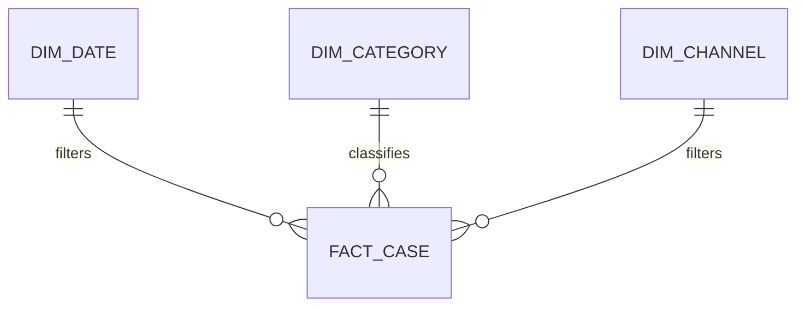

# From Raw Labels to Reliable Insight: The Art of Categorizing and Summarizing Data in Power BI

| Metadata | Details |
|---|---|
| **Article Level** | Intermediate |
| **Publication Date** | 20 March 2026, 09:45 PM |
| **Article Category** | Power BI, Data Modeling, and Business Reporting |
| **Target Audience** | Managers, product and project managers, service managers, Scrum Masters, business analysts, and Power BI professionals |
| **Prepared by** | Ahmed Safwat Gawady |
| **Estimated Reading Time** | 12 minutes |
| **Privacy Note** | The events, organization, characters, figures, and operational situations in this article are based on my experience to help the article deliver its value and are created only to explain the analytical concepts. They do not reproduce my employer, colleagues, customers, systems, or actual projects. |

## Summary

Complex reports rarely become clear by adding more visuals. Clarity begins earlier, when raw values are translated into governed business categories and detailed records are summarized at the correct grain. This article follows an experience-inspired reporting situation in which accurate totals still failed to explain where work was concentrated or what required action. It separates categorization from summarization, shows how a mapping table, a simple star schema, Power Query, and reusable DAX measures can support the process, and connects the technical design with project measurement, service value, and Scrum’s transparency–inspection–adaptation cycle.


## The Total Was Correct, but It Explained Very Little

One of my situations began with a request to prepare a report from a large operational extract.

The source contained dates, identifiers, channels, free-text descriptions, statuses, amounts, and several technical labels. The first report displayed the total number of records and a trend over time. Both were correct.

Still, the management discussion stopped at a very reasonable question:

> “What types of work are actually inside this total?”

The raw data could not answer cleanly. Similar activities appeared under different labels. Some values described a business request, while others described a processing state. Blank and unfamiliar values had been placed into a general category. The total was mathematically accurate, but its composition was not governed well enough to support a confident decision.

Think with me for a moment. Let’s assume a synthetic dataset contains 62,400 records and more than 300 distinct source labels. Those labels might eventually represent only eight meaningful business categories. If we summarize the records before establishing that meaning, the report becomes technically busy and managerially weak.

This is where two tasks that are often treated as one need to be separated:

> **Categorization decides what a record means. Summarization decides how records with that meaning are measured.**

## Categorization Is a Business Rule

Categorization converts detailed or inconsistent source values into a stable analytical language.

Suppose the source contains these synthetic descriptions:

| Raw source value | Governed category | Reason |
|---|---|---|
| Password reset request | Access Support | The request concerns account access |
| User locked after attempts | Access Support | The symptom differs, but the service need is related |
| Payment pending confirmation | Payment Processing | The request concerns transaction completion |
| File rejected by validation | File Processing | The issue occurs during file validation |
| RE: Update required | Review Required | The text does not contain enough evidence for a reliable category |

The final row is important. A weak classification model often sends every unclear value to **General Inquiry** or **Other**. That keeps the dataset tidy, but it hides uncertainty.

A governed **Review Required** category is more honest. It tells the report owner that the classification could not be completed from the available evidence. The value can then be reviewed, mapped, and incorporated into the taxonomy if it recurs.

The classification rule should be based on the business meaning of the record, not merely one convenient word. “Failed” may refer to login, payment, file upload, validation, or notification delivery. The keyword is the same; the operational category is not.

This is why categorization normally needs a combination of normalized source values, contextual fields, explicit precedence rules, and human review for unresolved cases.

## Summarization Is a Measurement Rule

After the categories are stable, summarization answers questions such as:

- How many distinct cases belong to each category?
- What proportion reached a successful final state?
- How did the category change over time?
- Which category contributes most to workload, delay, or exception volume?

These are not category definitions. They are measures calculated over categorized records.

The distinction matters because one category can support several summaries. **Payment Processing** might be measured by case count, transaction amount, success rate, average duration, threshold breaches, or month-over-month change. The category remains stable while the measure changes with the decision.

The reverse is also true. A measure such as **Case Count** can be sliced by category, date, channel, region, or customer segment. Repeating the counting logic separately inside every visual creates inconsistency. A reusable semantic-model measure gives the report one governed definition.

## Decide the Grain Before Counting Anything

Before writing a measure, establish what one row represents.

A row might represent one business case, one status event, one message, one transaction attempt, or one daily snapshot. Those grains produce different counts even when the table contains the same case identifier.

Let’s assume one case passes through four statuses: Created, Processing, Validated, and Completed. If the fact table stores one row per status event, `COUNTROWS` returns four. If the business question asks for the number of cases, the correct result is one.

This is not a DAX problem. It is a definition problem.

The report design should state the grain clearly and choose a business key that represents the object being counted. If historical events are needed for process analysis, preserve them. If final status is needed for management reporting, define the rule that identifies it rather than deleting the earlier events.

Microsoft’s Power BI modeling guidance explains that fact tables store observations or events and that their dimension-key values determine granularity. It also recommends keeping fact tables at a consistent grain. [Microsoft Learn: Understand star schema and its importance for Power BI](https://learn.microsoft.com/en-us/power-bi/guidance/star-schema)

## A Mapping Table Is Better Than Scattered Logic

For a very small, temporary dataset, a few conditional rules may be sufficient. As categories grow, a mapping table is usually easier to review and maintain.

A simple mapping table might contain:

| SourceValue | BusinessCategory | Subcategory | ActiveFlag | RuleOwner |
|---|---|---|---|---|
| PASSWORD RESET REQUEST | Access Support | Credential Reset | Yes | Service Operations |
| USER LOCKED AFTER ATTEMPTS | Access Support | Account Lock | Yes | Service Operations |
| PAYMENT PENDING CONFIRMATION | Payment Processing | Pending Transaction | Yes | Payments Team |

The `SourceValue` is a normalized matching key. `BusinessCategory` and `Subcategory` provide the reporting hierarchy. `ActiveFlag` helps manage retired rules, and `RuleOwner` makes governance visible.

This design prevents classification knowledge from being buried inside a long expression that only one report developer understands. It also makes review easier: business owners can inspect the mapping without reading DAX or Power Query code.

## Applying the Mapping in Power Query

Assume two queries are available:

- `RawCases`, containing one row per source record and a `RawType` column
- `CategoryMap`, containing normalized source values and their governed categories

The following Power Query pattern normalizes the source label, performs a left outer merge, expands the matched category, and marks unmatched values for review. The input is the detailed source table plus the mapping table. The output is the original detail with a governed `BusinessCategory` column.

```powerquery
let
    Source = RawCases,
    NormalizedType = Table.TransformColumns(
        Source,
        {{"RawType", each Text.Upper(Text.Trim(_)), type text}}
    ),
    MergedCategory = Table.NestedJoin(
        NormalizedType,
        {"RawType"},
        CategoryMap,
        {"SourceValue"},
        "CategoryMatch",
        JoinKind.LeftOuter
    ),
    ExpandedCategory = Table.ExpandTableColumn(
        MergedCategory,
        "CategoryMatch",
        {"BusinessCategory", "Subcategory"},
        {"BusinessCategory", "Subcategory"}
    ),
    Classified = Table.ReplaceValue(
        ExpandedCategory,
        null,
        "Review Required",
        Replacer.ReplaceValue,
        {"BusinessCategory"}
    )
in
    Classified
```

`Text.Trim` removes leading and trailing spaces, while `Text.Upper` reduces simple capitalization differences. `Table.NestedJoin` links the detail to the mapping table, and the left outer join preserves every source row even when no category is found. Microsoft describes a Power Query merge as joining two tables through matching values in one or more columns and notes that the matched columns must use compatible data types. [Microsoft Learn: Merge queries overview](https://learn.microsoft.com/en-us/power-query/merge-queries-overview)

The important assumption is that each normalized source value maps to one active category. Duplicate keys in the mapping table can multiply rows after expansion and distort every summary. The mapping key should therefore be validated for uniqueness before refresh.

The limitation is that exact normalization will not understand meaning hidden in complex free text. Fuzzy matching may assist discovery, but an approximate match should not silently become a governed classification. Sensitive or high-impact categories still need explicit rules and review.

## Let the Semantic Model Carry the Structure

Once categories have been defined, the semantic model should separate descriptive business dimensions from measurable events.



`FACT_CASE` stores the case-level observations or events. `DIM_CATEGORY` provides the governed category hierarchy. `DIM_DATE` and `DIM_CHANNEL` provide reusable analytical contexts. This structure allows the same measures to be filtered and grouped consistently across different report pages.

Microsoft’s star-schema guidance states the responsibility plainly: dimension tables support filtering and grouping, while fact tables support summarization. It also explains that one-to-many relationships provide the filter path between them. [Microsoft Learn: Understand star schema and its importance for Power BI](https://learn.microsoft.com/en-us/power-bi/guidance/star-schema)

For a small model, the category fields may initially remain in the fact table. A separate category dimension becomes more valuable when the model needs a hierarchy, sort order, category owner, target, service family, display color, active status, or other reusable attributes.

## Build Summaries as Reusable Measures

Assume `FactCase` contains a business key called `CaseID` and a governed final status. The report needs a distinct case count, a resolved-case count, and a resolution rate.

The following DAX measures accept the current report filter context—such as date, category, and channel—and return governed summaries for the visible population.

```DAX
Case Count :=
DISTINCTCOUNT(FactCase[CaseID])

Resolved Case Count :=
CALCULATE(
    [Case Count],
    FactCase[FinalStatus] = "Resolved"
)

Resolution Rate :=
DIVIDE(
    [Resolved Case Count],
    [Case Count]
)
```

`Case Count` counts unique business cases rather than physical rows. `Resolved Case Count` uses `CALCULATE` to evaluate that measure under an additional final-status condition. `Resolution Rate` divides resolved cases by all visible cases and safely handles a zero denominator.

Microsoft defines `DISTINCTCOUNT` as counting distinct values in a column and notes that distinct-count totals are not necessarily additive across categories. The same case can appear in more than one subgroup yet count only once at the total level. [Microsoft Learn: DISTINCTCOUNT](https://learn.microsoft.com/en-us/dax/distinctcount-function-dax)

Microsoft also explains that `CALCULATE` evaluates an expression in modified filter context. [Microsoft Learn: CALCULATE](https://learn.microsoft.com/en-us/dax/calculate-function-dax)

These measures assume that `CaseID` is a stable business identifier and that `FinalStatus` has been derived correctly. If a case can legitimately belong to several categories, the model may need a bridge table and the category totals may become non-additive. If the source contains blank case identifiers, the distinct-count behavior should be tested rather than assumed.

By the way, this is where summarization becomes more than choosing **Sum** or **Count** from a visual menu. The measure has to preserve the intended business grain under every filter the report allows.

## Do Not Pre-Aggregate Away the Questions You Have Not Asked Yet

Power Query can group rows and calculate sums, averages, medians, minimums, maximums, distinct counts, and other summaries. [Microsoft Learn: Grouping or summarizing rows in Power Query](https://learn.microsoft.com/en-us/power-query/group-by)

That capability is useful when the model intentionally needs a prepared aggregate table or when source detail is too large and the reporting requirement is stable. It can also reduce data volume.

However, grouping too early has a cost.

Suppose the query is reduced to Month, Category, and Case Count. The report can no longer investigate individual cases, recalculate a distinct customer count, analyze duration distribution, or apply a later channel filter unless those attributes were preserved in the aggregation grain.

The safe question is not, “Can Power Query summarize this?”

It is:

> “Which future questions will become impossible if I remove this detail?”

For many business reports, detailed facts plus reusable semantic-model measures provide the right balance. Prepared aggregates should be a conscious architectural decision, not an early convenience.

## Governance Lives Between the Category and the Number

A category table should not be treated as a one-time technical artifact. New products, channels, service states, and operating rules will create new values.

A practical governance routine includes reviewing unmapped values, checking duplicate mapping keys, confirming category definitions with business owners, testing totals before and after mapping, and documenting changes that alter historical interpretation.

From a PMP perspective, this supports the Measurement Performance Domain. PMI connects measurement with assessing performance and taking appropriate action, and emphasizes timely, accurate information about delivery and variance. [PMI: Project Performance Domains](https://www.pmi.org/-/media/pmi/documents/public/pdf/pmbok-standards/pmi-project-performance-domains.pdf)

The project-management lesson is that a report category is part of the measurement system. If its definition changes, stakeholders need to understand whether the trend reflects actual performance or a revised classification rule.

ITIL adds the principle of focusing on value. PeopleCert’s ITIL 4 guidance highlights **Focus on Value**, **Start Where You Are**, and **Optimise and Automate**, and connects data and feedback with continual improvement. [PeopleCert: ITIL 4 Create, Deliver and Support](https://www.peoplecert.org/browse-certifications/it-governance-and-service-management/ITIL-1/itil-4-specialist-create-deliver-and-support-2693)

From that service-management perspective, categories should help explain service outcomes, customer experience, operational demand, or improvement opportunities. A technically elegant taxonomy that nobody can use is not creating value.

Scrum contributes transparency, inspection, and adaptation. The Scrum Guide describes teams and stakeholders inspecting results and adjusting what happens next. [The 2020 Scrum Guide](https://scrumguides.org/scrum-guide.html)

For Scrum Master practice at both PSM I and PSM II depth, transparency means more than making a chart visible. The people inspecting it need a shared understanding of the category definitions and measures. The Scrum Master can facilitate that understanding and help the team adapt the reporting rules when evidence shows that the current taxonomy no longer represents the work.

## What Improved, and What Remained Open

Returning to the situation, the report became more useful after category logic was separated from summary logic.

The raw values were normalized and mapped through a reviewable table. Unresolved records remained visible as **Review Required** rather than disappearing into a broad general category. Reusable measures replaced visual-specific counting. The detailed records remained available for validation and follow-up.

The improvement was not a claimed percentage or cost saving. It was stronger consistency, traceability, and management clarity.

Several limitations remained. Free text could still require human judgment. A category could be correct today and outdated later. Distinct counts could remain non-additive. Final-status logic could be wrong even when the category was right. A well-designed model could still present an irrelevant metric.

These limitations matter because categorization and summarization organize evidence; they do not create certainty.

## A Practical Discipline for Complex Reports

Before building the final visuals, I use a short sequence.

**Define the business object.** Decide whether the report counts cases, events, messages, attempts, transactions, customers, or snapshots.

**Set the grain.** State what one fact row represents and how the business key behaves.

**Design the taxonomy.** Separate categories, subcategories, statuses, and outcomes instead of mixing them into one label.

**Externalize the rules.** Use a reviewable mapping structure when classification logic is expected to grow or change.

**Preserve uncertainty.** Route weak or unmapped evidence to review rather than forcing false confidence.

**Build reusable measures.** Calculate counts, rates, amounts, and durations once in the semantic model.

**Validate totals and detail.** Reconcile the full population, test sample records, and inspect how filters change the result.

**Review the business meaning.** Confirm that each summary supports an actual decision, service outcome, inspection, or improvement action.

This sequence is not complicated, but it prevents the report canvas from becoming the place where unresolved data meaning is hidden.

## The Report Is the Final Layer, Not the First

Complex reporting becomes manageable when we stop asking one visual to solve every problem.

Categorization gives raw records a governed business language. Summarization turns those records into measures at the correct grain. The semantic model connects dimensions and facts so filters behave consistently. The report then presents the result in a form people can inspect and use.

Think about it: the visual is the last expression of several earlier decisions.

If the categories are unclear, the summary will be unclear. If the grain is wrong, the count will be wrong. If the measure is scattered across visuals, the report will be difficult to govern. If the business question is missing, even a perfect model may produce information without value.

The art is not reducing a complex dataset to the smallest number of categories.

It is creating just enough structure to preserve the truth, reveal the pattern, and support a responsible decision.
