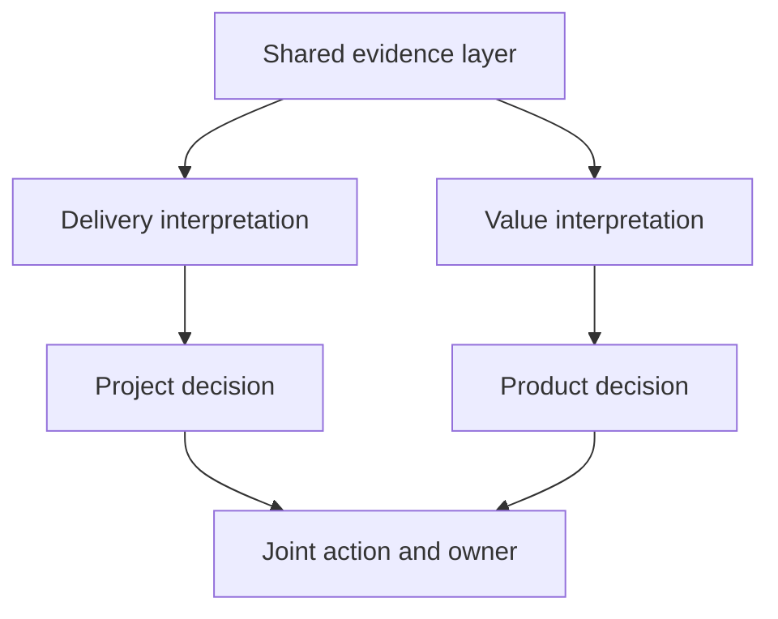
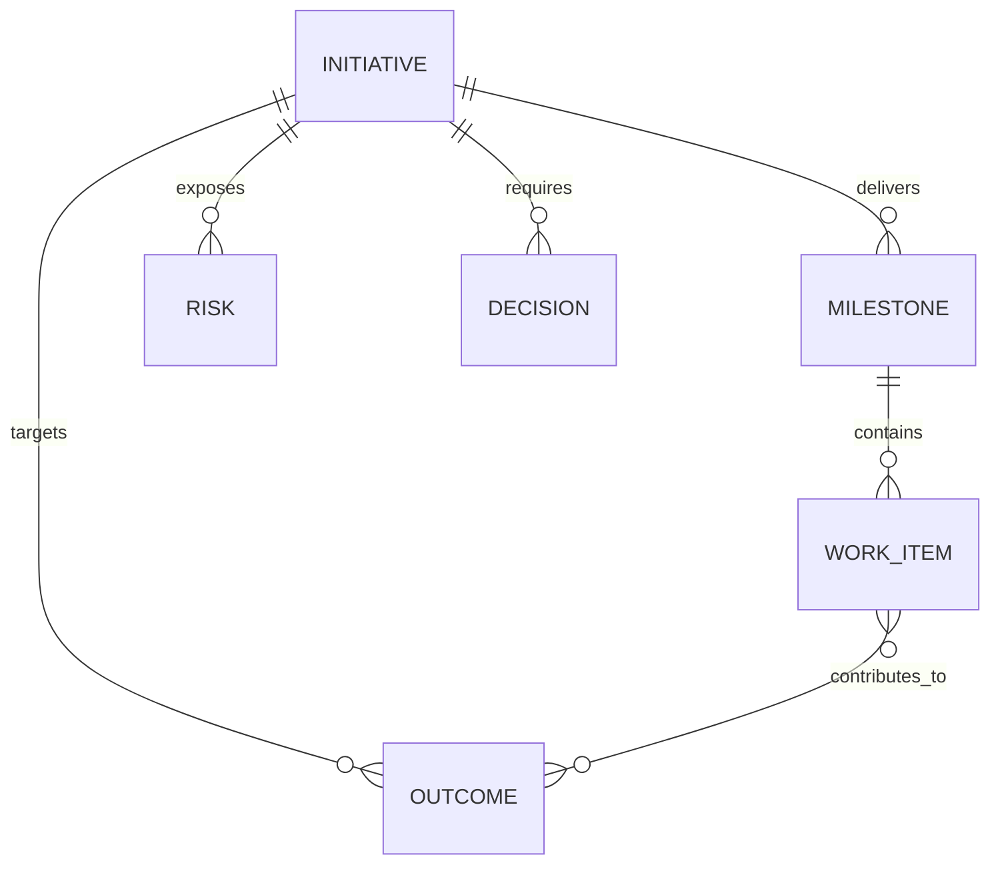
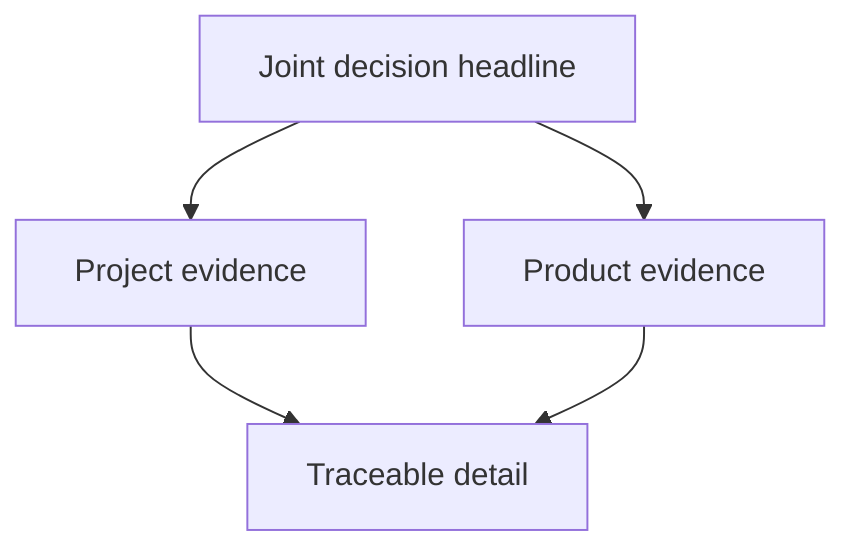

# From Status to Strategy: Bridging Project and Product Reporting

| Metadata | Details |
|---|---|
| **Article Level** | Intermediate |
| **Publication Date** | 22 May 2026, 11:50 PM |
| **Article Category** | Project Delivery, Product Management, and Decision Support |
| **Target Audience** | Project managers, product managers, Product Owners, Scrum Masters, PMO professionals, business analysts, service managers, and reporting specialists |
| **Prepared by** | Ahmed Safwat Gawady |
| **Estimated Reading Time** | 12 minutes |
| **Privacy Note** | The events, organization, characters, figures, and operational situations in this article are based on my experience to help the article deliver its value and are created only to explain the analytical concepts. They are not based on the author’s employer, colleagues, customers, systems, or actual projects. |

## Summary

Project managers and product managers often examine the same work but ask different questions. The project manager needs confidence in commitments, dependencies, cost, risk, and delivery dates. The product manager needs evidence about customer outcomes, adoption, value, and the next investment decision. A single generic status report rarely serves both well. This article explains how a governed reporting layer and tailored summaries can connect these perspectives without creating competing versions of reality. Through a privacy-safe professional situation, it develops a practical model for separating shared facts from role-specific interpretation, linking delivery evidence to product outcomes, and turning reporting into a disciplined decision conversation.


## The Report Was Correct, but the Meeting Still Split

One of my situations began with a status meeting that should have been simple.

The delivery report showed that most planned activities were complete. The current milestone remained achievable, the budget had not crossed its agreed tolerance, and the major technical dependency had an owner. From a project perspective, the work looked controlled.

Then the product manager asked a different question:

> “If we deliver this on time, which customer outcome will improve?”

The report could not answer.

It contained work completed, open actions, schedule variance, risk ratings, and a summary of the next milestone. It did not show adoption, customer friction, expected product behavior, or whether the delivered scope still represented the best use of capacity.

The project manager was not wrong. The product manager was not rejecting delivery discipline. They were reading the same initiative through two different decision responsibilities.

The conversation became uncomfortable because the report treated those responsibilities as if they required the same summary.

The lesson was clear: one report can contain accurate facts and still fail to create shared understanding.

## Two Roles, Two Forms of Confidence

A project manager typically needs confidence that a temporary endeavor can reach its intended outcome within an understood delivery system. The questions often concern commitments, scope, schedule, resources, dependencies, risks, issues, quality, and stakeholder expectations.

A product manager works across a different decision horizon. The questions often concern the product problem, target users, outcomes, adoption, value, sequencing, evidence, and which opportunity deserves investment next.

These perspectives overlap, but they are not interchangeable.

Think with me for a moment. A feature can be delivered on time and still fail to improve the intended customer outcome. Another feature can create promising early value while its delivery remains operationally fragile. In the first case, delivery confidence is high while value confidence is weak. In the second, value evidence may be encouraging while execution risk remains high.

Good reporting makes both conditions visible.

| Decision perspective | Primary question | Typical evidence |
|---|---|---|
| **Project** | Can we deliver the agreed outcome responsibly? | Milestones, forecast, cost, risks, issues, dependencies, quality, decisions required |
| **Product** | Is this the right outcome to pursue, and is it creating value? | Customer behavior, adoption, outcome measures, learning, opportunity cost, product risks |
| **Shared** | What should we continue, change, defer, or stop? | Linked delivery and outcome evidence, assumptions, trade-offs, ownership, next decision |

The shared row is the bridge. It prevents project reporting from becoming a list of completed activities and product reporting from becoming a collection of aspirations disconnected from delivery reality.

## One Truth Does Not Mean One Summary

The solution is not to force both managers to use an identical page.

One truth means that both views draw from the same governed definitions, refresh point, decision history, and initiative structure. One summary would mean that both people receive the same compression of those facts, even though their decisions are different.

That distinction matters.

The project manager may need to know that a dependency threatens the next milestone. The product manager may need to know which customer outcome becomes uncertain if that milestone moves. Both statements should come from the same dependency record and the same outcome map, but the emphasis is different.



The evidence is shared, the interpretations are role-aware, and the final action is reconciled. This structure reduces arguments about whose report is correct because the discussion moves toward what the evidence means for each decision.

## Start with the Decision Contract

Before designing a report, I find it useful to define a small decision contract. This is not a formal legal document. It is an agreement about what the report is expected to help people decide.

For each audience, the contract should make five points clear:

- Which decisions the audience owns or influences
- Which evidence is required before making those decisions
- Which thresholds or tolerances require attention
- How often the decision should be revisited
- Where the resulting action and owner will be recorded

For example, a steering discussion may need to decide whether to protect the delivery date, reduce scope, accept additional cost, or escalate a dependency. A product review may need to decide whether to continue investing, change the solution, test another assumption, or stop an item.

If the report does not support a defined decision, its presence should be questioned. By the way, this is where reporting becomes governance rather than decoration.

## Build a Shared Evidence Spine

A useful bridge needs a small set of objects that both perspectives can recognize. Let’s assume a generalized initiative contains product outcomes, delivery milestones, work items, dependencies, risks, and decisions.

The relationships matter more than the number of fields.



This model creates traceability without pretending that every work item has a simple one-to-one effect on value. A work item may support several outcomes, and an outcome may depend on several milestones, operational changes, or external conditions.

At an Intermediate level, the minimum governed fields might include:

| Object | Essential fields |
|---|---|
| **Initiative** | Initiative ID, owner, objective, current state |
| **Outcome** | Outcome ID, definition, baseline, target, observation period, evidence owner |
| **Milestone** | Milestone ID, forecast date, confidence, completion rule, accountable owner |
| **Work item** | Work item ID, status, milestone link, outcome link, delivery owner |
| **Risk or dependency** | Description, probability or condition, impact, response, owner, review date |
| **Decision** | Decision required, evidence date, options, decision owner, due date, result |

The model is not a promise that causation is known. A link between a work item and an outcome expresses an intended contribution. The outcome still requires observation, and external factors may influence the result.

## Connect Activity, Output, Outcome, and Decision

Many reporting conflicts start because different levels of evidence are mixed together.

**Activity** describes work performed: workshops held, stories developed, tests executed, or communications sent.

**Output** describes something produced: a released capability, completed migration, approved design, or updated process.

**Outcome** describes a change in behavior, performance, experience, risk, or value.

**Decision** describes what management will do because of the evidence.

Suppose a team reports that 90% of planned work items are complete. That is useful delivery evidence, but it does not establish that 90% of the intended product value exists. Work items vary in size, risk, and contribution. Some outcome evidence may appear only after release.

A stronger summary might read:

> The milestone remains achievable under the current forecast. The capability linked to the primary customer outcome is complete, but outcome evidence is not yet available because controlled adoption begins after release. One external dependency could delay measurement by two weeks. A decision is required on whether to protect the measurement window or move the next scope item forward.

That short paragraph serves both perspectives. It states delivery position, value status, uncertainty, consequence, and the decision required.

## Use a Layered Summary Instead of a Longer Report

The bridge does not require more pages. It requires better compression.

I prefer a three-layer summary.

The first layer is the **joint decision headline**. It should explain the current position in one or two sentences: what changed, why it matters, and whether a decision is required.

The second layer contains **role-specific evidence**. The project view shows delivery confidence, variance, risk, and dependencies. The product view shows outcome confidence, learning, adoption, and value assumptions.

The third layer provides **traceable detail**. This is where the reader can inspect source measures, milestone definitions, decision history, or segmented product evidence.



The headline supports speed, the role-specific layer protects relevance, and the detail layer protects verification. Executives are not forced into operational detail, while specialists are not asked to trust a summary without evidence.

## Summarization Is a Controlled Loss of Detail

Every summary removes information. The professional question is whether it removes the right information.

A weak project summary may say:

> Overall status is amber because of several open risks.

This is concise but incomplete. Which risk changed? What is the consequence? Which decision is needed? Does amber refer to date, cost, quality, value, or all of them?

A weak product summary may say:

> Early feedback is positive.

Positive according to whom, from how many observations, against which expected behavior, and with what limitation?

A controlled summary preserves five elements:

1. **Change:** What is different from the previous review?
2. **Evidence:** Which measure, event, or validated observation supports the statement?
3. **Meaning:** What does it imply for delivery or value?
4. **Uncertainty:** What is not yet known or stable?
5. **Action:** Which decision, owner, and date follow?

This structure is short enough for management use but strong enough to resist empty confidence.

## A Simple Measure Layer for Connected Reporting

The technical layer should preserve the distinction between delivery and outcome measures while allowing a combined management view.

Let’s assume a semantic model contains a `Milestones` table, a `ProductOutcomes` table, and a shared `Initiatives` dimension. The business needs two transparent ratios: milestone delivery reliability and outcome target attainment.

The inputs are the currently filtered milestones and outcomes. The outputs are percentages that remain separate because they answer different questions.

```DAX
M_Milestones Delivered On Time :=
CALCULATE(
    DISTINCTCOUNT(Milestones[MilestoneID]),
    Milestones[DeliveryStatus] = "Delivered",
    Milestones[ActualDate] <= Milestones[CommittedDate]
)

M_Total Delivered Milestones :=
CALCULATE(
    DISTINCTCOUNT(Milestones[MilestoneID]),
    Milestones[DeliveryStatus] = "Delivered"
)

M_Delivery Reliability :=
DIVIDE(
    [M_Milestones Delivered On Time],
    [M_Total Delivered Milestones]
)

M_Outcomes Meeting Target :=
CALCULATE(
    DISTINCTCOUNT(ProductOutcomes[OutcomeID]),
    ProductOutcomes[MeasurementStatus] = "Measured",
    ProductOutcomes[ActualValue] >= ProductOutcomes[TargetValue]
)

M_Total Measured Outcomes :=
CALCULATE(
    DISTINCTCOUNT(ProductOutcomes[OutcomeID]),
    ProductOutcomes[MeasurementStatus] = "Measured"
)

M_Outcome Attainment :=
DIVIDE(
    [M_Outcomes Meeting Target],
    [M_Total Measured Outcomes]
)
```

`M_Delivery Reliability` describes how consistently delivered milestones met their committed dates. `M_Outcome Attainment` describes how many measured outcomes reached their defined targets. Both respond to the selected initiative, period, or portfolio context through the semantic model.

The separation matters. Averaging the two ratios into one “success score” would hide their different denominators and meanings. A high delivery ratio cannot compensate mathematically for weak value evidence, and a strong outcome signal does not erase delivery risk.

The measures also carry assumptions. Milestone commitments must be governed rather than repeatedly moved without history. Outcome direction must be defined correctly because some measures improve when they decrease. A binary target test can also hide meaningful partial improvement. In a mature model, outcome direction, baseline, target, observation window, and confidence should be modeled explicitly.

## Do Not Turn the Bridge into a Composite Score

It is tempting to combine schedule, budget, risk, adoption, and outcome measures into one number. The result looks executive-friendly, but it can become analytically weak.

Let’s assume delivery reliability is 90% and outcome attainment is 40%. A simple average gives 65%. What does 65% mean? Is the initiative healthy? Should management continue investing? Does the number represent a tolerable delay, a failed customer assumption, or both?

The arithmetic removes the exact tension the managers need to discuss.

A better approach is a small decision matrix:

| Delivery confidence | Value confidence | Management interpretation |
|---|---|---|
| High | High | Continue while monitoring assumptions and sustainability |
| High | Low | Revisit the product hypothesis, scope, or measurement design |
| Low | High | Protect the value opportunity through delivery recovery or resequencing |
| Low | Low | Reassess continuation, options, and exposure before adding more work |

This matrix does not automate the decision. It makes the trade-off visible.

## Where PMP, Scrum, and ITIL Naturally Meet

The connection to project management is measurement and stakeholder engagement. PMI’s Project Performance Domains describe measurement as assessing performance and taking appropriate action, while the stakeholder domain emphasizes productive involvement in decisions and implementation. That supports role-aware reporting: evidence should enable action and engagement, not merely document activity. [PMI: Project Performance Domains](https://www.pmi.org/-/media/pmi/documents/public/pdf/pmbok-standards/pmbok-project-performance-domains.pdf)

Scrum contributes transparency, inspection, and adaptation. The official Scrum Guide states that the Product Owner is accountable for maximizing product value and for effective Product Backlog management. It also explains that the Sprint Review inspects the outcome of the Sprint and determines future adaptations with stakeholders. A shared report can support that conversation, but it should not replace direct inspection of the Increment, customer evidence, or collaborative decision-making. [The 2020 Scrum Guide](https://scrumguides.org/scrum-guide.html)

ITIL 4 adds a service perspective. Its guiding principles include focusing on value, progressing iteratively with feedback, collaborating and promoting visibility, and thinking and working holistically. PeopleCert’s current guidance applies these ideas by connecting monitoring with service outcomes and shared visibility rather than isolated technical metrics. This is relevant when a product becomes a live service: reporting must connect delivery changes with operational performance and stakeholder value. [PeopleCert: Optimizing IT Monitoring with ITIL 4](https://atv.peoplecert.org/itil4-peoplecert-accredited-monitoring-tools/)

These frameworks should not be forced into one reporting ceremony. Their useful common ground is simpler: make work and evidence transparent, connect them to outcomes, involve the right stakeholders, and adapt when the evidence changes.

## The Meeting Changed When the Summary Changed

Returning to the situation, we did not create a larger dashboard. We changed the reporting logic.

The first section became a joint decision headline. The delivery section retained milestone confidence, dependencies, and exposure. The product section added the intended outcome, current evidence state, and the next learning point. Each material risk showed both its delivery consequence and its possible effect on product value. Decisions were recorded with one accountable owner and a due date.

The next conversation became more useful.

The project manager could explain what remained controllable and what required escalation. The product manager could explain whether the delayed dependency threatened only a date or also the opportunity to learn from customers. The group no longer debated whether the initiative was simply “green” or “amber.” It discussed which confidence had changed and which action followed.

The improvement was not a claimed increase in revenue or delivery speed. We had no verified evidence for such a claim. The credible improvement was stronger decision clarity, better traceability, and less ambiguity between completion and value.

## What the Reporting Bridge Does Not Solve

A connected report cannot remove genuine tension between date, scope, quality, cost, and value. It makes the tension easier to see.

It cannot prove that a delivered feature caused an observed outcome. Product outcomes may be affected by seasonality, customer mix, operations, communications, market conditions, or other changes. Causal claims require suitable measurement design.

It cannot repair unclear accountability. If no one owns the outcome definition, dependency response, or investment decision, the report will expose the gap but cannot close it.

It also cannot turn weak source data into reliable evidence. Inconsistent milestone definitions, overwritten baselines, duplicated work items, missing outcome observations, and changing targets will weaken the summary.

Finally, the model should not be generalized into a belief that project and product management are competing roles. Organizational designs vary. Some responsibilities overlap, some are distributed across several people, and some initiatives do not use Scrum. The principle is about decision needs, not job-title boundaries.

## A Practical Reporting Discipline

When preparing a shared project-product report, I use a short discipline.

**Begin with the decisions.** Define what the project manager, product manager, and shared governance group must decide.

**Separate evidence from interpretation.** Preserve governed facts while allowing each role to explain their meaning.

**Link delivery to outcomes.** Connect milestones and work items to intended outcomes without pretending the link proves causation.

**Show confidence separately.** Keep delivery confidence and value confidence visible instead of hiding them inside one score.

**Summarize the change.** Explain what changed since the previous review, why it matters, what remains uncertain, and which action follows.

**Preserve traceability.** Let the reader move from the headline to the measure definition, source record, assumption, or decision history.

**Review usefulness.** Remove content that does not support a decision, question, or verification need.

This discipline makes reporting smaller in appearance but stronger in meaning.

## The Bridge Is the Decision, Not the Dashboard

Project managers and product managers do not need identical reports. They need compatible views of reality.

The project perspective protects delivery responsibility. The product perspective protects value responsibility. When either disappears, management can optimize the wrong thing: delivering efficiently without confirming value, or pursuing value without understanding execution risk.

The bridge is created when shared evidence connects four questions:

> What did we intend to achieve?

> What have we delivered or learned?

> What has changed in delivery confidence and value confidence?

> What should we decide now?

A dashboard can support those questions. A summary can focus them. A semantic model can govern the evidence beneath them.

But the real bridge is the decision conversation that follows.
