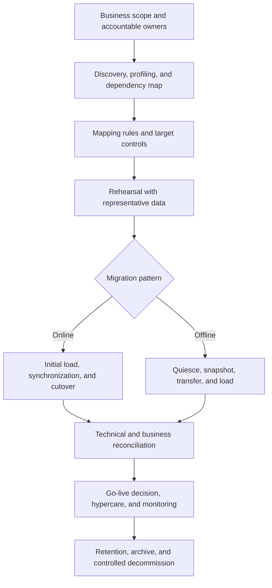

# Moving Trust, Not Just Data: Common Rules for Successful Banking System Migrations

| Metadata | Details |
|---|---|
| **Article Level** | Complex |
| **Publication Date** | 17 July 2026, 11:15 PM |
| **Article Category** | Banking Technology, Data Migration, Operational Resilience, and Governance |
| **Target Audience** | Banking managers, data and solution architects, migration leads, project and product professionals, service owners, risk and control teams, and Scrum practitioners |
| **Prepared by** | Ahmed Safwat Gawady |
| **Privacy Note** | The events, organization, characters, figures, and operational situations in this article are based on my experience to help the article deliver its value and are created only to explain the migration concepts. They are not based on my employer, colleagues, customers, systems, or actual projects. |

## Article Summary

A banking migration succeeds only when the target system preserves the business meaning, integrity, security, and operational obligations carried by the source. Moving rows is the visible task; proving equivalence is the real one. This article develops a common migration operating model covering scope, data ownership, profiling, mapping, security, rehearsal, reconciliation, cutover, rollback, hypercare, and controlled decommissioning. It distinguishes online migration—where synchronization continues until a short cutover—from offline movement performed inside an accepted outage. Two simulated banking situations show how the patterns change managerial choices without changing the core controls. A SQL reconciliation example demonstrates why record counts alone are insufficient. The result is a practical framework for moving trust, not merely data.


## The First Question Was About Volume

I remember one migration discussion that began with a very simple question: how many records do we need to move?

It sounded sensible. Volume influences duration, storage, network capacity, tooling, and the cutover window. Yet the number could not tell us whether the migration would preserve customer entitlements, payment instructions, status history, reference relationships, audit evidence, or the source's interpretation of a blank field.

A million rows can move successfully and still produce an unsuccessful migration. One critical record may be missing. A date may be shifted by a timezone conversion. A beneficiary may arrive without its approval relationship. Two legacy statuses may be collapsed into one target value without business approval. The target count may match the source while money totals differ through rounding or duplication.

The conversation changed when we stopped asking, “How much data will move?” and asked, “Which business truths and service obligations must remain true after the move?”

That is the managerial foundation of migration.

## Migration Is a Change of System of Record

Data migration is often described as extract, transform, and load. Technically, that is part of it. Managerially, a migration changes where the organization trusts a fact, who can alter it, which controls protect it, and which service depends on it.

The target is not ready merely because it contains rows. It is ready when authorized stakeholders can show that:

- the intended population was moved or explicitly dispositioned;

- source meanings were translated into approved target meanings;

- relationships, histories, balances, and control attributes remain valid;

- privacy, confidentiality, integrity, retention, and access obligations were maintained;

- the target supports the required business journeys and operational volumes;

- reconciliation differences are understood and approved;

- rollback, recovery, and support arrangements are credible;

- the target has formally become the system of record for the defined scope.

The Basel Committee's BCBS 239 implementation update of 6 January 2026 describes the principles as a strong framework for bank risk-data aggregation and reporting and notes their use within broader enterprise data-governance initiatives ([Bank for International Settlements](https://www.bis.org/publ/bcbs_nl36.htm)). The principles were designed for risk data, not as a universal migration standard. Still, their emphasis on governance, architecture, accuracy, completeness, timeliness, and adaptability provides a useful test: a migration should not weaken the institution's ability to aggregate, explain, and report trusted information.

## The Common Migration Control Chain



The chain starts with business scope and ownership, not tooling. Discovery identifies the real source population and dependencies. Mapping defines how meaning will change. Rehearsal tests the design before production. The online and offline branches use different movement mechanics, but both return to the same obligations: reconciliation, authorized go-live, monitoring, retention, and controlled retirement.

This is not a strictly linear process. Profiling may expose a missing business rule; rehearsal may force a mapping redesign; reconciliation may block cutover. The gates are valuable precisely because they allow evidence to send the migration backward before customers or operations absorb the defect.

## Define the Business Perimeter Before the Technical Scope

A technical inventory may list databases, schemas, tables, files, interfaces, and jobs. A business perimeter explains which customers, accounts, products, transactions, documents, entitlements, histories, and reporting obligations are included.

The migration charter should define:

| Question | Why it matters |
|---|---|
| What becomes the new system of record? | Prevents two systems from claiming authority for the same fact |
| Which population is in scope? | Establishes the reconciliation denominator |
| What history must move, archive, or remain accessible? | Aligns operations, audit, legal, and retention needs |
| What is deliberately excluded? | Prevents silent loss from being mistaken for design |
| Which business journeys depend on the data? | Connects migration quality to real service outcomes |
| Who owns each data domain and mapping rule? | Places semantic decisions with accountable roles |
| What are the cutover and rollback authorities? | Avoids governance ambiguity during the highest-risk period |
| Which control evidence is required for acceptance? | Makes “ready” testable rather than subjective |

Scope should be expressed at the level of business objects and relationships. “Move the customer table” is incomplete if customers also depend on accounts, signatories, roles, limits, beneficiaries, approval matrices, documents, devices, notification preferences, and consent records.

The source may also contain data that is technically reachable but not lawfully or operationally appropriate to move. Retention, purpose limitation, records-management policy, legal holds, localization requirements, and customer privacy can alter the migration perimeter. More data is not automatically safer.

## Discover the Source as It Exists, Not as It Was Designed

Architecture diagrams and data dictionaries describe intent. Profiling describes reality. Both are needed.

Discovery should cover data shape, semantics, lineage, ownership, quality, volumes, growth, update patterns, access paths, upstream and downstream dependencies, batch windows, interfaces, reports, controls, and operational users. It should also identify undocumented extracts, manual corrections, and side processes. These are often called workarounds, but they may carry essential business meaning.

Profile at several levels:

- **Schema:** types, lengths, nullability, defaults, keys, constraints, and encodings.

- **Content:** nulls, ranges, distributions, duplicates, patterns, invalid characters, and unexpected categories.

- **Relationships:** orphaned children, many-to-many behavior, broken references, and sequencing dependencies.

- **Time:** timezones, daylight-saving handling, effective dates, event order, late-arriving data, and source retention windows.

- **Financial controls:** currencies, decimal precision, sign conventions, rounding, balances, control totals, and posting state.

- **Security:** classifications, sensitive fields, encryption, masking, access roles, keys, secrets, audit logs, and segregation of duties.

- **Operations:** peak loads, cut-off times, end-of-day or end-of-month processing, recovery points, and downstream delivery commitments.

The output is not a list of defects to clean automatically. It is a set of findings requiring disposition. Some anomalies are errors. Others are legitimate exceptions. A duplicated customer identifier may represent a source defect, two legal entities, a historical merge, or different namespaces. The data owner must decide the meaning before the engineer transforms it.

## Mapping Is a Business Specification

A mapping document should do more than connect `SOURCE_COLUMN` to `TARGET_COLUMN`. It should explain meaning, transformation, validation, ownership, exception treatment, and reversibility.

| Mapping element | Example of the question it answers |
|---|---|
| Source definition | What did the field mean in the legacy process? |
| Target definition | What will it mean in the new product or service? |
| Transformation rule | Is the value copied, derived, split, merged, normalized, or defaulted? |
| Reference mapping | Which approved target code replaces each source code? |
| Precision and format | How are decimals, dates, identifiers, text, and encodings handled? |
| Validation rule | What makes the transformed value acceptable? |
| Exception route | Is the record rejected, quarantined, corrected, or deferred? |
| Accountable owner | Who approved the semantic decision? |
| Lineage identifier | How can target data be traced to source evidence and rule version? |

Defaults deserve special caution. Replacing an unknown source value with a common target category may make the load pass while manufacturing false certainty. Where the target requires a value that the source cannot support, the migration needs an approved policy: derive from authoritative evidence, route to remediation, use an explicit “unknown” state if the model permits it, or exclude the object with visible impact.

Transformation rules should be version-controlled and testable. Mapping changes close to cutover can invalidate previous rehearsals. A change-control process should show which data domains, test cases, control totals, interfaces, and business journeys require retesting.

## Choose Online or Offline From Business Tolerance

“Online” and “offline” are migration patterns, not measures of quality.

Microsoft's Azure Database Migration Service documentation, updated 20 February 2026, explains that offline migration begins application downtime when migration starts, while online migration limits downtime mainly to the final cutover after ongoing movement ([Microsoft Learn](https://learn.microsoft.com/en-us/azure/dms/resource-scenario-status)). A PostgreSQL migration overview similarly describes online migration as an initial copy followed by replication that keeps the target synchronized until cutover ([Microsoft Learn](https://learn.microsoft.com/en-us/azure/postgresql/migrate/migration-service/overview-migration-service-postgresql)). The implementation details vary by engine and tool, but the distinction is useful.

| Consideration | Online pattern | Offline pattern |
|---|---|---|
| Source availability | Usually remains active during initial load and synchronization | Writes are stopped or the application is unavailable during movement |
| Downtime | Concentrated near cutover | Extends across snapshot, transfer, load, validation, and activation |
| Data-change handling | Requires change data capture, replication, dual-write, or another synchronization mechanism | Relies on a stable final snapshot after quiescence |
| Operational complexity | Higher: lag, ordering, conflict, and cutover state must be controlled | Lower synchronization complexity, but outage execution is time-critical |
| Best fit | Services with low downtime tolerance and suitable source/target capabilities | Data or services with acceptable outage windows and a controllable frozen state |
| Principal risk | Divergence, missed changes, replay errors, conflict, or ambiguous system-of-record transition | Overrunning the outage, failed restore/load, or insufficient time for validation |

The choice should be driven by business impact tolerance, permitted data loss, recovery objectives, source behavior, target capability, data volume, network throughput, security constraints, dependency windows, and rollback feasibility. “Online is modern” and “offline is safer” are both unreliable generalizations.

An online pattern is not necessarily zero downtime. Applications still need a controlled transition of connections, jobs, messages, caches, and write authority. An offline pattern is not necessarily a simple copy. It still requires consistent snapshots, transfer security, import ordering, reconciliation, and restart sequencing.

## Build Security and Privacy Into the Movement Path

Migration creates temporary risk surfaces: staging databases, export files, transfer channels, elevated service accounts, logs, reconciliation extracts, backups, and support access. Temporary does not mean exempt from control.

The migration security design should cover:

- data classification and approved movement locations;

- encryption in transit and at rest using organization-approved mechanisms;

- key ownership, rotation, and separation from encrypted data;

- least-privilege access and time-bounded elevated permissions;

- segregation between extraction, transformation, approval, and production activation where required;

- integrity verification for transferred artifacts;

- masking or tokenization in non-production rehearsals;

- audit logging and monitoring of privileged activity;

- secure disposal of temporary files and revoked credentials;

- incident and contingency procedures for failed or exposed migration assets.

NIST's data-integrity practice guide applies the Cybersecurity Framework to identifying and protecting assets against destructive data events ([NIST SP 1800-25](https://nvlpubs.nist.gov/nistpubs/SpecialPublications/NIST.SP.1800-25.pdf)). NIST's contingency-planning guidance also connects recovery planning with the system development lifecycle and organizational resilience ([NIST SP 800-34 Rev. 1](https://csrc.nist.gov/pubs/sp/800/34/r1/upd1/final)). These are US federal guidance documents, not banking regulations for every jurisdiction, but they provide useful control patterns that should be tailored to applicable law, policy, and supervisory expectations.

A checksum or cryptographic digest can show whether a transferred artifact changed in transit. It cannot show that the source extract was complete, the transformation was correct, or the target preserved business meaning. Integrity verification is one layer of reconciliation, not a substitute for it.

## Rehearsal Is Where the Plan Becomes Evidence

A migration rehearsal should execute the real sequence with representative data, realistic volumes, controlled credentials, measured durations, named operators, and actual decision points. A small happy-path sample may validate syntax while hiding production-scale failure.

Each rehearsal should answer:

- Can the source snapshot or synchronization start without damaging operations?

- Are extraction and transfer durations within the window?

- Does the target load preserve ordering and relationships?

- Do transformations produce expected exceptions?

- Can reconciliation complete before the go/no-go deadline?

- Do downstream interfaces, reports, jobs, and customer journeys work?

- Can rollback be executed, not merely described?

- Are runbook steps, owners, commands, evidence paths, and communications clear?

Record actual timings and defects without presenting rehearsal results as guarantees. Production volumes, network conditions, concurrent writes, and external dependencies can behave differently. A useful rehearsal reduces uncertainty; it does not eliminate it.

PMI migration and cutover literature emphasizes testing and quality assurance as critical cutover tasks, especially where the new environment has not yet experienced expected traffic ([Project Management Institute](https://www.pmi.org/learning/library/couch-potato-cutover-acquisition-integration-6933)). In PMP terms, rehearsal evidence should update risk responses, schedule estimates, resource plans, stakeholder communications, quality criteria, and go-live conditions.

## Reconciliation Must Prove More Than Counts

A reliable reconciliation framework operates in layers.

| Layer | Example controls |
|---|---|
| Transport | File count, byte size, manifest, approved hash, and transfer status |
| Structural | Schema, data types, constraints, indexes, partitions, and object count |
| Population | Source scope, extracted, accepted, rejected, deferred, and target counts |
| Financial | Amounts by currency, balances, debit/credit signs, and posting-state totals |
| Referential | Parent-child completeness, orphan count, and relationship cardinality |
| Semantic | Status mappings, date interpretation, customer type, and business-rule outcomes |
| Functional | Login, inquiry, payment, approval, statement, service, and reporting journeys |
| Operational | Performance, batch completion, monitoring, access, backup, and recovery |

A basic population identity can be expressed as:

$$
N_{\text{expected}} = N_{\text{loaded}} + N_{\text{rejected}} + N_{\text{deferred}}
$$

Each term needs a precise definition and mutually exclusive membership. If one record can appear in both rejected and deferred categories, the equation is misleading.

Coverage is sometimes reported as:

$$
\text{Coverage} = \frac{N_{\text{loaded}}}{N_{\text{expected}}} \times 100\%
$$

A high percentage does not prove success. The missing fraction may contain a critical account, a high-value balance, a regulatory record, or a privileged entitlement. Reconcile both quantity and materiality.

## A Synthetic SQL Reconciliation Pattern

The following SQL is a simplified, read-only example for two consistent snapshots: `source_snapshot` and `target_snapshot`. Both contain `customer_id`, `status_code`, `currency_code`, and `available_balance`. The business purpose is to produce control totals by status and currency, then identify key-level mismatches after mapping. The expected output is an aggregate comparison plus an exception list; it is not a production sign-off by itself.

The example assumes that source statuses have already been transformed through an approved mapping view named `source_mapped`. Monetary columns must use fixed-precision numeric types. The exact syntax may require adaptation for the selected database engine.

```sql
-- Aggregate controls by business-relevant dimensions
WITH source_control AS (
    SELECT
        mapped_status AS status_code,
        currency_code,
        COUNT(*) AS record_count,
        COUNT(DISTINCT customer_id) AS distinct_customers,
        SUM(available_balance) AS total_balance
    FROM source_mapped
    GROUP BY mapped_status, currency_code
),
target_control AS (
    SELECT
        status_code,
        currency_code,
        COUNT(*) AS record_count,
        COUNT(DISTINCT customer_id) AS distinct_customers,
        SUM(available_balance) AS total_balance
    FROM target_snapshot
    GROUP BY status_code, currency_code
)
SELECT
    COALESCE(s.status_code, t.status_code) AS status_code,
    COALESCE(s.currency_code, t.currency_code) AS currency_code,
    COALESCE(s.record_count, 0) AS source_records,
    COALESCE(t.record_count, 0) AS target_records,
    COALESCE(t.record_count, 0) - COALESCE(s.record_count, 0)
        AS record_difference,
    COALESCE(s.distinct_customers, 0) AS source_customers,
    COALESCE(t.distinct_customers, 0) AS target_customers,
    COALESCE(s.total_balance, 0) AS source_balance,
    COALESCE(t.total_balance, 0) AS target_balance,
    COALESCE(t.total_balance, 0) - COALESCE(s.total_balance, 0)
        AS balance_difference
FROM source_control s
FULL OUTER JOIN target_control t
    ON s.status_code = t.status_code
   AND s.currency_code = t.currency_code;

-- Key-level exceptions for mapped business values
SELECT
    COALESCE(s.customer_id, t.customer_id) AS customer_id,
    s.mapped_status AS source_status,
    t.status_code AS target_status,
    s.currency_code AS source_currency,
    t.currency_code AS target_currency,
    s.available_balance AS source_balance,
    t.available_balance AS target_balance
FROM source_mapped s
FULL OUTER JOIN target_snapshot t
    ON s.customer_id = t.customer_id
WHERE s.customer_id IS NULL
   OR t.customer_id IS NULL
   OR s.mapped_status <> t.status_code
   OR s.currency_code <> t.currency_code
   OR s.available_balance <> t.available_balance;
```

The first query compares counts, distinct customers, and monetary totals at a meaningful dimensional grain. The `FULL OUTER JOIN` makes source-only and target-only groups visible. The second query moves from aggregate controls to individual exceptions and exposes missing keys or unequal mapped values.

The pattern has important limitations. Equal totals can hide offsetting errors, so aggregate and key-level checks are both required. Null comparisons need explicit treatment because `NULL <> value` and `NULL = NULL` do not behave like normal Boolean comparisons in SQL; production logic should use null-safe comparisons appropriate to the engine. A single `customer_id` may not be the correct business key across legal entities or namespaces. Decimal scale, currency conversion, collation, whitespace, and timestamp normalization can create false or hidden differences. Most importantly, the two snapshots must represent the same business cut-off. Comparing a moving source with a static target produces expected differences that can be mistaken for defects.

## Banking Situation: Online Migration of Corporate Access and Entitlements

Let us assume a corporate-banking platform is moving customer profiles, users, roles, approval limits, account access, and beneficiary relationships to a new system. The service has a low tolerance for extended downtime, so the team proposes an online pattern.

The migration starts with a controlled initial load. New and changed source records are then captured and applied to the target. The team monitors replication lag, failed changes, ordering, and relationship completeness. Before cutover, it rehearses the final sequence: stop or redirect writes, drain messages, apply remaining changes, verify zero or acceptable lag, reconcile critical objects, switch application connections, run business smoke tests, and declare the target authoritative.

The technical challenge is not only copying customer and user rows. Entitlements are relational and temporal. A user may belong to a corporate profile, hold access to selected accounts, initiate transactions within one limit, approve within another, and require a second approver depending on payment type. Moving the user without the full authorization graph creates a security and service defect even if the user count matches.

The managerial go/no-go pack therefore includes critical entitlement reconciliation, high-risk exception review, synchronization lag, unresolved mapping defects, authentication and approval-journey tests, rollback feasibility, customer-support readiness, and the remaining cutover time. The migration team recommends; the authorized governance body decides.

Rollback is also time-dependent. Before new-system transactions begin, returning to the source may be relatively direct. After target-only business events occur, rollback may require reverse synchronization or manual reconciliation. The plan needs a *point of no simple return*, with decision authority and alternatives defined in advance.

This situation is simulated and privacy-safe. No real bank, customer, volume, incident, entitlement defect, or outcome is represented.

## Banking Situation: Offline Movement of a Controlled Historical Dataset

Now assume a bank is moving a historical operational dataset and its document references from a legacy platform to a replacement repository. The data is required for customer service, audit, investigation, and reporting, but the legacy function can accept a formally approved outage window. The team selects an offline pattern to obtain a stable source state and simpler reconciliation.

At the approved start time, new writes are stopped. The source owner confirms quiescence, records the final high-water mark, and produces a consistent snapshot plus manifest. The files are encrypted and transferred through an approved channel; integrity values are verified on receipt. The target loads data in dependency order, applies approved transformations, captures rejects, rebuilds search structures, and performs technical and business reconciliation.

Offline does not remove risk. If export or load duration exceeds rehearsal evidence, the validation window shrinks. If document identifiers move without their metadata relationships, records become operationally unusable. If the source is reopened after the snapshot without a controlled delta process, the target becomes stale before go-live.

The decision pack therefore reports actual elapsed time against the outage budget, manifest and integrity status, population and document-link reconciliation, rejected and deferred records, representative retrieval tests, access-control validation, backup status, and restart readiness. If the acceptance criteria are not met before the decision deadline, the authorized owner executes rollback or invokes a pre-approved contingency.

After successful acceptance, the legacy source should not be deleted immediately. Retention, legal holds, audit needs, fallback risk, and evidence of target stability govern archive and decommissioning. The source should be made read-only or otherwise controlled according to the approved plan, not left indefinitely as an unofficial second system of record.

This is also a simulated situation. It claims no real outage duration, migration result, productivity gain, or avoided loss.

## Cutover Is a Managed Business Event

The cutover runbook should identify each step, predecessor, owner, planned start and finish, evidence, communication, and abort condition. It should include more than database actions:

- change freeze and source-state confirmation;

- interface, scheduler, message, and batch handling;

- extraction, synchronization, and final-delta control;

- target load and configuration activation;

- reconciliation and exception approval;

- security, access, monitoring, backup, and recovery checks;

- business-journey smoke tests;

- go/no-go and rollback decision points;

- stakeholder and customer communication where applicable;

- hypercare handover and evidence storage.

Rollback must be executable, not ceremonial. Define the latest safe decision time, restoration sequence, data written during the target window, communication path, and reconciliation required after return. A backup without a tested restore path is not a complete rollback strategy.

The Basel operational-resilience principles state that banks should use change-management capabilities under operational-risk management and improve their ability to withstand, adapt to, and recover from disruption ([Basel Committee on Banking Supervision](https://www.bis.org/basel_framework/chapter/ORR/20.htm)). A migration cutover is exactly the kind of controlled change where dependency mapping, testing, response, and recovery need to meet the critical operation's tolerance—not merely the project schedule.

## Hypercare Is Evidence Collection, Not Celebration

The first successful login or balanced control total does not close the migration. Hypercare should monitor leading and lagging indicators across data, service, customers, controls, and operations.

Useful signals include synchronization or queue backlog, rejected transactions, access failures, reconciliation differences, unresolved data exceptions, batch completion, interface errors, customer contacts, manual workarounds, performance against service objectives, and privileged changes. Each alert needs an owner, threshold, response, and escalation path.

Define exit criteria before go-live. Hypercare ends when the target demonstrates stable operation for the agreed observation period, critical controls operate normally, priority defects are resolved or formally accepted, support ownership is established, documentation is current, and residual exceptions have approved plans. It should not end merely because the project team is scheduled to leave.

ITIL's current framework connects strategy, design, delivery, operation, and continual improvement across digital products and services ([PeopleCert](https://www.peoplecert.org/Frameworks-Professionals/ITIL-framework)). Migration therefore crosses multiple management concerns: change enablement, deployment, service configuration, monitoring and event management, incident management, information security, knowledge, service validation, and continual improvement. ITIL supports the operating model; it does not prescribe one universal migration sequence.

## PMP Governance Turns Readiness Into Decisions

For a PMP practitioner, migration is a temporary endeavor that changes an operating capability. The project plan must integrate scope, schedule, cost, quality, resources, communications, risks, procurement or suppliers, and stakeholders. Yet integration is not enough unless governance establishes evidence-based decisions.

Useful gates include mapping approval, rehearsal readiness, rehearsal exit, cutover readiness, go/no-go, rollback, hypercare exit, and decommission approval. Each gate needs an authorized decision owner, required evidence, unresolved-risk treatment, and recorded rationale. The project manager coordinates and advises but does not inherit every approval right.

Migration reporting should separate progress from readiness. “Ninety percent of tables loaded” is progress. It does not prove that the remaining ten percent is immaterial, that relationships reconcile, or that the service can operate. Readiness is multidimensional and constraint-based: one unresolved critical control may legitimately block cutover even when most work is complete.

The project baseline should also reflect cut-off calendars, freeze periods, month-end or regulatory events, dependency releases, supplier commitments, and rollback time. Compression near cutover often removes validation time—the very activity needed to decide safely.

## Scrum Can Reduce Migration Risk Without Becoming a Cutover Method

Scrum can help a cross-functional team discover, build, test, and refine migration capabilities incrementally. Product Backlog items may cover profiling, mappings, extract components, reconciliation controls, rehearsal automation, exception workflows, monitoring, or migrated business slices.

The Scrum Guide states that the Definition of Done creates transparency by providing a shared understanding of completed work and that work not meeting it is not part of an Increment ([The Scrum Guide](https://scrumguides.org/scrum-guide.html)). For a migration product, a tailored Definition of Done might require reviewed mapping, automated tests, representative-volume evidence, security checks, lineage, error handling, reconciliation, and operational documentation.

At PSM I depth, the connection is straightforward: use transparency, inspection, and adaptation; keep the Product Goal clear; preserve accountabilities; and create usable Increments. At PSM II depth, the Scrum Master helps the team and organization confront hidden work, external dependencies, late governance, weak definitions of done, and false certainty. The Scrum Master does not become the migration manager or go-live approver.

Scrum also does not require production cutover every Sprint. An Increment must be usable, but release and enterprise activation are separate decisions. A migration team can produce tested, integrated capabilities incrementally while the bank retains a formal go-live gate appropriate to operational and regulatory risk.

## Common Failure Patterns

Several migration failures begin as reasonable shortcuts:

**Count-only reconciliation.** Source and target counts match, but relationships, amounts, or meanings differ.

**Technical ownership of semantic rules.** Engineers decide how ambiguous statuses or missing values should be interpreted because business ownership is unavailable.

**Testing with clean samples.** The rehearsal excludes the malformed, high-volume, or historically unusual records most likely to fail.

**A rollback plan without time logic.** The plan can restore a system but does not address target-only events, reconciliation, or the last safe rollback point.

**Migration and remediation mixed together.** Source defects are corrected during movement without approved rules or traceable evidence.

**Two active systems of record.** Both platforms accept writes after cutover, creating divergence without an authoritative conflict process.

**Late operational involvement.** Support, monitoring, access, backup, and batch teams see the solution only near go-live.

**Premature decommissioning.** The legacy system or evidence is removed before retention, audit, fallback, and target-stability conditions are satisfied.

**Permanent dual running.** A temporary safety measure becomes an expensive, ambiguous operating model with repeated reconciliation and split ownership.

The corrective principle is consistent: make the assumption visible, assign an owner, test it with evidence, and define the decision it influences.

## Limitations and Tailoring

There is no universal migration plan. Core banking, cards, payments, identity, customer master data, documents, analytics, and archival platforms have different consistency, latency, history, regulatory, and recovery needs. The same organization may use online movement for one domain and offline movement for another.

Vendor tooling can automate assessment, replication, schema conversion, and monitoring, but support varies by source-target pair, version, data type, object, and topology. A tool's “successful” status does not constitute business reconciliation or regulatory acceptance.

Parallel running can reduce cutover uncertainty while introducing duplicate processing, conflict, privacy, cost, and operational ambiguity. Dual-write patterns can lose ordering or create inconsistent writes. Change data capture can miss unsupported operations or fail if logs are not retained long enough. Offline snapshots can become invalid if the source is not genuinely quiescent.

Historical data may be intentionally transformed, aggregated, or archived rather than copied one-for-one. In that case, reconciliation should test the approved target representation, not force technical equality with the legacy model. Every intentional difference needs an owner and explanation.

This article is a professional operating model, not legal, regulatory, cybersecurity, accounting, or architecture advice for a specific institution. Applicable laws, supervisory requirements, internal policies, data classifications, risk appetite, and qualified control functions take precedence.

## Editorial Image Placeholder

**Title:** Moving Trust Across Banking Systems

**Purpose:** Create a publication hero illustration showing that a successful banking migration transfers data, relationships, controls, and accountability through a governed path.

**Prompt:** Design a sophisticated editorial vector illustration of two generic banking technology ecosystems: a legacy platform on the left and a modern target platform on the right. Between them, show a controlled migration bridge containing labeled checkpoints for Scope, Profile, Map, Protect, Rehearse, Reconcile, Cut Over, and Monitor. Split the bridge into two visible movement patterns: an Online lane with initial load, continuous synchronization, and a short cutover; and an Offline lane with quiescence, snapshot, secure transfer, load, and validation. Include abstract customer, account, entitlement, transaction, and document relationships moving together. Show an exception route and a rollback path. Use privacy-safe generic data and no real institution details.

**Aspect Ratio:** 16:9

**Required Labels:** Legacy System; Target System; Business Scope; Data Mapping; Security; Online Synchronization; Offline Snapshot; Reconciliation; Cutover; Rollback; Hypercare

**Style Guidance:** Premium editorial vector style; calm navy, teal, slate, and restrained amber; light neutral background; clear directional flow; strong hierarchy; readable typography; suitable for senior banking, technology, and governance audiences.

**Avoid:** Real bank logos, identifiable customers, photorealistic production screens, loose files flying without controls, autonomous AI approving cutover, guaranteed success symbols, unreadable code, excessive red alerts, and decorative complexity.

**Alt Text:** Governed bridge moving customer, account, entitlement, transaction, and document relationships from a legacy banking system to a target through online and offline migration lanes, with reconciliation, rollback, and hypercare controls.

**Caption:** Successful migration moves business meaning and control evidence with the data—and proves both before the target becomes authoritative.

## Final Professional Judgment

The common rules of successful migration are simple to state and demanding to execute.

Define the business perimeter. Name the system of record. Profile reality. Assign mapping ownership. Choose online or offline movement from service tolerance, not fashion. Protect every temporary copy. Rehearse the actual runbook. Reconcile structure, population, money, relationships, meaning, function, and operations. Set explicit go/no-go and rollback authority. Monitor until the target is stable. Decommission only when evidence, retention, and risk allow it.

PMP practice makes the change governable. ITIL connects it to service value, resilience, and continual improvement. Scrum helps teams reveal uncertainty and build migration capability incrementally. None of them replaces sound data engineering, business ownership, security, or managerial judgment.

The visible achievement is that the new system is running. The professional achievement is that the organization can prove why the data should still be trusted.
