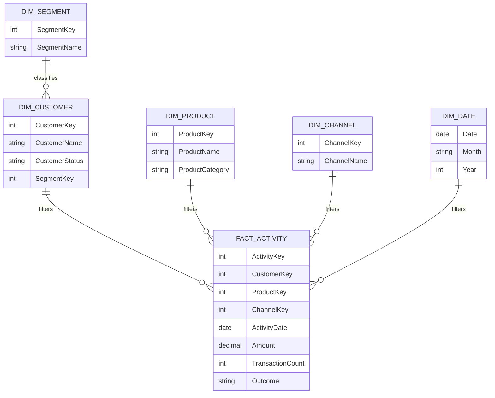
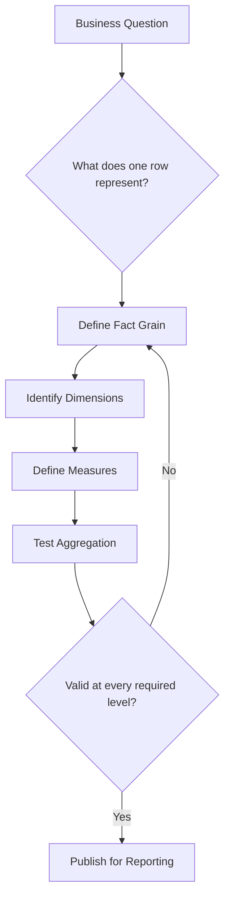
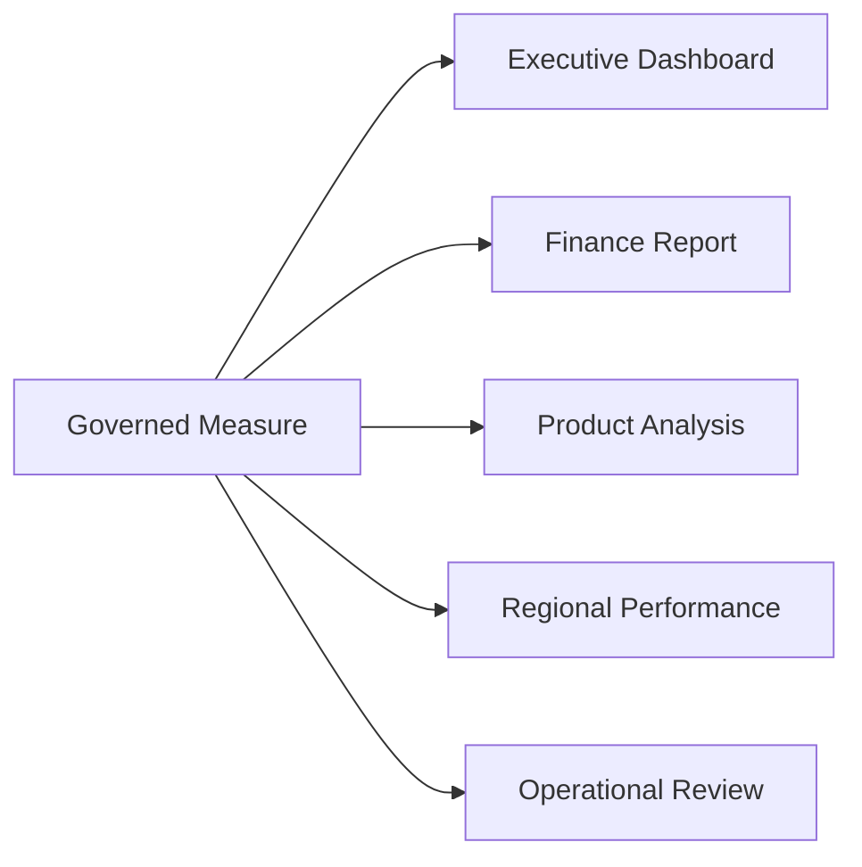
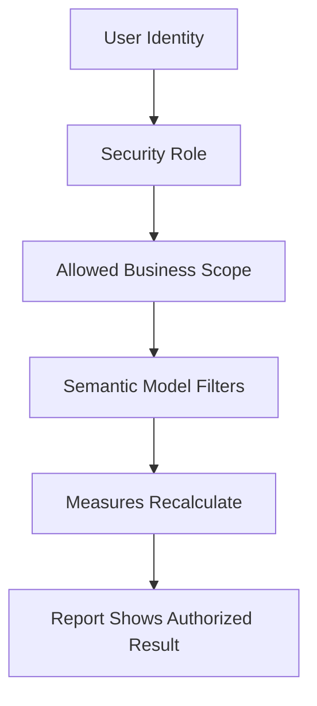

# The Power BI Semantic Model from a Business Perspective

| Article Metadata | Details |
|---|---|
| **Article Level** | Intermediate |
| **Publication Date and Time** | 7 August 2026, 12:57 AM — Arabia Standard Time |
| **Article Category** | Business Intelligence; Power BI; Data Governance; Decision Support |
| **Target Audience** | Business leaders, product managers, operations managers, finance professionals, business analysts, data analysts, Power BI developers, and governance teams |
| **Article Type** | Fictionalized professional case study with practical technical guidance |
| **Estimated Reading Time** | 11–13 minutes |
| **Primary Business Domain** | Enterprise reporting, operational analytics, and management decision support |
| **Tools and Technologies** | Power BI, DAX, Power Query, star-schema modeling, governed business definitions, and row-level security |
| **Author** | Ahmed Mohamed Safwat — Digital Corporate Platform Manager | Product Manager | Banking Analytics and Transformation |
| **Article Version** | 1.0 — Publication Edition |
| **Privacy Note** | The organization, people, systems, figures, and events in this article are entirely fictional. They were created only to explain the analytical concepts and are not based on the author’s employer, colleagues, clients, systems, or actual projects. |

## Article Summary

A Power BI semantic model is often described through tables, relationships, and DAX. That description is technically correct, but it misses its most important role. From a business perspective, the semantic model is the controlled layer where raw data becomes agreed meaning. This article follows a fictional financial-services company whose management team received three different answers to one simple question: “How many active customers do we have?” The problem was not a missing chart. It was the absence of shared definitions, governed measures, consistent analytical dimensions, and clear ownership. The lesson is simple: a strong semantic model is not merely built for reports; it is built for decisions.


---

## Three Reports, One Question, Three Answers

At a fictional regional financial-services company, the monthly performance meeting began with a simple question.

“How many active customers do we currently have?”

The sales dashboard showed **184,000**.

The operations dashboard showed **171,500**.

The finance report showed **163,200**.

All three reports came from Power BI. All three refreshed successfully. None displayed an error.

Think with me for a moment. Which number was correct?

The sales team counted every customer who had signed a contract and had not formally closed the relationship.

Operations counted customers who had used at least one service during the previous ninety days.

Finance counted customers who generated recognized revenue during the current reporting period.

The problem was not that one team had built a bad visual.

Each team had answered a different business question while using the same label: **Active Customers**.

The meeting stopped being a performance review and became a debate about definitions.

That was the turning point.

The company did not need another report.

It needed a semantic model that could distinguish between contracted customers, operationally active customers, and revenue-generating customers—and name each measure honestly.

## The Model Is Not the Report

A report is what the user sees.

A semantic model is what makes the report mean something.

Microsoft describes a Power BI semantic model as data prepared for reporting and visualization. In Microsoft Fabric guidance, a semantic model is also described as a logical representation of an analytical domain containing metrics, business-friendly terminology, and structures that support analysis. Those definitions are useful because they move the conversation beyond a collection of imported tables. The official references are Microsoft Learn’s [Semantic models in the Power BI service](https://learn.microsoft.com/en-us/power-bi/connect-data/service-datasets-understand) and [Power BI semantic models in Microsoft Fabric](https://learn.microsoft.com/en-us/fabric/data-warehouse/semantic-models).

From a business perspective, a semantic model should answer several questions before anyone selects a chart:

What does each measure mean?

At what level of detail is it calculated?

Which dimensions can be used to analyze it?

Which date controls the result?

Who is allowed to see it?

Which business rules are applied?

Who owns the definition?

How can the result be reconciled?

The semantic model is therefore not simply a technical asset. It is a **business agreement expressed through data structures and calculations**.

## Think About the Word “Semantic”

The word *semantic* relates to meaning.

That is exactly what the model should provide.

A source system might contain fields such as:

```text
CUST_STAT
LAST_TXN_DT
REL_START_DT
REV_AMT
SEG_CD
CHANNEL_ID
```

These fields may be technically valid, yet they are not automatically suitable for management use.

A business reader expects concepts such as:

```text
Customer Status
Last Activity Date
Relationship Start Date
Recognized Revenue
Customer Segment
Service Channel
```

The difference is not cosmetic.

The model must translate technical storage into business language while preserving the rules behind it.

Now pause here. Renaming a column is not enough.

If `CUST_STAT = A` means “active in the source system,” the business still needs to understand whether that status represents a valid contract, recent service use, revenue generation, or simply a record that has not been closed.

A good semantic model does not hide ambiguity behind a friendly label. It resolves the ambiguity—or exposes it clearly.

## The Business Contract Inside the Model

The fictional company created a short definition record for every important KPI.

For each measure, the record stated its business purpose, grain, calculation rule, date basis, exclusions, owner, security treatment, and validation method.

| Definition element | Example |
|---|---|
| **Measure name** | Operationally Active Customers |
| **Business purpose** | Show customers who used at least one eligible service recently |
| **Grain** | Distinct customer |
| **Activity window** | Previous 90 days from the selected reporting date |
| **Included activity** | Approved financial and service transactions |
| **Excluded activity** | Test activity, reversals, and internal accounts |
| **Date basis** | Transaction completion date |
| **Business owner** | Head of Customer Operations |
| **Validation** | Reconciled with approved operational totals |
| **Display rule** | Whole number with prior-period change |

This is where the semantic model becomes a business contract.

The DAX measure is only one implementation of that contract.

By the way, this is strongly connected to the PL-300 skill area around designing and managing a semantic model. Microsoft’s official training module, [Configure a semantic model in Power BI](https://learn.microsoft.com/en-us/training/modules/configure-semantic-model-power-bi/), covers relationships, model properties, hierarchies, and measures. The business lesson is that those technical objects should express agreed analytical meaning rather than exist only because the tool supports them.

## From Business Questions to Model Structure

The company began with management questions rather than source tables.

The questions included:

How much revenue did we recognize?

Which customers used our services?

Which channels handled the activity?

Which products are growing or declining?

Where are service failures concentrated?

How does performance compare with target?

Those questions revealed two different types of information.

The first type described **business events**: transactions, service requests, revenue entries, and customer interactions.

The second type described the context around those events: customer, product, channel, date, segment, region, and status.

That separation naturally led to a star-schema design.

Microsoft recommends star-schema principles for Power BI semantic models because fact tables and dimension tables serve different purposes and support models optimized for usability and performance. The official guidance is [Understand star schema and the importance for Power BI](https://learn.microsoft.com/en-us/power-bi/guidance/star-schema).



This diagram shows a business-event table surrounded by descriptive dimensions. The structure allows the same governed measures to be analyzed consistently by customer, product, channel, date, and segment.

The star schema is not valuable merely because it looks tidy.

It is valuable because the model begins to mirror how the business asks questions.

## Grain Comes Before Calculation

One of the most important business decisions in a semantic model is the grain.

The grain describes what one row in a fact table represents.

It might be one transaction, one customer per day, one service request, one payroll file, one monthly account balance, or one product target by period.

If the grain is unclear, measures can appear correct at one level and fail at another.

The fictional company originally combined detailed transactions and monthly targets in one wide table.

The transaction rows were daily and customer-level.

The targets were monthly and segment-level.

When users filtered by customer, the target values repeated across many transaction rows and became overstated.

The visible problem was an incorrect target chart.

The deeper problem was mixed grain.

The team separated actual activity and target planning into different fact tables, each connected to shared dimensions at the level where comparison was valid.



The diagram shows why grain must be decided before measures and visuals. When aggregation fails at a required business level, the model design should be revisited rather than corrected with increasingly complex visual logic.

## Measures Should Carry Business Meaning

A raw column is not always a business measure.

Consider revenue.

The source might contain gross amount, discount amount, tax amount, reversal amount, recognized amount, and settlement amount.

Which one should appear as “Revenue”?

The answer depends on the reporting purpose.

A financial report may require recognized revenue.

A commercial report may focus on gross billed value.

An operational report may need settled value.

The semantic model should not force users to choose among technical amount columns every time they build a visual.

Instead, it should provide governed measures with clear names and definitions.

```DAX
M_Recognized Revenue =
CALCULATE (
    SUM ( FactFinancialActivity[RecognizedAmount] ),
    KEEPFILTERS ( DimEntryStatus[IncludeInRevenue] = TRUE () )
)
```

This measure sums recognized amounts only for entries that the business has approved for revenue reporting. The technical calculation is short, but its reliability depends on the `IncludeInRevenue` rule being governed, tested, and owned. A different organization may need additional logic for reversals, timing, currency conversion, or accounting periods.

The measure is not valuable because DAX can sum a column.

It is valuable because the business no longer has to redefine revenue inside every report.

## One Measure, Many Reports

A strong semantic model allows multiple reports to reuse the same business logic.

The finance report can use `M_Recognized Revenue`.

The executive dashboard can use it.

The product-performance view can use it.

The regional analysis can use it.

The definition remains stable while the visual context changes.



The important point is not that every report looks the same. It is that the same business question receives the same answer when the filters and reporting period are the same.

This reuse reduces definition drift.

It also makes disagreement easier to diagnose. When two reports use the same semantic model and measure but show different values, the investigation can focus on filters, dates, security, or visual context rather than competing calculation logic.

## Relationships Are Business Paths

Relationships are often treated as technical lines between tables.

From a business perspective, they define how context travels.

When a user selects a customer segment, which activity should be filtered?

When a user selects a month, which date should control revenue?

When a product belongs to more than one reporting hierarchy, which route should be used?

Microsoft’s guidance on [Model relationships in Power BI Desktop](https://learn.microsoft.com/en-us/power-bi/transform-model/desktop-relationships-understand) explains that relationships propagate filters and that cardinality, active status, and cross-filter direction affect model behavior.

Think about it from the manager’s side.

The manager does not care whether the relationship is represented by `1:*`.

The manager cares that selecting “Enterprise Customers” returns enterprise activity—completely, accurately, and without duplication.

That is why relationship design should be tested using business questions, not only technical model validation.

A relationship can be technically valid and still express the wrong analytical path.

## Dates Are Business Definitions Too

Many business events contain more than one date.

A service request may have created, assigned, resolved, and closed dates.

A transaction may have initiated, authorized, value, and settlement dates.

A customer relationship may have application, approval, activation, and first-use dates.

If the semantic model contains a single generic field called `Date`, users may believe they are analyzing one concept while the model applies another.

The fictional company created separate measures for different date meanings and documented the active reporting date for each KPI.

This may look like a small modeling detail, but it changes the business conclusion.

A service team measuring resolution performance should not accidentally group cases by creation date.

A finance team reviewing recognized revenue should not unknowingly use transaction initiation date.

The semantic model must make the intended date visible through names, relationships, measure definitions, and report guidance.

## Security Is Part of Meaning

A measure can be correct and still be inappropriate for every user.

Regional managers may be allowed to view only their own customers.

Product owners may see activity for their product portfolio.

Executives may see the full organization.

Power BI row-level security filters table rows for the current user, but Microsoft notes that RLS does not restrict access to model objects such as tables, columns, or measures. The official design guidance is [Row-level security guidance in Power BI Desktop](https://learn.microsoft.com/en-us/power-bi/guidance/rls-guidance).

This matters from a business perspective because security should be designed around data-entitlement rules, not visual hiding.

Hiding a page does not secure the data.

Removing a column from one report does not guarantee that another report cannot use it.

The model should express who may see which rows, while workspace, semantic-model, and report permissions govern who may connect, build, share, and administer.



The diagram shows that the user does not receive a prewritten number. The security scope filters the model, and the measures recalculate within that authorized context.

## Friendly Names Are Not Enough

The fictional company initially believed that a business-friendly model meant replacing technical names.

`CUST_ID` became `Customer ID`.

`TRX_AMT` became `Transaction Amount`.

That improved readability, but the model remained difficult to use.

There were still multiple customer-status fields.

There were several amount columns with unclear purposes.

Users could see technical keys they did not need.

Measures were mixed with raw numeric columns.

The model eventually applied a broader business-consumption design.

Technical keys were hidden from report authors.

Columns were grouped into understandable display folders.

Default summarization was disabled where sums made no sense.

Descriptions explained important fields and measures.

Hierarchies supported common navigation paths.

Measures used consistent naming.

Deprecated objects were removed or clearly marked.

The model became easier not because it contained more metadata, but because it reduced unnecessary choices.

## A Semantic Model Needs Ownership

The company solved the initial “active customer” disagreement by defining three different measures:

```text
Contracted Customers
Operationally Active Customers
Revenue-Generating Customers
```

That resolved the immediate confusion.

But definitions can change.

The activity window might move from ninety days to sixty.

A new product may count as eligible activity.

A regulatory requirement may change which customer records can be included.

A business segment may be reorganized.

Without ownership, the semantic model slowly becomes outdated while remaining technically operational.

The company therefore assigned a business owner to each priority measure and a technical owner to the model implementation.

The business owner approved meaning.

The technical owner implemented and tested the rule.

Governance reviewed changes that affected shared reporting.

This is where the model becomes sustainable.

By the way, this reflects a practical product-management principle: a shared analytical asset needs a clear purpose, accountable ownership, and controlled evolution. The semantic model is not finished when it is published. It must continue to represent the business as the business changes.

## What Management Should Ask Before Approving a Model

A business review of a semantic model does not require management to inspect every relationship or DAX expression.

It requires the right questions.

Can the model explain every priority KPI in plain business language?

Do two people using the same measure and filters receive the same answer?

Is the grain of each fact clear?

Are dates named according to their business meaning?

Can actuals be compared with targets without duplication?

Are security rules based on approved entitlements?

Can each important number be reconciled with a trusted source?

Does every shared KPI have an owner?

Are report authors guided toward governed measures rather than raw columns?

Does the model support future reports without recreating the same logic?

These questions move model approval from “Does it refresh?” to “Can the business trust and reuse it?”

## The Model Changed the Meeting

One month later, the fictional management team returned to the customer-performance review.

This time, the dashboard did not show a generic “Active Customers” card.

It showed three measures:

```text
Contracted Customers: 184,000
Operationally Active Customers: 171,500
Revenue-Generating Customers: 163,200
```

Each measure included a description and an owner.

The management conversation changed immediately.

The numbers were no longer competing answers.

They were three views of the customer relationship.

The gap between contracted and operationally active customers became an adoption question.

The gap between operationally active and revenue-generating customers became a commercial and service-use question.

The semantic model did not remove complexity.

It organized complexity into meaningful concepts.

That is a much more valuable outcome.

## What a Semantic Model Does Not Solve

A semantic model cannot correct poor source data by definition alone.

It cannot create ownership where the organization refuses to assign it.

It cannot resolve policy disagreements without business decisions.

It cannot guarantee that every report author will choose the correct measure.

It cannot replace reconciliation, testing, documentation, or training.

It also cannot prove that a KPI is useful merely because it is consistently calculated.

Consistency is essential, but the business must still ask whether the measure supports a real decision.

The model creates a reliable analytical language.

The organization still has to use that language responsibly.

## The Practical Lessons

A semantic model should begin with business questions, not imported tables.

Grain must be defined before measures are trusted.

Facts represent business events or observations. Dimensions provide the context used to analyze them.

A measure should express a governed business rule, not merely summarize an available column.

Relationships define how business context reaches facts.

Dates must be named and modeled according to their actual meaning.

Security belongs in the model and permission design, not in visual concealment.

Shared measures need business owners as well as technical owners.

And perhaps the most important lesson: a model becomes business-friendly when it reduces ambiguity, not when it merely replaces technical names.

## Where Data Becomes a Decision

The phrase *semantic model* may sound technical.

Its purpose is deeply practical.

It gives the organization a shared language for customers, revenue, activity, risk, service, targets, and performance.

It places that language inside reusable relationships and measures.

It protects the meaning through security, ownership, and validation.

Then reports can focus on communication rather than rebuilding definitions.

Think about one important KPI in your organization.

Can two teams explain it in exactly the same way?

Can they identify its grain, date basis, exclusions, owner, and source?

Can they reuse the same calculation across reports?

If not, the organization may have several dashboards, but it does not yet have one analytical language.

> **A Power BI semantic model becomes valuable when it stops being a technical container for data and starts becoming the business’s trusted contract for meaning.**
