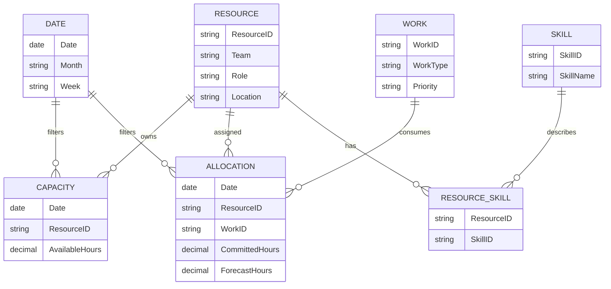

# Capacity Without Guesswork: A Standard Dashboard for Resource and Capacity Management

| Metadata | Details |
|---|---|
| **Article Level** | Intermediate |
| **Publication Date** | 30 January 2026, 9:18 PM |
| **Article Category** | Resource Analytics, Capacity Planning, and Management Reporting |
| **Target Audience** | Managers, project managers, PMO professionals, resource managers, product managers, service managers, Scrum Masters, business analysts, and Power BI professionals |
| **Prepared by** | Ahmed Safwat Gawady |
| **Estimated Reading Time** | 15 minutes |
| **Privacy Note** | The events, organization, characters, figures, and operational situations in this article are based on my experience to help the article deliver its value and are created only to explain the analytical concepts. They are not based on the author’s employer, colleagues, customers, systems, or actual projects. |

## Summary

Resource and capacity discussions often begin with a simple question: “Do we have enough people?” The answer becomes unreliable when headcount, availability, skills, committed work, operational workload, leave, and future demand are mixed into one utilization percentage. This article develops a standard management dashboard that separates capacity from demand and shows where the real constraint exists by time, team, role, and skill. It explains the minimum data model, practical measures, Power BI calculations, visual design, thresholds, and governance required for an intermediate implementation. It also connects the model to PMI resource planning, ITIL monitoring, and Scrum’s focus on transparency and sustainable self-management.

## The Team Looked Fully Available

One of my situations started with a resource question that sounded easy.

A manager asked:

> “Can this team take one more initiative next month?”

The first answer was yes.

The team had enough people on paper. The overall workload percentage looked acceptable. No major leave was visible in the summary.

Then we looked one level deeper.

The initiative required a specific skill.

Only two people had that skill, and both were already heavily committed during the same period.

At the total-team level, capacity looked healthy.

At the skill level, capacity was already exhausted.

That is the main reason resource dashboards can mislead managers: **capacity is not only a headcount problem**.

It is a time, skill, availability, and demand problem.

## Capacity and Demand Need Separate Definitions

Before building the dashboard, define the terms.

**Gross capacity** is the theoretical working time available before deductions.

**Available capacity** is the time realistically available for the type of work being planned after agreed deductions such as leave, training, operational commitments, or protected activities.

**Demand** is the work expected to consume that capacity.

**Committed demand** is demand already assigned or approved.

**Forecast demand** is anticipated work that may require capacity later.

**Capacity gap** is the difference between available capacity and demand for the same period and resource grain.

PMI material on capacity management describes resource planning as matching supply with demand and emphasizes understanding resource requirements, operational commitments, and future project needs. [PMI: Work Delivery Process — Project Portfolio Management](https://www.pmi.org/learning/library/work-delivery-process-project-portfolio-management-6680)

The basic relationship is simple:

$$
\text{Capacity Gap} = \text{Available Capacity} - \text{Committed Demand}
$$

If available capacity is 160 hours and committed demand is 144 hours:

$$
\text{Capacity Gap} = 160 - 144 = 16\text{ hours}
$$

A positive value indicates remaining capacity under the selected assumptions. A negative value indicates overload.

The calculation is simple. The difficult part is ensuring that both sides of the equation describe the same period, resource group, skill, and type of work.

## Do Not Start with Utilization Alone

Utilization is useful, but it is easy to misuse.

A basic utilization measure is:

$$
\text{Utilization Rate} =
\frac{\text{Committed Hours}}{\text{Available Capacity Hours}}
\times 100
$$

If committed work is 144 hours and available capacity is 160 hours:

$$
\text{Utilization Rate} = \frac{144}{160} \times 100 = 90\%
$$

That does not automatically mean the team is in a perfect position.

Maybe the remaining 10% is needed for unexpected work.

Maybe the committed hours are concentrated in the first two weeks.

Maybe one specialist is overloaded while others have spare capacity.

Maybe operational work is missing from the denominator.

Maybe 160 hours is gross capacity, not realistic available capacity.

Think about it. A precise percentage built on a weak definition only gives us precise confusion.

## The Standard Dashboard Should Answer Five Questions

A useful management dashboard does not need dozens of visuals.

It should answer a small set of questions consistently:

> How much capacity is actually available?

> How much work is already committed?

> Where is demand higher than capacity?

> Which skills or roles create the constraint?

> How does the position change over the next periods?

Microsoft’s Power BI guidance recommends designing dashboards around the audience’s decisions, keeping the overview uncluttered, and emphasizing the most important information. [Microsoft Learn: Tips for designing a great Power BI dashboard](https://learn.microsoft.com/en-us/power-bi/create-reports/service-dashboards-design-tips)

For this use case, that usually means a small scorecard at the top, a capacity-versus-demand trend, a team or skill comparison, and an exception table.

## A Practical Dashboard Layout

A standard first page could contain:

| Area | Suggested content |
|---|---|
| **Top cards** | Available capacity, committed hours, utilization, capacity gap, overloaded resources |
| **Trend** | Capacity versus demand by week or month |
| **Skill view** | Available versus committed hours by role or skill |
| **Resource view** | Utilization distribution by team or resource pool |
| **Exception table** | Overloaded resources, missing capacity records, unassigned demand, or large forecast gaps |
| **Filters** | Period, team, role, skill, location, work type |

The purpose is not to create a scheduling system inside the dashboard.

The purpose is to make constraints visible early enough for managers to make resourcing decisions.

## Averages Can Hide the Constraint

Let’s assume two resource groups.

| Group | Available Capacity | Committed Demand | Utilization |
|---|---:|---:|---:|
| General team | 420 hours | 390 hours | 92.9% |
| Specialist team | 120 hours | 138 hours | 115.0% |
| **Total** | **540 hours** | **528 hours** | **97.8%** |

At the total level, the organization appears to have 12 hours of spare capacity.

But the specialist group is overloaded by 18 hours.

The spare time in the general team cannot automatically solve the problem if the work requires specialist capability.

This is why capacity must be analyzed at the grain where substitution is realistic.

If people are interchangeable, aggregation may be reasonable.

If the work requires a specific skill, certification, location, access level, language, or role, the dashboard should preserve that dimension.

## Build the Model Around Time, Resource, Skill, and Work

A Power BI implementation becomes easier when the data model separates descriptive dimensions from measurable events.

Microsoft’s Power BI star-schema guidance recommends classifying tables as facts and dimensions so models are easier to use and can perform well. Dimension tables describe business entities; fact tables store observations or events. [Microsoft Learn: Understand star schema and the importance for Power BI](https://learn.microsoft.com/en-us/power-bi/guidance/star-schema)

A simple model can look like this:



This model separates the **supply side** from the **demand side**.

That separation is important because capacity and allocation often come from different processes and may update at different times.

## Start with a Few Governed Measures

The business problem is to compare available working capacity with committed demand under the current report filters. The inputs are available-capacity hours and allocated work hours. The output is a small set of measures managers can use consistently across cards, trends, and exception tables.

```DAX
Available Capacity Hours :=
SUM(Capacity[AvailableHours])

Committed Hours :=
SUM(Allocation[CommittedHours])

Capacity Gap Hours :=
[Available Capacity Hours] - [Committed Hours]

Utilization Rate :=
DIVIDE(
    [Committed Hours],
    [Available Capacity Hours]
)

Overload Hours :=
MAX(
    0,
    [Committed Hours] - [Available Capacity Hours]
)
```

These measures remain intentionally simple. `Available Capacity Hours` and `Committed Hours` aggregate the two sides of the planning equation. `Capacity Gap Hours` preserves the absolute difference. `Utilization Rate` shows proportional demand and uses `DIVIDE` so a zero denominator does not produce an uncontrolled division error. Microsoft documents `DIVIDE` as a DAX function that returns an alternate result or `BLANK()` when dividing by zero. [Microsoft Learn: DIVIDE function](https://learn.microsoft.com/en-us/dax/divide-function-dax)

The key assumption is that the data model filters capacity and allocation consistently by the same period and resource dimensions. If the allocation table contains monthly records while capacity is daily, the totals may still calculate but the comparison can be misleading unless the grains are reconciled.

The limitation is also important: utilization is not productivity, quality, value, or employee performance. It is a capacity-consumption measure under a set of planning assumptions.

## Add Forecast Without Mixing It with Commitment

Committed work and forecast work should not be presented as the same certainty level.

A useful dashboard may show three layers:

**Committed demand** — approved or assigned work.

**Likely demand** — work with a high probability of starting.

**Pipeline demand** — work being considered but not yet committed.

If these are all added together without distinction, management may overreact to uncertain demand.

If forecast work is ignored entirely, future shortages may remain invisible until commitments are already made.

One approach is to show a forecast scenario separately rather than adding it into the primary utilization card.

For example:

$$
\text{Forecast Gap} = \text{Available Capacity} - (\text{Committed Demand} + \text{Weighted Forecast Demand})
$$

The weighting method must be governed. A 50% probability applied to forecast hours is a planning assumption, not a measured fact.

## Capacity Is Different from Availability

A resource may exist in the organization but not be available for a specific period.

Leave, training, operational support, regulatory duties, maintenance windows, on-call responsibilities, and other work can reduce usable capacity.

This is why headcount is a weak denominator for capacity planning.

A team of ten people does not automatically provide ten full-time equivalents of project capacity.

A stronger model starts from working time and applies agreed deductions.

For example:

$$
\text{Available Capacity} =
\text{Gross Working Hours}
- \text{Leave}
- \text{Training}
- \text{BAU Reserve}
- \text{Other Protected Time}
$$

Each deduction should have a business definition and source.

Do not hide these assumptions inside a calculation nobody can explain.

## Show Distribution, Not Only the Average

Two teams can have the same average utilization and very different risk.

Team A may have everyone between 75% and 90%.

Team B may have half the team at 55% and the other half above 110%.

The average can be identical.

The management response should not be.

A useful dashboard therefore shows the distribution of resource load or at least counts resources in governed bands such as available, balanced, high, and overloaded.

The thresholds should reflect the organization’s planning model. They should not be copied from a generic “80% good, 100% bad” template.

## Resource Utilization Should Support Decisions

PMI has published examples of resource-management reporting where managers receive regular information on resource utilization, planned versus actual work, missed activities, and project status to support action on problems and trends. [PMI: Improving project delivery and resource utilization](https://www.pmi.org/learning/library/2019/04/07/15/10/improving-project-delivery-resource-utilization-3732)

The practical connection is important.

A capacity dashboard should lead to decisions such as:

- rebalance work;
- move a milestone;
- acquire or contract capability;
- train or cross-skill people;
- reduce lower-priority demand;
- protect operational capacity; or
- challenge an unrealistic commitment.

If the dashboard only shows percentages but does not help a manager choose among these actions, it is not yet decision-ready.

## ITIL Adds the Service Context

Resource planning is not limited to project work.

Service teams need capacity for incidents, requests, monitoring, maintenance, improvements, and unexpected demand.

PeopleCert describes ITIL Monitoring and Event Management as systematically observing services and service components, reporting selected changes of state, and responding to events. [PeopleCert: ITIL 4 Practitioner — Monitoring and Event Management](https://www.peoplecert.org/browse-certifications/it-governance-and-service-management/ITIL-1/itil4-practices-monitoring-and-event-management-3686)

That service perspective is useful because it reminds us to preserve operational capacity.

A team planned at 100% against project work may have no room to absorb service events.

The dashboard should therefore distinguish planned project demand from operational or BAU commitments when that distinction matters.

## Scrum Adds a Warning About Turning Capacity into Control

Scrum Teams are self-managing. The Scrum Guide states that team members internally decide who does what, when, and how, and that Scrum relies on transparency, inspection, and adaptation. [The 2020 Scrum Guide](https://scrumguides.org/scrum-guide.html)

A resource dashboard should not undermine that accountability by assigning every hour from outside the team.

For Scrum environments, capacity data is better used to expose constraints, dependencies, and likely load than to replace Sprint Planning or the team’s own decisions about how to accomplish the work.

This also connects to PSM I and PSM II. Scrum.org positions PSM I as fundamental Scrum mastery and PSM II as advanced Scrum mastery and understanding of Scrum Master accountabilities and Scrum Team functioning. [Scrum.org: Professional Scrum Certifications](https://www.scrum.org/professional-scrum-certifications)

The mature management question is not “How do I maximize every person to 100%?”

It is:

> “How do I create enough capacity transparency to make good commitments without reducing people to utilization cells?”


## What Improved, and What Stayed Difficult

Returning to the situation, the main improvement came from changing the grain of the analysis.

We stopped asking only whether the team had enough total hours.

We compared supply and demand by period, role, and skill. We separated committed work from forecast demand. We made leave and operational deductions visible. We showed absolute gap alongside utilization.

The management decision became clearer because the specialist shortage was visible before another commitment was accepted.

Several limitations remained.

Skill data could become outdated. Forecast demand was uncertain. People were not perfectly interchangeable even inside the same skill category. Some work estimates were weak. And capacity could change quickly when priorities shifted.

That is why the dashboard needed regular review rather than a one-time calculation.

## The Professional Judgment

Resource and capacity management is not a headcount exercise.

It is the discipline of matching **realistic supply** with **meaningful demand** at the level where work can actually be performed.

From a PMP perspective, good resource information supports planning, monitoring, forecasting, and timely adjustment.

From an ITIL perspective, resource capacity should preserve the ability to operate and respond to service conditions, not only deliver planned change.

From a Scrum and PSM perspective, transparency should improve commitment decisions without turning capacity planning into individual micromanagement.

And from a Power BI perspective, the model should separate dimensions from facts, use governed measures, and make the most important constraint visible quickly.

The practical principle is simple:

> Do not ask only, “How many people do we have?” Ask, “What capacity is actually available, what demand is coming, and where will the first real constraint appear?”
