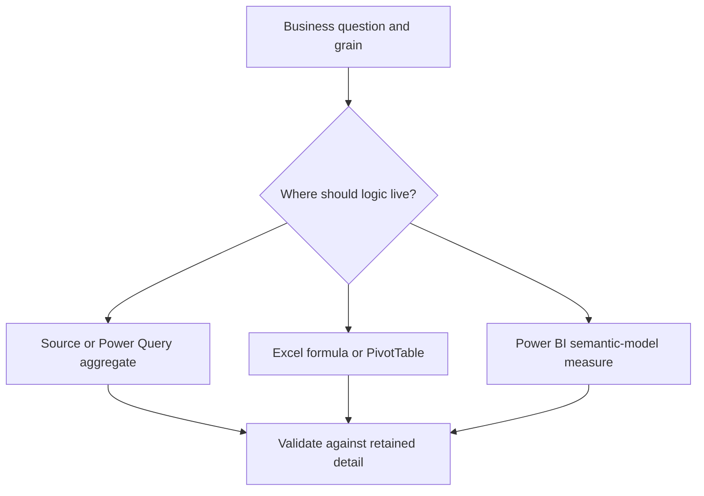

# Same Function, Different Context: Understanding Data Aggregation in Excel and Power BI

| Metadata | Details |
|---|---|
| **Article Level** | Intermediate |
| **Publication Date** | 13 March 2026, 07:10 PM |
| **Article Category** | Data Aggregation, Excel, and Power BI |
| **Target Audience** | Managers, project and service managers, Scrum Masters, business analysts, Excel users, and Power BI professionals |
| **Prepared by** | Ahmed Safwat Gawady |
| **Estimated Reading Time** | 13 minutes |
| **Privacy Note** | The events, organization, characters, figures, and operational situations in this article are based on my experience to help the article deliver its value and are created only to explain the analytical concepts. They do not reproduce my employer, colleagues, customers, systems, or actual projects. |

## Summary

Excel and Power BI can both calculate sums, counts, averages, minimums, and maximums. Yet identical function names do not guarantee identical business answers. Excel formulas usually work with explicit cells, ranges, tables, or PivotTable layouts. Power BI measures work over a relational model and are reevaluated under filter context. This article follows an experience-inspired reconciliation problem where both tools appeared correct but summarized different populations. It compares their aggregation models, demonstrates equivalent Excel and DAX calculations, explains weighted averages and non-additive totals, and provides a practical discipline for selecting the right tool and validating the result.


## Two Correct Totals That Did Not Match

One of my situations started with a familiar reconciliation question.

An Excel workbook showed one total. A Power BI card showed another. Both files were using the same extract, and both calculations appeared to be simple sums.

The first reaction was predictable:

> “Which tool is wrong?”

That question was too early.

After reviewing the calculation paths, the difference became clearer. The Excel formula referenced a prepared table that already excluded cancelled records. The Power BI measure used the full fact table, while the report page applied a date filter and a channel slicer. One result summarized a physically reduced dataset. The other summarized a larger model under a visible filter context.

Both arithmetic operations were correct.

The populations were different.

Think with me for a moment. If one tool sums 8,000 eligible rows and another sums 8,250 loaded rows before a different set of filters, comparing only the final totals will not reveal the issue. We need to compare the grain, inclusion rules, filters, blank treatment, and aggregation logic.

This is the central principle:

> **Aggregation is not only a function. It is a function applied to a defined population under a defined context.**

## Start with the Business Object, Not the Software

Before choosing `SUM`, `COUNT`, or `AVERAGE`, decide what the report is measuring.

A row can represent one transaction, one case, one message, one status event, one customer, or one daily snapshot. The same dataset can therefore support several valid totals.

Suppose one business case generates three status-history rows. `COUNTROWS` in Power BI or a PivotTable row count in Excel returns three. A distinct count of the case identifier returns one. Neither is universally correct.

The correct aggregation depends on the question:

- **Workload events:** count the three status events.
- **Unique cases:** count the case identifier once.
- **Final outcomes:** identify the governed final record and summarize that population.

The grain should be documented before calculations are compared. Otherwise, the reconciliation becomes a search for formula differences when the real difference is the object being counted.

## Excel Makes the Calculation Boundary Visible

Excel is strong when the analyst needs a transparent, direct calculation over a visible range or structured table.

The source can be reviewed row by row. Criteria can be written explicitly into functions such as `SUMIFS`, `COUNTIFS`, or `AVERAGEIFS`. PivotTables can group and summarize data interactively.

Microsoft defines `SUMIFS` as adding values that meet multiple criteria. [Microsoft Support: SUMIFS function](https://support.microsoft.com/en-us/excel/functions/sumifs-function)

Assume an Excel table named `tblActivity` contains `Amount`, `Status`, and `Month` columns. Cell `H2` contains the reporting month. The business needs the total amount for completed records in that month.

The input is the table plus the explicit status and month criteria. The output is one numeric total.

```excel
=SUMIFS(
    tblActivity[Amount],
    tblActivity[Status], "Completed",
    tblActivity[Month], H2
)
```

The formula sums `Amount` only where `Status` equals **Completed** and `Month` equals the value in `H2`. The business rule is visible inside the formula, which makes targeted reconciliation convenient.

The important assumption is that the table contains the intended population and that `Month` uses a consistent value and data type. The limitation is that the logic is tied to this workbook structure. If another worksheet repeats the rule with different ranges or criteria, the organization can quietly acquire several definitions of “Completed Amount.”

Excel PivotTables provide another path. Microsoft notes that PivotTables support summary functions such as Sum, Count, Average, Min, Max, and Distinct Count, with Distinct Count available when the PivotTable uses the Excel Data Model. [Microsoft Support: Sum values in a PivotTable](https://support.microsoft.com/en-us/excel/sum-values-in-a-pivottable)

This makes Excel capable of much more than isolated cell formulas. Still, the analyst must understand which field is being summarized, which filters are active, how the source table was prepared, and whether the PivotTable cache or query has been refreshed.

## Power BI Makes the Calculation Reusable

Power BI moves the calculation from a worksheet location into a semantic model.

A measure references model tables and columns rather than a fixed display range. When a user selects a month, category, channel, or region, the measure is reevaluated for the resulting filter context.

Microsoft’s DAX guidance describes filter context as one or more filters applied to a calculation that determine its result. It also explains that DAX functions reference complete columns or tables, while filters and relationships determine which rows participate. [Microsoft Learn: DAX basics in Power BI Desktop](https://learn.microsoft.com/en-us/power-bi/transform-model/desktop-quickstart-learn-dax-basics)

Assume `FactActivity` contains the detailed records and is related to governed date and channel dimensions. The report needs the same completed amount used in Excel.

The input is the current report context plus an explicit completed-status condition. The output is a measure that can be reused in cards, charts, tables, and tooltips.

```DAX
Completed Amount :=
CALCULATE(
    SUM(FactActivity[Amount]),
    FactActivity[Status] = "Completed"
)
```

`SUM` adds the visible amount values. `CALCULATE` evaluates that sum under a modified filter context that includes `Status = "Completed"`. Microsoft documents that `CALCULATE` adds or modifies filters when evaluating an expression. [Microsoft Learn: CALCULATE](https://learn.microsoft.com/en-us/dax/calculate-function-dax)

The month is not written inside the measure because it can arrive from the date dimension, a slicer, the visual axis, or another report filter. This reusability is one of the main strengths of the semantic model.

The important assumption is that the relationships propagate filters correctly and that `Amount` is stored at a consistent grain. The limitation is that the formula alone does not reveal every active filter. A correct measure can appear incorrect when a hidden page filter, visual interaction, inactive relationship, or unexpected slicer changes its population.

## Similar Names, Different Calculation Environments

The comparison is not “simple Excel versus advanced Power BI.” Both can perform serious analysis. The difference is how each calculation finds its data and receives context.

| Question | Excel | Power BI |
|---|---|---|
| What does the formula reference? | Cells, ranges, arrays, or structured table columns | Model columns, tables, relationships, and measures |
| Where does context usually come from? | Formula criteria, worksheet filters, PivotTable layout, or prepared data | Visual axes, slicers, report filters, relationships, and DAX filters |
| How is logic reused? | Copying formulas, named formulas, tables, PivotTables, Power Pivot, or templates | Central measures in the semantic model |
| How visible is the population? | Often directly inspectable in the sheet or table | Distributed across the model and current report context |
| What is the common risk? | Range drift, copied logic, stale refreshes, hidden rows, or inconsistent formulas | Incorrect relationships, misunderstood filter context, implicit measures, or hidden interactions |
| Best natural fit | Targeted analysis, reconciliation, flexible working models, and manual review | Governed reusable analytics, interactive reports, shared measures, and scalable slicing |

The strongest operating model often uses both. Excel can support evidence review, exceptions, and detailed reconciliation. Power BI can carry governed measures and repeatable reporting across many analytical views.

## Averages Expose the Difference Quickly

Simple sums are additive. Averages require more care.

Let’s assume two synthetic channels:

| Channel | Volume | Average duration |
|---|---:|---:|
| Digital | 10,000 | 2 minutes |
| Assisted | 100 | 20 minutes |

The simple average of the two displayed averages is:

$$
\frac{2+20}{2}=11\text{ minutes}
$$

That result gives both channels equal weight even though their volumes are very different.

The weighted average is:

$$
\text{Weighted Average}
=
\frac{(10{,}000\times2)+(100\times20)}{10{,}000+100}
\approx2.18\text{ minutes}
$$

The difference is not caused by Excel or Power BI. It is caused by averaging already aggregated values without preserving their weights.

In Excel, if the table contains one row per channel with `Volume` and `AverageDuration`, the weighted result can be calculated as follows.

The input is the channel-level summary table. The output is the volume-weighted duration.

```excel
=SUMPRODUCT(
    tblSummary[Volume],
    tblSummary[AverageDuration]
) / SUM(tblSummary[Volume])
```

Microsoft describes `SUMPRODUCT` as multiplying corresponding array values and then adding the products. [Microsoft Support: SUMPRODUCT function](https://support.microsoft.com/en-us/excel/functions/sumproduct-function)

The formula preserves each channel’s volume when combining its average. Its assumption is that `Volume` and `AverageDuration` refer to the same population and period. Its limitation is that an already rounded channel average can introduce small differences compared with recalculating from detailed records.

In Power BI, the preferred calculation depends on the available grain. If one row represents one completed activity and contains `DurationMinutes`, use `AVERAGE(FactActivity[DurationMinutes])`. The detailed rows already provide the correct weight.

If only a channel-level summary table is available, the model can calculate the weighted result explicitly.

The input is one summary row per channel in the current filter context. The output is the volume-weighted average duration.

```DAX
Weighted Average Duration :=
DIVIDE(
    SUMX(
        ChannelSummary,
        ChannelSummary[Volume]
            * ChannelSummary[AverageDuration]
    ),
    SUM(ChannelSummary[Volume])
)
```

`SUMX` evaluates volume multiplied by average duration for each visible channel and adds the results. `DIVIDE` then divides by total visible volume. The measure adapts to the report context, but it assumes the summary table does not double-count channels and retains the appropriate grain. If detailed records exist, recalculating directly from them is normally clearer and avoids using rounded intermediate averages.

## Totals Are Not Always the Sum of the Visible Rows

Another common reconciliation issue appears in distinct counts.

Suppose one customer uses two channels. A table may count that customer once under Digital and once under Assisted. Adding the visible channel rows produces two. A distinct-customer grand total correctly returns one.

Microsoft explicitly notes that `DISTINCTCOUNT` totals are not additive: the grand total is recalculated over the total context rather than produced by summing the category-level results. [Microsoft Learn: DISTINCTCOUNT](https://learn.microsoft.com/en-us/dax/distinctcount-function-dax)

This behavior can appear in Excel’s Data Model as well as Power BI because both can perform distinct counts over a model. The apparent discrepancy is a property of the measure, not a broken total.

The management question should determine the display:

- If the report asks, “How many channel relationships exist?” adding channel counts may be valid.
- If it asks, “How many unique customers exist?” the distinct grand total is the valid result.

The report title and measure name must make that difference visible.

## Blank, Zero, and Missing Are Different States

Excel and Power BI can also diverge because blank values are handled differently across functions, source types, and visual behaviors.

A blank may mean that the source did not provide a value. Zero may mean that the value was measured and found to be zero. Missing may mean that no eligible row exists at all.

These states should not be converted casually.

For example, replacing a missing duration with zero reduces an average and makes an unmeasured case look instantaneous. Excluding every blank may also be wrong if a blank represents a failed capture that management needs to monitor.

The business rule should state whether a blank is excluded, treated as zero, counted as a data-quality issue, or routed for review. The same rule must then be implemented in both tools.

## Choose the Layer That Owns the Aggregation

Aggregation can happen in several places:



The diagram is not a ranking. It shows that the correct layer depends on the purpose, required flexibility, reuse, performance, and need for detail.

Source-level or Power Query aggregation can reduce data volume, but it can remove detail needed for future questions. Excel formulas and PivotTables are effective for direct investigation and controlled working files. Power BI measures are effective when the same business logic must respond consistently across many filters and visuals.

The risky pattern is to calculate the same KPI independently in all three layers without an agreed owner. Reconciliation then becomes difficult because each layer may use a slightly different rule.

A governed design identifies one authoritative definition and uses other calculations as validation or presentation paths.

## The Professional Frameworks Point to the Same Discipline

From a PMP perspective, aggregation belongs to measurement governance. PMI’s Measurement Performance Domain connects timely and accurate performance information with learning and selecting an appropriate response. [PMI: Project Performance Domains](https://www.pmi.org/-/media/pmi/documents/public/pdf/pmbok-standards/pmi-project-performance-domains.pdf)

That means a project manager should ask what the measure includes, which baseline or period it uses, and whether the aggregation supports the intended action. A total that cannot be traced to its grain and scope is not strong control evidence.

ITIL adds a value-focused service perspective. PeopleCert’s ITIL 4 guidance highlights **Focus on Value**, **Start Where You Are**, and **Optimise and Automate**, while connecting data and feedback with continual improvement. [PeopleCert: ITIL 4 Create, Deliver and Support](https://www.peoplecert.org/browse-certifications/it-governance-and-service-management/ITIL-1/itil-4-specialist-create-deliver-and-support-2693)

The practical lesson is to avoid moving a calculation into Power BI merely because automation is available. First understand the existing Excel logic, confirm the value it supports, and then automate a governed definition.

Scrum contributes empiricism. The Scrum Guide describes teams and stakeholders inspecting results and adjusting what happens next. [The 2020 Scrum Guide](https://scrumguides.org/scrum-guide.html)

For Scrum Master practice at PSM I and PSM II depth, transparency requires more than showing a metric during a review. The team needs a shared understanding of how the metric is aggregated. Inspection becomes weak when one person reads a unique-case count while another assumes it is a sum of events. The Scrum Master can help surface that difference and facilitate adaptation of the measure or working agreement.

## A Reliable Reconciliation Sequence

When Excel and Power BI do not match, I recommend a disciplined comparison.

**Name the business object.** Confirm what one row and one identifier represent.

**Freeze the period.** Use the same explicit start and end dates in both tools.

**Align the population.** Apply the same status, eligibility, channel, and exclusion rules.

**Compare row counts.** Check total rows, distinct business keys, blanks, and duplicates before comparing amounts.

**Match the aggregation.** Confirm whether each result uses sum, count, distinct count, average, weighted average, minimum, maximum, or a custom rule.

**Inspect totals separately.** Determine whether the measure is additive, semi-additive, or non-additive.

**Trace sample records.** Select a few included and excluded identifiers and follow them through both calculation paths.

**Document the authoritative rule.** Record the grain, filters, formula, owner, refresh expectation, and accepted limitations.

This sequence usually resolves the disagreement faster than rewriting formulas immediately.

## What Improved, and What Remained Open

Returning to the situation, the two totals became reconcilable after the population rules were aligned.

The Excel workbook remained useful for detailed validation. The Power BI measure became the reusable reporting definition. A small reconciliation view showed total rows, distinct identifiers, eligible records, excluded statuses, and the final amount in both paths.

The improvement was not that one tool defeated the other. It was that the business rule became explicit and testable.

Some limitations remained. Excel formulas could still be changed outside the governed template. Power BI filters could still be misunderstood. Source corrections could alter historical results. A measure could be mathematically accurate but managerially irrelevant. Weighted averages could still be calculated from rounded summaries when detail was unavailable.

These limitations are why reconciliation is a control, not a one-time technical task.

## The Right Question Is Not “Excel or Power BI?”

Excel and Power BI share many aggregation concepts, but they apply them through different analytical environments.

Excel often makes the range and criteria direct. Power BI makes the measure reusable across a relational model and dynamic filter context. Excel is excellent for controlled exploration and evidence review. Power BI is excellent for governed, interactive, repeatable reporting.

The better question is:

> “What is the business object, which population is eligible, which aggregation expresses the decision correctly, and where should that rule be governed?”

Once those points are clear, the tool comparison becomes much calmer.

The functions may have familiar names. The professional responsibility is to ensure they are summarizing the same truth.
