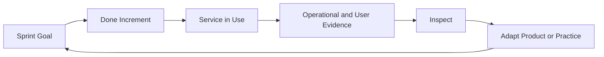

# From Sprint Activity to Service Value: Connecting Scrum Empiricism with ITIL Continual Improvement

| Metadata | Value |
|---|---|
| **Article Level** | Standard |
| **Publication Date** | 09 Jan 2026, 09:35 PM |
| **Article Category** | Agile Delivery, Scrum, Service Management |
| **Target Audience** | Scrum Masters, team leads, service managers, product owners, and managers working with agile teams |
| **Prepared by** | Ahmed Safwat Gawady |
| **Privacy Note** | The events, organization, characters, figures, and operational situations in this article are based on my experience to help the article deliver its value and are created only to explain the analytical concepts. They are not based on the author’s employer, colleagues, customers, systems, or actual projects. |

## Summary

A Scrum Team can complete every event, close many backlog items, and still struggle to improve the service people actually experience. In one of my situations, the delivery view looked healthy while operational complaints kept returning. The gap was not a lack of activity. It was a weak connection between what the team inspected during the Sprint and what the service environment was teaching us after delivery. Scrum gives teams a disciplined empirical loop of transparency, inspection, and adaptation. ITIL brings a continual-improvement view focused on changing business needs, services, and outcomes. Connecting the two helps teams turn Sprint activity into learning that improves real service value.

## The Sprint Looked Healthy

One of my situations looked good on the delivery board.

The Sprint had a clear goal. Work was moving. Several Product Backlog items reached Done. The review had useful discussion, and the retrospective produced an improvement action.

If I looked only at Scrum activity, I had many reasons to feel comfortable.

But the service view told a different story.

A recurring user complaint had appeared again. A support team was still using a manual workaround. A small operational delay had become normal enough that people stopped escalating it.

That created an uncomfortable question: **How can a team be improving Sprint after Sprint while the service around the product still feels the same?**

The answer, in many cases, is that the team is inspecting one system while customers and operations are experiencing another.

## Scrum Gives Us a Learning Loop

The Scrum Guide describes Scrum as founded on empiricism and lean thinking. Its empirical pillars are **transparency, inspection, and adaptation**. Scrum events exist to create regular opportunities for inspection and adaptation, while the Sprint turns ideas into value. The official definition is available in the [2020 Scrum Guide](https://scrumguides.org/scrum-guide.html).

That sounds simple, but the implication is important.

Scrum is not designed to prove that the team stayed busy. It is designed to make reality visible often enough that the team can change direction before assumptions become expensive.

Transparency gives people something meaningful to inspect.

Inspection asks whether the product, progress, and working approach are producing what was expected.

Adaptation changes the product or the way of working when reality shows that the current approach is not enough.

If any part of that loop becomes ceremonial, empiricism becomes weaker.

A Sprint Review without meaningful evidence becomes a presentation. A retrospective without adaptation becomes conversation. A Daily Scrum used only for reporting can become a status ritual rather than an opportunity for Developers to inspect progress toward the Sprint Goal and adapt their plan.

## ITIL Extends the Question Beyond Delivery

ITIL adds a useful perspective because it asks teams to think about products and services as vehicles for value, experience, reliability, and outcomes across a wider lifecycle.

ITIL 4 guidance describes continual improvement as an ongoing effort to align products, services, and practices with changing business needs. Its Foundation guidance also frames service management around value, guiding principles, the four dimensions, and the service value chain. See the official PeopleCert pages for [ITIL 4 Foundation](https://www.peoplecert.org/browse-certifications/it-governance-and-service-management/ITIL-1/itil-4-foundation-2565) and [ITIL 4 Practitioner: Continual Improvement](https://www.peoplecert.org/browse-certifications/it-governance-and-service-management/ITIL-1/itil-4-practitioner-continual-improvement-3871).

This creates a strong connection with Scrum.

Scrum asks: **What did we learn from this Sprint, and what should we adapt?**

Continual improvement asks: **What are we learning about the product, service, practices, and outcomes over time, and what should improve next?**

They are not identical questions, but they reinforce each other.

## The Missing Evidence Was Outside the Sprint Board

Think with me for a moment.

Suppose a Scrum Team delivers an improvement intended to reduce failed user attempts in a digital journey.

The work reaches Done. The Sprint Goal is achieved. The implementation behaves correctly according to the agreed acceptance conditions.

From the Sprint perspective, this can be a valid success.

But what happens after release?

Perhaps the support team reports that users now reach the next step but still abandon the journey. Perhaps operational monitoring shows fewer technical failures but longer completion time. Perhaps users contact the service desk with a different question because the underlying experience is still unclear.

None of that automatically means the Scrum Team failed.

It means new evidence has appeared.

And new evidence is exactly what an empirical system should use.

The important part is the return path. Delivery should create evidence, and evidence should influence what the team considers next.

Without that return path, the organization can become very good at delivering work while remaining slow at learning from outcomes.

## Done Does Not Mean Finished Learning

The Scrum Guide gives the Definition of Done an important purpose: when a Product Backlog item meets the Definition of Done, an Increment is born, and the Definition of Done creates transparency around what is complete. It is a quality commitment, not a declaration that the product or service can no longer improve. See the [Scrum Guide](https://scrumguides.org/scrum-guide.html).

This distinction matters.

“Done” answers a question about the state and quality of the Increment.

It does not answer every question about customer value, operational performance, adoption, reliability, or long-term service behavior.

That evidence often appears only after people use the Increment in a real environment.

So a mature team should be comfortable saying two things at the same time:

> The Increment met our Definition of Done.

> We learned something after release that should influence what we do next.

There is no contradiction there. That is learning.

## Image Placeholder — The Learning Loop Beyond the Sprint

**Purpose:** Illustrate how Scrum delivery evidence and ITIL continual-improvement evidence reinforce each other.

**Image Prompt:** Create a clean professional editorial diagram showing a circular learning loop. On the left, show Sprint Goal, Scrum Team, and Done Increment. On the right, show Service in Use, User Experience, Operations, and Support Evidence. Connect them through Inspect, Learn, and Adapt, with the loop returning to product and service priorities. Keep the visual conceptual, not tied to any real software.

**Aspect Ratio:** 16:9

**Required Labels:** Sprint Goal; Done Increment; Service in Use; Evidence; Inspect; Learn; Adapt; Value

**Style Guidance:** Minimal modern business illustration, white and light gray background, restrained details, clear flow, editorial rather than infographic-heavy.

**Avoid:** Scrum-board screenshots, ITSM tool interfaces, company logos, real incident records, excessive icons, process bureaucracy visual clichés.

**Alt Text:** A circular learning loop connects a Done Increment with service use, evidence, inspection, learning, and adaptation.

**Suggested Caption:** The Sprint can finish while the learning continues.

## The Sprint Review Can Look Further Than the Sprint

The Sprint Review is often one of the best places to reconnect delivery with service evidence.

The Scrum Guide describes it as an event to inspect the outcome of the Sprint and determine future adaptations. The Scrum Team and stakeholders review what was accomplished and what changed in the environment, then collaborate on what to do next. [Scrum Guide](https://scrumguides.org/scrum-guide.html)

That means the discussion does not need to stop at, “Here is what we built.”

A stronger question is, “What has changed since the last time we looked?”

That change may include customer feedback, service levels, adoption patterns, incidents, support demand, operational workload, new regulations, competitor movement, or business priorities.

Not every service metric belongs in the Sprint Review. The point is not to transform Scrum into a service-management meeting.

The point is to bring in the evidence that could materially affect product decisions.

## The Retrospective Improves the Team, but the Evidence Can Be Wider

The Sprint Retrospective focuses on ways to increase quality and effectiveness. The team inspects how the Sprint went with respect to people, interactions, processes, tools, and the Definition of Done, and identifies useful improvements. [Scrum Guide](https://scrumguides.org/scrum-guide.html)

ITIL continual improvement can strengthen that conversation when operational evidence reveals friction in the wider delivery system.

Suppose the team repeatedly loses time because deployment approval is manual and unpredictable.

The immediate problem may appear outside the Scrum Team. But if it repeatedly affects the team’s ability to deliver value, it is worth inspecting the system around the team.

The improvement may require collaboration with another function rather than a local process change.

This is where a Scrum Master can help without becoming the owner of every organizational problem. The role can make impediments visible, encourage the right conversations, and help the organization understand how systemic constraints affect the Scrum Team’s effectiveness.

## Improvement Should Have Evidence

One danger in continual improvement is collecting improvement ideas faster than the organization can test them.

A retrospective can produce five actions. A service review can produce ten more. A customer survey may create another list. Soon the improvement backlog becomes another storage place for good intentions.

I prefer a smaller question: **What change are we making, and what evidence would tell us that it helped?**

For example, if the team changes an approval workflow, the evidence might be reduced waiting time or fewer blocked items.

If the team improves an error message, the evidence might be fewer repeated support contacts for the same confusion.

If a technical change is intended to improve reliability, the evidence should come from the behavior of the service, not only from the fact that the code was deployed successfully.

This does not require a large measurement framework.

It requires a habit of linking an improvement to an observable outcome.

## Do Not Turn Scrum into ITIL, or ITIL into Scrum

The two bodies of guidance serve different purposes.

Scrum is a lightweight framework for generating value through adaptive solutions to complex problems. ITIL 4 provides broader service-management guidance, including continual improvement across products, services, and practices.

Trying to merge them into one giant process would miss the point.

A team does not need to insert service-management gates into every Scrum event. A service organization does not need to rename every improvement cycle a Sprint.

The useful connection is simpler.

Scrum creates a frequent empirical cadence for learning and adaptation around a product.

ITIL encourages the organization to keep learning about the service, its stakeholders, its practices, and its value over time.

When the evidence can flow between those perspectives, both become stronger.

## Where This Approach Has Limits

Not every operational signal should become Product Backlog work.

Some issues belong to infrastructure teams, service operations, vendors, security functions, or organizational governance. Some are transient noise. Some are outside the Product Goal.

Likewise, service metrics can mislead if the team does not understand the denominator, time window, user population, or operational context behind them.

A rise in support contacts may indicate a problem—or it may reflect successful growth in adoption.

That is why inspection requires interpretation, not just data collection.

The purpose is not to flood the Scrum Team with more metrics. It is to bring useful evidence into decisions.

## Final Professional Judgment

A healthy Sprint is valuable, but it is not the final unit of value.

The product eventually lives in a service environment where users, operations, support teams, and business stakeholders experience the consequences of what was delivered.

Scrum gives us a disciplined way to make progress visible, inspect reality, and adapt. ITIL continual-improvement thinking reminds us to keep asking whether the wider product and service system is actually getting better.

The strongest connection between the two is not process.

It is learning.

The Sprint can end. The Increment can be Done. But if new evidence appears tomorrow, the professional response is still the same: make it visible, inspect it carefully, and adapt what should happen next.
