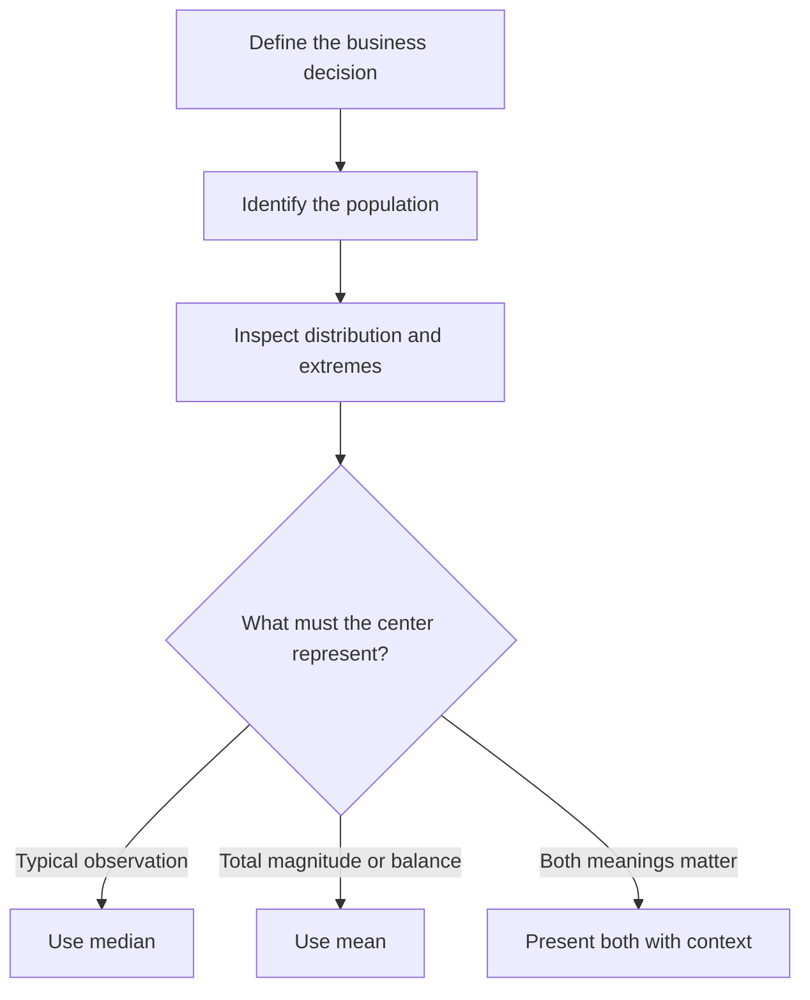

# The Average Is Not Always Typical: Tailoring Mean and Median to Business Decisions

| Metadata                   | Details                                                      |
| -------------------------- | ------------------------------------------------------------ |
| **Article Level**          | Intermediate                                                 |
| **Publication Date**       | 15 May 2026, 08:40 PM                                        |
| **Article Category**       | Business Analytics and Decision Support                      |
| **Target Audience**        | Managers, product managers, project managers, service managers, Scrum Masters, business analysts, and Power BI professionals |
| **Prepared By**            | Ahmed Safwat Gawady                                          |
| **Estimated Reading Time** | 12 minutes                                                   |
| **Privacy Note**           | The events, organization, characters, figures, and operational situations in this article are based on my experience to help the article deliver its value and are created only to explain the analytical concepts. They are not based on the author’s employer, colleagues, customers, systems, or actual projects. |

## Summary

Mean and median are often presented as competing statistical measures, but business decisions rarely need a universal winner. The mean represents the mathematical balance of every value and is useful for totals, capacity, forecasting, and financial impact. The median represents the middle observation and often describes a typical experience more reliably when data is skewed or contains extreme values. This article follows an experience-inspired situation where one average created two conflicting management interpretations. It develops a practical method for selecting, combining, and governing mean and median according to the business question, population, distribution, and action being considered.


## One Average, Two Interpretations

One of my situations started with a service-performance report that appeared straightforward.

A card on the report showed:

> **Average processing time: 23 minutes**

The number generated concern. The expected processing time was much lower, so the first interpretation was that customers were generally waiting more than twenty minutes.

The proposed response was immediate: add operational capacity.

Before discussing the action, I looked at the detailed observations. Most cases had been completed in around ten to fifteen minutes. A small number had taken much longer, including one exceptional case that remained open for nearly two hours.

The average was correct.

The interpretation was not.

The measure described the mathematical effect of every processing minute, including the extreme case. It did not describe what the middle customer had experienced.

When we calculated the median, the result was 11 minutes.

Now we had two numbers:

- Mean processing time: approximately 23 minutes
- Median processing time: 11 minutes

Neither was false. Each revealed a different operational truth.

The median suggested that the typical case was being completed near the expected range. The mean showed that a few prolonged cases were consuming substantial time and lifting the overall workload.

The decision was no longer simply “add more people.” It became:

> Why are a small number of cases remaining open for so long, and can we prevent those cases from accumulating exceptional delay?

That was a better business question.

## Mean and Median Are Not Rivals

The mean and median are both measures of location, sometimes called measures of central tendency. They attempt to describe where the center of a set of values lies, but they define that center differently.

For values $x_1, x_2, \ldots, x_n$, the arithmetic mean is:

$$
\bar{x}=\frac{\sum_{i=1}^{n}x_i}{n}
$$

Every observation contributes its full magnitude to the result.

The median is the middle observation after the values have been sorted. When the dataset contains an even number of observations, the conventional median is the mean of the two middle values.

The distinction is important because the mean responds to the magnitude of every value, while the median depends primarily on order and position.

The NIST/SEMATECH Engineering Statistics Handbook explains that the mean and median are similar for well-behaved symmetric distributions. In skewed distributions, however, the mean is pulled toward the longer tail. NIST also notes that extreme tail values can distort the mean, while the median remains useful because it is based on ranks. [NIST: Measures of Location](https://www.itl.nist.gov/div898/handbook/eda/section3/eda351.htm)

This does not make the median automatically better. It makes the business question more important.

## Think About What “Typical” Means

Let’s assume nine synthetic processing times, measured in minutes:

$$
8,\ 9,\ 10,\ 10,\ 11,\ 12,\ 13,\ 15,\ 120
$$

The median is the fifth ordered value:

$$
\text{Median}=11\text{ minutes}
$$

The mean is:

$$
\begin{aligned}
\text{Mean}
&=\frac{8+9+10+10+11+12+13+15+120}{9} \\
&=\frac{208}{9} \\
&\approx 23.1\text{ minutes}
\end{aligned}
$$

If a manager asks, “What did a typical case experience?” the median of 11 minutes is usually more representative of the center of this dataset.

If the manager asks, “How many processing minutes must the operation absorb on average per case?” the mean of 23.1 minutes remains relevant because the 120-minute case consumed real capacity.

Think about it. The exceptional case may be atypical for the customer population, but it is not imaginary for the operation.

The median protects the description of the middle experience from the extreme value. The mean preserves the extreme value’s full contribution to workload.

That is why replacing the mean with the median can sometimes solve one interpretation problem while hiding another management problem.

## Start with the Decision, Not the Formula

A useful selection process begins with the action the measure is expected to support.



The measure should follow the decision. Choosing “average” as a default aggregation and explaining it afterward reverses the correct order.

### Use the mean when magnitude must be preserved

The mean is especially useful when every unit contributes to a total that the business must absorb, fund, allocate, or forecast.

Examples include:

- Average cost per transaction for budget estimation
- Average effort per work item for capacity planning
- Average revenue per customer for portfolio economics
- Average material consumption per unit
- Average demand for resource planning
- Average defect cost when every loss contributes financially

Suppose nine cases require a total of 208 processing minutes. The operation cannot staff itself on the assumption that every case requires only the median of 11 minutes. The long case still consumes capacity.

If future cases follow a comparable pattern, the mean helps connect case volume with total required effort:

$$
\text{Expected total effort}
=
\text{Expected case volume}
\times
\text{Mean effort per case}
$$

This calculation depends on an important assumption: the future population should be sufficiently comparable with the historical one. A process change, seasonal event, product migration, or altered case mix may invalidate that assumption.

### Use the median when the middle experience matters

The median is often more useful when the question concerns the typical observation within skewed data.

Examples include:

- Typical customer waiting time
- Typical household income
- Typical incident-resolution duration
- Typical order value
- Typical delivery delay
- Typical project-task duration when a few blocked tasks remain open much longer
- Typical page-response time when rare events create a long tail

The median answers a positional question: half the observations are at or below it, and half are at or above it.

Microsoft’s Power BI documentation describes median aggregation as the middle value, with the same number of items above and below it; for an even number of observations, Power BI averages the two middle values. [Microsoft Learn: Work with aggregates in Power BI](https://learn.microsoft.com/en-us/power-bi/create-reports/service-aggregates)

The median is therefore useful for describing the middle case, but it does not say that most observations equal the median. It also does not describe how far the observations are dispersed around it.

### Present both when the business has two valid questions

In many operational and management situations, the strongest answer is not a choice between mean and median. It is a controlled comparison of both.

The mean may answer:

> What is the overall resource or financial effect?

The median may answer:

> What does the middle case experience?

The distance between them can itself become an analytical signal.

When the mean is materially higher than the median, the data may contain a right-skewed tail: a small number of unusually high values. When the mean is materially lower, the distribution may contain unusually low values.

This difference does not prove that the data is wrong or that an outlier should be removed. It tells the analyst where to investigate.

## The Distribution Comes Before the Decision

A single summary number hides the shape of the data.

Two datasets can have the same mean but produce very different operating conditions.

Consider these synthetic examples:

| Dataset      | Values                            | Mean | Median | Interpretation                                          |
| ------------ | --------------------------------- | ---- | ------ | ------------------------------------------------------- |
| Stable       | 18, 19, 20, 20, 21, 22            | 20   | 20     | Values are concentrated around the center               |
| Split        | 5, 5, 5, 35, 35, 35               | 20   | 20     | No observation is actually close to the reported center |
| Right-skewed | 8, 9, 10, 10, 11, 12, 13, 15, 120 | 23.1 | 11     | A long upper tail pulls the mean upward                 |

The Stable and Split datasets have the same mean and median. Yet their business meanings are completely different.

In the Split dataset, reporting that the “typical value is 20” would be misleading because no case has a value near 20. The data may contain two different populations that should not be summarized together.

Perhaps one group uses an automated process and another requires manual handling. Perhaps one customer segment follows a different workflow. Perhaps the dataset combines normal and exceptional service types.

This is why mean and median should not be selected only by checking whether outliers exist. The analyst should also inspect distribution shape, subgroups, data quality, and business process differences.

A histogram, box plot, percentile view, or segmented table may reveal what one measure of center cannot.

## Do Not Remove an Extreme Value Just Because It Is Inconvenient

An outlier may result from:

- A data-entry error
- A duplicate record
- A timestamp problem
- An unusual but valid case
- A process breakdown
- A high-value customer condition
- A dependency or approval delay
- A different population mixed into the data

These possibilities require different actions.

If the 120-minute observation resulted from an incorrect timestamp, it should be corrected through a governed data-quality process.

If it represents a genuine severe delay, removing it would make the report look cleaner while hiding the event that management may most need to understand.

The right question is not:

> “How can we prevent this value from affecting the average?”

It is:

> “What generated this value, and which business question should include it?”

The median provides resistance to extreme magnitude. It does not provide permission to ignore extreme events.

## Averages Can Fail Before the Calculation Begins

Sometimes the problem is not whether mean or median was selected. The problem is the population being summarized.

Suppose one service channel processes 10,000 cases with a mean duration of 8 minutes. Another processes 100 cases with a mean duration of 40 minutes.

A simple average of the two channel averages gives:

$$
\frac{8+40}{2}
=
\frac{48}{2}
=
24\text{ minutes}
$$

But this treats both channels as though they had equal volumes.

The correct overall mean is weighted by their case counts:

$$
\begin{aligned}
\text{Weighted mean}
&=\frac{(10{,}000\times8)+(100\times40)}{10{,}000+100} \\
&=\frac{80{,}000+4{,}000}{10{,}100} \\
&=\frac{84{,}000}{10{,}100} \\
&\approx 8.32\text{ minutes}
\end{aligned}
$$

The difference is substantial.

This is the classic danger of averaging averages without considering group size. A correct mean at the channel level does not automatically produce a correct enterprise mean when the channel results are averaged again.

Median aggregation has its own non-additive behavior. The median of group medians is not generally the median of all underlying observations.

For both measures, the calculation should be performed at the correct grain over the intended population.

## Tailoring the Measures in Power BI

Suppose a Power BI semantic model contains a `ServiceCases` table with one row per completed case and a numeric `ResolutionMinutes` column.

The business needs three measures:

- Mean resolution time for capacity and total-effort interpretation
- Median resolution time for the middle customer experience
- The difference between them as an investigation signal

The input is the currently filtered set of completed cases. The output consists of two measures of center and their absolute gap.

```DAX
M_Mean Resolution Minutes :=
AVERAGE(ServiceCases[ResolutionMinutes])

M_Median Resolution Minutes :=
MEDIAN(ServiceCases[ResolutionMinutes])

M_Mean Median Gap :=
[M_Mean Resolution Minutes]
    - [M_Median Resolution Minutes]
```

`AVERAGE` returns the arithmetic mean of the visible numeric values. `MEDIAN` returns the middle value of the filtered column. Microsoft notes that `MEDIAN` ignores blanks and that `MEDIANX` should be used when the median must be calculated over an expression evaluated row by row. [Microsoft Learn: MEDIAN function](https://learn.microsoft.com/en-us/dax/median-function-dax)

Because these are measures, they respond to filter context. Selecting a month, product, region, or service category recalculates all three values for that population.

The gap does not independently measure skewness, statistical significance, or data quality. It is only a prompt for investigation. Its magnitude also depends on the unit of measurement, so comparing gaps across fundamentally different measures would be unsafe.

Before using these calculations, the model must confirm that each row represents one valid completed case. If the table holds status history, duplicate snapshots, or multiple events per case, the calculation grain must be corrected first.

## When the Business Measure Requires an Expression

Sometimes duration is not stored as a prepared numeric column. It must be derived from start and completion timestamps.

In this case, the model can evaluate a duration expression for each eligible case and then find its median.

```DAX
M_Median Resolution Minutes :=
MEDIANX(
    FILTER(
        ServiceCases,
        NOT ISBLANK(ServiceCases[CompletedAt])
            && ServiceCases[Status] = "Completed"
    ),
    DATEDIFF(
        ServiceCases[CreatedAt],
        ServiceCases[CompletedAt],
        MINUTE
    )
)
```

The measure first filters the table to completed cases with a completion timestamp. `DATEDIFF` calculates the duration for every remaining row, and `MEDIANX` returns the median of those evaluated durations.

Microsoft defines `MEDIANX` as returning the median of an expression evaluated for each row in a table. Its treatment of blanks differs from `MEDIAN`, which means eligibility and missing-data rules should be explicit rather than left to accidental function behavior. [Microsoft Learn: MEDIANX function](https://learn.microsoft.com/en-us/dax/medianx-function-dax)

The calculation assumes that `CreatedAt` and `CompletedAt` use compatible time conventions and that elapsed clock minutes match the business definition of resolution time.

If the organization measures only working hours, excludes customer-waiting periods, or pauses the service clock during external dependency, a simple timestamp difference is not sufficient. The measure would need a working calendar or event-based duration model.

By the way, this is where a statistical choice becomes a process-definition choice.

## Mean and Median Need a Companion Measure

Neither mean nor median describes variability adequately.

A median of 11 minutes could represent values tightly grouped between 10 and 12 minutes. It could also represent values scattered between one minute and several hours.

A mean of 20 minutes could result from a stable process centered near 20. It could also result from two completely different operating populations.

For management reporting, a measure of center should often be accompanied by at least one of the following:

- Case count
- Minimum and maximum
- Interquartile range
- Standard deviation
- 75th, 90th, or 95th percentile
- Target or service threshold
- Number or rate of cases exceeding the threshold
- Distribution visual or segmented detail

The choice depends on the decision.

For service experience, the median and a high percentile can work well together. The median explains the middle case, while the 90th or 95th percentile gives visibility into the slower tail.

For capacity planning, the mean and volume are often more useful because together they connect average effort with total demand.

For control management, the rate of threshold breaches may be more actionable than either center.

The purpose is not to place every possible statistic on the dashboard. It is to prevent one summary number from carrying more meaning than it can support.

## Tailoring the Measure to the Management Role

Different stakeholders can look at the same dataset and reasonably need different summaries.

A product manager may ask whether the normal user experience is improving. The median may be appropriate, supported by a high percentile and segmentation by journey.

A service manager may ask how much effort the operation must absorb. The mean, volume, backlog, and threshold breaches may be more relevant.

A project manager may examine task duration or delivery variance. The mean can support aggregate forecasting, while the median may describe the typical completed item. Neither should replace schedule dependencies, critical-path analysis, or risk assessment.

A Scrum Team may inspect cycle time as empirical evidence. The official Scrum Guide states that knowledge comes from experience and decisions should be based on what is observed. It also connects transparency with effective inspection and adaptation. [The 2020 Scrum Guide](https://scrumguides.org/scrum-guide.html)

For a Sprint Review or improvement conversation, showing both median cycle time and the long-tail items may create more transparency than reporting one average. The purpose is not to evaluate individuals. It is to help the team inspect the system and decide what to adapt.

## Measurement Should Lead to an Appropriate Response

PMI’s Measurement Performance Domain connects performance assessment with appropriate action. It emphasizes timely, accurate information that helps teams understand variances and determine a response. [PMI: Project Performance Domains](https://www.pmi.org/-/media/pmi/documents/public/pdf/pmbok-standards/pmi-project-performance-domains.pdf)

The phrase **appropriate action** matters.

If the mean rises because the whole distribution moved upward, a broad process or capacity intervention may be justified.

If the median remains stable while the mean rises sharply, the response may need to focus on a small set of blocked or exceptional cases.

If both improve while threshold breaches remain high for one critical segment, the central measures may be hiding an important local problem.

ITIL’s value-focused service-management perspective leads to the same professional discipline. Performance measures should help improve services and outcomes, not merely populate reports. A statistic becomes valuable when it clarifies customer experience, operational effectiveness, service risk, or an improvement opportunity.

## What Improved, and What Remained Open

Returning to the situation, we kept both measures.

The median became the primary description of the middle processing experience. The mean remained visible as an indicator of overall time consumption. We added case volume and a view of cases exceeding the service threshold.

This did not produce an automatic answer. It produced a more disciplined investigation.

The discussion moved away from assuming that every customer experienced a 23-minute delay. It also avoided the opposite mistake of presenting 11 minutes and ignoring the long-running cases.

The improvement was clearer separation between normal experience and exceptional operational impact.

Several limitations remained.

The historical distribution could change. Different service types might require separate baselines. Some prolonged cases might reflect valid complexity rather than poor performance. The timestamp definition could still require refinement. Neither mean nor median could independently establish causation.

Those limitations were important because they prevented the selected measures from becoming false certainty.

## A Practical Selection Discipline

When choosing between mean and median, I use the following sequence.

**Define the decision.** Is the measure supporting customer-experience interpretation, capacity planning, cost forecasting, service control, risk investigation, or another purpose?

**Confirm the population.** Ensure the records belong together and use a consistent business grain.

**Inspect the distribution.** Look for skewness, long tails, multiple populations, unusual values, and missing data.

**Choose the center.** Use the median for the middle observation, the mean for total-magnitude implications, or both when both meanings matter.

**Add context.** Include volume, threshold, target, period, relevant percentile, or variability where needed.

**Investigate extremes.** Validate whether they are errors, exceptional valid cases, or evidence of a different process.

**Connect the measure to action.** State what management could decide differently and what the measure cannot establish.

This is not about making a simple report more statistical. It is about preventing a simple statistic from driving the wrong action.

## The Better Question Is Not “Which Average?”

Mean and median solve different problems because business populations do not always have one obvious center.

The mean respects the magnitude of every observation. That makes it valuable for capacity, cost, totals, and forecasting. It also makes it sensitive to extreme values.

The median respects the ordered position of observations. That makes it valuable for describing the middle experience in skewed data. It also means that it can understate the operational impact of extreme cases.

So the better question is not:

> “Should we use mean or median?”

It is:

> “What must this measure represent, which population does it describe, and which decision will it support?”

Once that question is clear, the calculation becomes easier.

More importantly, the resulting decision becomes more defensible.
