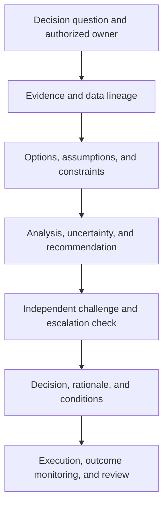

# The Decision Line: How Managers Support Better Choices Without Confusing Advice with Authority

| Metadata | Details |
|---|---|
| **Article Level** | Complex |
| **Publication Date** | 24 July 2026, 08:35 PM |
| **Article Category** | Management, Decision Intelligence, Banking, and Governance |
| **Target Audience** | Banking managers, product and project leaders, decision-support analysts, service owners, risk professionals, and Scrum practitioners |
| **Prepared by** | Ahmed Safwat Gawady |
| **Privacy Note** | The events, organization, characters, figures, and operational situations in this article are based on my experience to help the article deliver its value and are created only to explain the managerial and analytical concepts. They are not based on my employer, colleagues, customers, systems, or actual projects. |

## Article Summary

Managers often say that they are “supporting a decision” when they are actually recommending, approving, or quietly making it. The ambiguity becomes dangerous in banking, where authority, evidence, risk appetite, and auditability must remain aligned. This article draws a practical line between decision support and decision ownership, then shows how to construct a decision brief, separate facts from assumptions, compare options, test uncertainty, challenge models, and record the final rationale. Three simulated banking situations—payment release, service failover, and migration-wave approval—show how the same evidence can support different decisions without transferring accountability. The goal is not slower governance. It is faster, clearer, and more defensible managerial judgment.

## The Meeting Ended, but Nobody Owned the Choice

I remember one managerial discussion that appeared to finish with agreement. A dashboard had been presented, risks were discussed, and one option clearly received more attention than the others. People left the meeting with action points.

Later, a simple question exposed the gap: who had actually decided?

The analyst believed the manager had approved the recommendation. The manager believed the operational owner had accepted it. The operational owner believed the group had reached a collective decision. Everyone had participated, but accountability had dissolved into the room.

This is not only a communication problem. It is a governance problem. A decision has consequences, and consequences need an authorized owner. Evidence may be produced by analysts, interpreted by specialists, challenged by risk, and discussed by stakeholders. None of those activities automatically transfers decision rights.

The difference can be stated plainly:

> Decision support improves the quality of a choice. Decision-making commits the organization to a course of action within defined authority.

Support can describe, predict, compare, recommend, warn, and challenge. The decision owner accepts, rejects, defers, or modifies the recommendation and becomes accountable for the choice within the organization's governance model. A committee can be the decision body, but its quorum, voting or approval rule, delegated authority, and recorded outcome still need to be explicit.

## Advice and Authority Are Different Forms of Work

The two activities are related, but they produce different outputs.

| Dimension | Supporting a decision | Making a decision |
|---|---|---|
| Core question | What should the decision owner understand? | Which course of action will be authorized? |
| Primary output | Evidence, options, assumptions, recommendation, uncertainty, and challenge | A committed choice, conditions, owner, effective time, and review trigger |
| Authority required | Access to evidence and competence to analyze or advise | Formal or delegated decision right |
| Accountability | Quality, integrity, and clarity of the support | Consequences of the authorized choice within the owner's remit |
| Treatment of uncertainty | Quantify, disclose, test, and explain | Accept, avoid, transfer, reduce, or escalate the exposure |
| Audit evidence | Data lineage, method, validation, assumptions, alternatives | Decision record, rationale, approvals, conditions, dissent, and follow-up |

A senior title does not automatically make someone the owner of every decision. Nor does technical expertise. The cyber specialist may best understand a vulnerability; the service owner may hold the operational authority; the risk function may define a limit or provide independent challenge; a committee may approve an exception. The correct design depends on policy, regulation, risk appetite, and delegated authority.

PMI's project-decision guidance connects better decisions with good data from trustworthy sources, timely judgment under uncertainty, and governance that places decisions at the appropriate level ([Project Management Institute](https://www.pmi.org/learning/library/better-faster-project-decisions-9651)). The lesson is not that a project manager should decide everything. It is that the project must make decision rights, escalation routes, evidence needs, and timing visible.

## The Decision Contract

Before analyzing options, I use what I call a decision contract. It is not necessarily a legal document. It is a concise agreement about the decision being prepared.

The contract answers eight questions:

- What exact choice must be made?

- Who has the authority to make it?

- By when must the choice be effective?

- What outcome is being protected or created?

- Which constraints and non-negotiable controls apply?

- Which options are genuinely available, including delay or no action?

- What evidence and uncertainty will be considered sufficient?

- Which condition requires escalation rather than local decision?

This prevents a common failure: optimizing the analysis before defining the choice. “Review payment performance” is an analytical request. “Decide whether to release, hold, or partially release today's payment batch before the settlement cut-off” is a decision statement.

The decision contract also separates the *recommender* from the *decider*. A RACI chart can help describe participation, but it is often too broad for a high-stakes choice. A dedicated decision-rights field is clearer: one named accountable role or one formally constituted body, supported by named contributors, reviewers, and implementers.

## A Support Chain That Preserves Accountability

The chain begins with authority, not with a chart. Evidence is then connected to its lineage; options and constraints are made explicit; analysis produces a recommendation rather than an automatic command. Independent challenge tests the reasoning. The owner then decides and records conditions. Monitoring closes the loop by comparing the expected decision logic with observed outcomes.

The arrows do not imply that work is purely sequential. New evidence may reopen assumptions, and effective challenge may require another option. The important feature is that no analytical step silently crosses into authorization.

## Build a Decision Brief, Not a Data Dump

A dashboard is useful when the decision owner already understands the choice and needs live signals. It is weak when it presents dozens of measures without showing how they change the decision.

A strong decision brief normally contains:

| Section | Managerial purpose |
|---|---|
| Decision statement | Defines the commitment required now |
| Owner and deadline | Makes authority and timing explicit |
| Current state | Establishes verified facts and material context |
| Options | Shows feasible choices, including no action where valid |
| Criteria and constraints | Separates preferences from mandatory controls |
| Analysis | Compares consequences, uncertainty, dependencies, and reversibility |
| Recommendation | States the support team's professional judgment |
| Challenge | Records limitations, counterarguments, and independent review |
| Decision record | Captures the authorized choice, rationale, conditions, and review trigger |

The brief should distinguish four evidence classes:

- **Observed facts:** traceable records or confirmed events.

- **Estimates:** quantities inferred from data or models.

- **Assumptions:** conditions treated as true for the analysis.

- **Judgments:** professional interpretations or value choices.

Mixing these classes creates false confidence. “The failure rate is 2%” may be an observed fact for a defined window. “It will remain 2% after migration” is an estimate. “The source population is representative” is an assumption. “That exposure is acceptable” is a judgment belonging to an authorized owner operating within risk appetite.

In banking, traceability matters especially when reports aggregate risk across systems and legal entities. On 6 January 2026, the Basel Committee reiterated that its BCBS 239 principles remain a strong framework for risk-data aggregation and reporting and noted that some banks apply them within broader enterprise data governance ([Bank for International Settlements](https://www.bis.org/publ/bcbs_nl36.htm)). Accurate, complete, timely, adaptable, and well-governed information supports a decision; it does not make the decision by itself.

## Compare Options Without Pretending the Score Is the Answer

A weighted decision matrix can organize a complex discussion. Suppose a managerial choice has criteria $j = 1, 2, \ldots, m$. A normalized score for option $i$ can be written as:

$$
S_i = \sum_{j=1}^{m} w_j r_{ij}
$$

where $w_j$ is the agreed weight of criterion $j$, $r_{ij}$ is the option's rating on that criterion, and the weights satisfy:

$$
\sum_{j=1}^{m} w_j = 1
$$

The calculation helps expose trade-offs. It does not remove judgment. Weights may encode stakeholder preferences, ratings may be uncertain, criteria may overlap, and a high total cannot override a mandatory regulatory or security constraint. A veto condition should be modeled as a constraint, not diluted inside an average.

For risk decisions, expected loss can also inform comparison:

$$
\operatorname{EL}(a) = \sum_{k=1}^{n} p_k(a) \times I_k(a)
$$

Here, $a$ is an action, $p_k(a)$ is the estimated probability of outcome $k$ under that action, and $I_k(a)$ is its estimated impact. Expected loss is useful only when probabilities and impacts are credible enough for the purpose. It can obscure tail events, correlated failures, non-financial harm, legal constraints, and risk appetite. It should therefore sit beside stress scenarios and qualitative challenge, not replace them.

The complex work begins after the first score appears. Change the weights within plausible ranges. Test optimistic, central, and adverse assumptions. Identify the switching point at which another option becomes preferable. Ask whether one uncertain input dominates the recommendation. If small, reasonable changes reverse the ranking, the honest result is not “Option A wins.” It is “The choice is sensitive; the owner needs more evidence, a reversible action, or a risk-limiting condition.”

## Effective Challenge Is a Control, Not an Obstacle

Decision support becomes stronger when someone competent is expected to disagree.

The US Federal Reserve's revised model-risk guidance, issued on 17 April 2026, describes effective challenge as critical analysis by objective experts with appropriate expertise and sufficient independence across the model lifecycle ([Board of Governors of the Federal Reserve System](https://www.federalreserve.gov/supervisionreg/srletters/SR2602.pdf)). The principle is useful beyond regulated models. Any influential score, forecast, segmentation, or scenario engine should be open to informed challenge proportionate to its impact.

A challenger should ask:

- Is the input population complete and relevant to this choice?

- Does the method answer the actual decision question?

- Which assumptions produce the recommendation?

- What evidence contradicts the preferred narrative?

- How does the result change under plausible stress?

- Is the model being used within its validated purpose?

- Can the owner understand the limitation without specialist translation?

Challenge is not a ceremonial signature after the recommendation is complete. It needs enough time, access, competence, and influence to change the analysis. Independence also does not mean isolation; a challenger must understand the business context while remaining able to question it.

## Banking Situation: Release or Hold a Corporate Payment Batch

Let us assume an operational dashboard identifies an unusual rise in rejected corporate-payment instructions before a settlement cut-off. The visible options are to release the batch, hold it, or release only records that pass an enhanced control.

The decision-support team verifies source completeness, compares the rejection pattern with normal ranges, segments the issue by channel and error code, checks whether the anomaly is concentrated in one file type, and estimates the operational exposure of each option. It clearly marks synthetic forecasts and discloses that some downstream acknowledgements have not yet arrived.

The recommendation might be: hold the affected segment for a short investigation window while unaffected records proceed, subject to control confirmation. That is still support. The analyst has not authorized payment movement.

The authorized operations or risk owner makes the decision according to policy and delegated limits. The owner may accept the recommendation, hold the entire batch because a non-negotiable control is unresolved, or escalate because the exposure exceeds local authority. The decision record states the chosen scope, release conditions, cut-off implications, customer-communication responsibility, and review time.

The distinction protects both speed and accountability. Analysts remain responsible for the integrity of the evidence and recommendation. The owner remains responsible for the authorized course of action. No real transaction, organization, loss, or outcome is represented in this simulated situation.

## Banking Situation: Fail Over During a Digital-Service Incident

Now assume a corporate-banking service shows rising latency and intermittent authentication failures. A secondary environment is available, but failover may interrupt active sessions and introduce its own operational risk.

Monitoring specialists provide service-health data, dependency status, error concentration, customer-impact indicators, and confidence in the telemetry. Engineering explains recovery options and reversibility. Cybersecurity assesses whether the pattern suggests malicious activity. Business representatives clarify time-sensitive customer journeys. The support group frames at least three options: continue diagnosis in place, fail over selected traffic, or invoke full failover.

The decision belongs to the incident authority defined by the bank's operating model—perhaps an incident commander, service owner, or emergency change body within delegated limits. The exact role cannot be assumed universally.

ITIL's current guidance emphasizes evidence-based decisions, governance, and continual learning across digital products and services ([PeopleCert on ITIL Version 5](https://www.peoplecert.org/news-and-announcements/itil-version-5-transition-for-existing-practitioners)). Its change-enablement material also describes risk assessment, authorization, and schedule management as distinct concerns ([PeopleCert](https://www.peoplecert.org/browse-certifications/it-governance-and-service-management/ITIL-1)). In this situation, observability supports the choice; the authorized role accepts the operational risk and commits the service to an action.

Urgency changes the time available, not the need for authority. A pre-approved emergency path can make the decision faster because thresholds, roles, and rollback conditions were established before the incident. Afterward, the team compares the observed result with the decision assumptions and improves monitoring, runbooks, or delegation. No availability improvement or avoided loss is claimed here; the situation is simulated to show the control boundary.

## Banking Situation: Approve the Next Customer-Migration Wave

In the third situation, a bank is preparing to move a customer segment from a legacy corporate platform to a new one. Readiness indicators cover identity records, entitlements, beneficiaries, channel activity, customer communication, support capacity, reconciliation, rollback readiness, and unresolved defects.

The migration team builds an evidence pack. It separates mandatory gates from weighted preferences, shows data-quality exceptions, tests peak-volume assumptions, and identifies customers whose journeys cannot yet be mapped cleanly. Product, operations, technology, support, cybersecurity, compliance, and risk provide challenge. The team recommends one of four options: proceed as planned, reduce the wave, delay the wave, or proceed with explicit conditions.

The sponsor or governance body with delegated migration authority makes the go/no-go decision. A project manager can orchestrate the evidence, maintain the decision log, assess schedule and dependency effects, and recommend action. PMP competence does not grant authority beyond the governance model.

This is also where Scrum is frequently misunderstood. The Scrum Guide makes the Product Owner accountable for maximizing product value and effective Product Backlog management; Developers are accountable for creating the plan and a usable Increment; the Scrum Master establishes Scrum and helps the team improve its effectiveness ([The Scrum Guide](https://scrumguides.org/scrum-guide.html)). None of these accountabilities automatically replaces enterprise go-live, risk, or regulatory authority.

For PSM I practice, the essential lesson is to preserve the accountabilities and the empirical pillars of transparency, inspection, and adaptation. At PSM II depth, the Scrum Master should coach the organization to expose hidden dependencies, false consensus, and slow decision paths without becoming the approval authority. The migration decision may use Sprint evidence, but it remains subject to the bank's governance.

Again, the situation is privacy-safe and simulated. It does not claim that a migration occurred or achieved any numerical outcome.

## Recommendation Is Not Neutrality

Some analysts avoid making recommendations because they fear taking ownership of the decision. That creates another failure mode: a large pack of facts with no professional judgment.

Support should be opinionated but bounded. A useful recommendation says:

> Based on the stated objective, verified evidence, and current assumptions, I recommend Option B because it best protects the critical constraint while preserving reversibility. The recommendation changes to Option C if the unresolved exception rate exceeds the agreed threshold. The authorized owner must decide whether the residual exposure is acceptable.

This statement does four things. It provides judgment, explains why, identifies a switching condition, and preserves authority. The analyst remains accountable for honest reasoning. The owner cannot outsource accountability by saying, “The model decided.”

AI requires the same boundary. A model may summarize evidence, simulate scenarios, detect patterns, or recommend an option. Its output can be wrong because of incomplete data, drift, poor instructions, hidden correlations, or use outside its intended context. Human review is not meaningful if the reviewer lacks time, competence, information, or practical authority to reject the output. “Human in the loop” is a control design question, not a label.

## Decision Latency and the Cost of Ambiguity

Governance is often blamed for slow decisions, but ambiguity is frequently the larger delay. Teams wait because they do not know who can approve, which evidence is enough, or when escalation is mandatory. Work is repeated for successive audiences, each asking for a different format.

A useful operating model defines decision classes in advance. Routine, reversible choices can be delegated closer to the work. High-impact, difficult-to-reverse, regulated, or cross-domain choices require stronger challenge and higher authority. Emergency decisions need pre-agreed thresholds and retrospective review. The principle is proportionality: increase assurance with consequence and uncertainty, not with organizational habit.

Track decision performance carefully. Time from a complete brief to an authorized decision can reveal bottlenecks. Reopened decisions can reveal weak assumptions or unclear rationale. Overdue actions can reveal execution failure. But metrics can be gamed: a team may start the clock late or classify a decision as incomplete. Definitions and audit trails matter.

Do not judge decision quality only by outcome. A sound choice under uncertainty can produce an adverse result; a careless choice can be lucky. Review both the process quality—evidence, assumptions, challenge, authority—and the observed outcome. Otherwise, hindsight bias will punish transparent judgment and reward unexplained luck.

## The Decision Record Closes the Governance Gap

A concise decision record should capture:

| Record field | What it protects |
|---|---|
| Decision identifier and statement | Traceability to the exact choice |
| Authorized owner or body | Accountability and delegated authority |
| Date, deadline, and effective time | Temporal clarity |
| Options considered | Evidence that alternatives were evaluated |
| Evidence and source versions | Reproducibility and lineage |
| Assumptions and uncertainties | Honest limits of knowledge |
| Recommendation and challenger view | Professional support and effective challenge |
| Final choice and rationale | Explanation of the commitment |
| Conditions, controls, and escalation triggers | Boundaries of authorization |
| Review date and outcome measures | Learning and adaptation |

The record should be proportionate. A routine operational choice may need a short structured entry. A material migration or risk exception may require formal minutes and evidence attachments. Privacy, retention, legal privilege, and access controls apply; recording a decision does not justify retaining unnecessary personal or confidential data.

## How PMP, ITIL, and Scrum Fit Without Competing

These professional bodies of knowledge solve different problems, so forcing them into one hybrid methodology weakens them.

PMP-oriented project practice helps define governance, stakeholders, risks, baselines, dependencies, escalation, and integrated effects. It is especially useful for asking whether the choice aligns with scope, benefits, schedule, cost, quality, and organizational authority.

ITIL helps place the choice inside a product or service value system. It brings attention to service outcomes, risk, change authorization, incident response, monitoring, knowledge, and continual improvement. The current ITIL framework retains continuity with ITIL 4 guiding principles while extending guidance for modern digital and AI-enabled environments ([PeopleCert ITIL FAQ](https://www.peoplecert.org/help-and-support/faq-itil)).

Scrum helps teams make complex work transparent and adapt through empiricism. It defines accountabilities inside Scrum but does not erase enterprise governance. The Product Owner decides ordering and value-related product direction within that accountability; Developers decide how to create the Increment; the Scrum Master coaches effectiveness. Organizational decision rights still apply around funding, regulation, production risk, and formal acceptance.

The frameworks meet at a practical point: make the work and evidence visible, place the choice with the right owner, inspect what happened, and adapt the system.

## Limitations and Difficult Cases

No decision method eliminates politics, incomplete information, or conflicting objectives. A matrix can hide value judgments inside weights. Expected-value analysis can understate extreme or correlated events. Dashboards can create an illusion of completeness. Committees can distribute expertise while diffusing accountability. Independent challenge can become procedural if challengers lack influence.

Some choices genuinely require shared authority. In that case, define the body, quorum, voting or consensus rule, tie-break mechanism, conflicts-of-interest treatment, and escalation route. “Everyone agreed” is not sufficient evidence of governance.

Regulated banking decisions depend on jurisdiction, internal policy, supervisory expectations, and the legal entity involved. This article offers a managerial operating model, not legal, compliance, credit, investment, cybersecurity, or regulatory advice. Organizations must tailor roles and controls with qualified internal functions.

Decision logs also create sensitive records. Access should follow least privilege, and the content should avoid unnecessary personal information. Model inputs, customer data, security details, and dissenting opinions may require specialized handling.

Finally, a recommendation may remain unresolved because evidence is insufficient. Deferral is a decision only when an authorized owner accepts the consequences, defines what evidence is needed, assigns ownership, and sets a new deadline. Silent delay is not prudent uncertainty management.

## Final Professional Judgment

The strongest manager is not the person who makes every decision. It is the person who knows which choices belong to the team, which belong to a product or service owner, which require independent challenge, which must be escalated, and which cannot proceed without formal authority.

Supporting a decision requires courage to recommend. Making a decision requires authority to commit and accountability for the consequence. Confusing the two produces passive analysis on one side and ungoverned power on the other.

Define the choice before building the dashboard. Name the owner before inviting the meeting. Separate facts, estimates, assumptions, and judgment. Compare real options. Test sensitivity. Invite effective challenge. Record the rationale and conditions. Then inspect the outcome without rewriting history.

When those disciplines are present, decision support does not weaken management. It makes managerial judgment clearer, faster, and more defensible.
