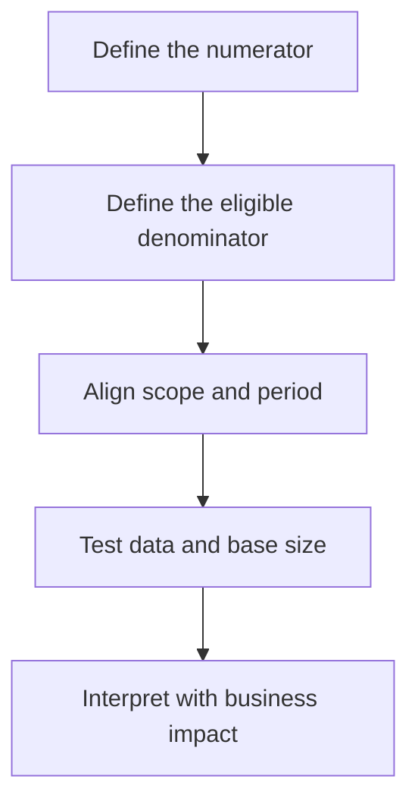

# The Missing Denominator: When Business Ratios Mislead Good Decisions

| Metadata | Details |
|---|---|
| **Article Level** | Standard |
| **Publication Date** | 11 April 2026 11:02 PM |
| **Article Category** | Business Analytics and Decision Support |
| **Target Audience** | Managers, product managers, project managers, service managers, Scrum Masters, business analysts, and Power BI professionals |
| **Prepared By** | Ahmed Safwat Gawady |
| **Estimated Reading Time** | 11 minutes |
| **Privacy Note** | The events, organization, characters, figures, and operational situations in this article are based on my experience to help the article deliver its value and are created only to explain the analytical concepts. They are not based on the author’s employer, colleagues, customers, systems, or actual projects. |

## Summary

Ratios help managers compare performance across teams, products, periods, and operating volumes. Yet a percentage can appear precise while hiding a weak or inconsistent denominator. A rising success rate may reflect a better process, a smaller eligible population, a change in exclusions, or incomplete data. A high failure rate may represent a serious problem—or one event in a tiny sample. This article follows an experience-inspired situation where two correct counts created the wrong management priority. It develops a practical discipline for defining, validating, presenting, and acting on business ratios without allowing a clean percentage to create false confidence.


## The Percentage Looked Decisive

One of my situations started with a comparison between two operational areas.

The report showed that Area A had 90 delayed cases, while Area B had only 45. The conclusion seemed obvious: Area A had twice as many delays and should receive attention first.

The count was correct. The priority was not yet clear.

Area A had processed 10,000 eligible cases. Area B had processed 900.

When the volume was added, the picture changed:

| Area | Delayed Cases | Eligible Cases | Delay Rate |
|---|---:|---:|---:|
| A | 90 | 10,000 | 0.9% |
| B | 45 | 900 | 5.0% |

Area A carried the greater delay workload. Area B had the weaker proportional performance.

Neither measure cancelled the other.

The count answered, “Where are most delayed cases?”

The rate answered, “Where are delays more common relative to eligible activity?”

The management mistake was not choosing the wrong calculation. It was treating one number as though it answered both questions.

Once we made the denominator visible, the conversation became more useful. Capacity planning could consider the count. Process investigation could consider the rate. Customer or financial impact could then be added before choosing an action.

## A Ratio Is a Relationship

A ratio compares one quantity with another. In business reporting, many familiar measures have this structure:

**Failure rate = Failed eligible cases ÷ Total eligible cases × 100**

**Conversion rate = Successful conversions ÷ Qualified opportunities × 100**

**Acceptance rate = Accepted items ÷ Submitted eligible items × 100**

The numerator receives most of the attention because it represents the event managers care about: failures, sales, delays, approvals, complaints, or completed work.

The denominator defines the opportunity in which that event could occur.

That distinction is fundamental. The US Centers for Disease Control and Prevention explains that a proportion compares a part with a whole and requires the numerator to be included within the denominator. Although its examples come from epidemiology, the statistical principle transfers directly to business measures: the population represented above the line must belong to the population represented below it. [CDC: Principles of Epidemiology—Ratios and Proportions](https://archive.cdc.gov/www_cdc_gov/csels/dsepd/ss1978/lesson3/section1.html)

If accepted files are divided by all customer records, the calculation may produce a percentage, but it is not an acceptance rate with a meaningful business definition. The denominator should represent the submitted files that were actually eligible for acceptance.

The formula is simple. The population design is where the real work begins.

## The Denominator Defines the Business Question

Think with me for a moment. Suppose a dashboard displays:

> **Success rate: 92%**

Before interpreting it, we need to know what the 92 successful units are being compared with.

The denominator might include:

- all initiated requests;
- only completed requests;
- completed and failed requests but not pending ones;
- only records that passed a validation rule;
- one attempt per customer;
- every retry as a separate attempt; or
- the latest status for each business case.

Each definition can produce a different result from the same operational process.

If pending cases are excluded, the reported success rate may look stronger during a period with a growing backlog. If every retry is counted, one difficult case may enter the denominator several times. If only the latest status is used, earlier failures may disappear from the final-state view even though they consumed effort and affected the customer journey.

This does not mean one definition is universally correct. It means the definition must match the decision.

A final-outcome ratio may be appropriate when management asks how cases eventually ended. An attempt-level ratio may be more useful when the question concerns process efficiency or rework. A customer-level ratio may be necessary when repeated attempts should still represent one affected customer.

The denominator is therefore not a technical footnote. It is the boundary of the business question.

## One Number Can Improve While the Situation Worsens

A ratio can move because the numerator changed, the denominator changed, or both changed.

Let’s assume a service reported the following synthetic results:

| Month | Failed Cases | Eligible Cases | Failure Rate |
|---|---:|---:|---:|
| April | 100 | 10,000 | 1.0% |
| May | 120 | 20,000 | 0.6% |

The number of failures increased from 100 to 120. At the same time, the failure rate improved from 1.0% to 0.6% because eligible volume doubled.

Which interpretation is correct?

Both are.

The operation handled more failure cases, which may require additional support capacity. Proportional performance improved, which may indicate a more stable process at higher volume.

Now reverse the situation:

| Month | Failed Cases | Eligible Cases | Failure Rate |
|---|---:|---:|---:|
| April | 100 | 10,000 | 1.0% |
| May | 80 | 4,000 | 2.0% |

The failure count decreased, but the rate doubled because total activity fell more sharply.

A manager who sees only the count may celebrate. A manager who sees only the rate may escalate. A manager who sees both can ask the better question:

> “Why did volume change, and what does the new relationship mean for workload, quality, and customer impact?”

## The Five Checks Behind a Trustworthy Ratio

A useful ratio passes through five connected checks before it reaches a management decision.



The sequence prevents a percentage from moving directly from calculation to action. Each stage makes part of the measure’s meaning explicit.

### Define the numerator

State exactly which event is being counted.

“Successful transactions” may mean transactions accepted by the channel, completed by the core process, settled financially, or confirmed to the customer. These are different milestones.

If the numerator mixes them, the ratio cannot have one stable interpretation.

### Define the eligible denominator

The denominator should represent the population that had a genuine opportunity to enter the numerator.

CDC guidance describes the same principle through an eligible or “at-risk” population: the denominator should be limited to people who could have experienced the event counted in the numerator. [CDC: Principles of Epidemiology—More About Denominators](https://archive.cdc.gov/www_cdc_gov/csels/dsepd/ss1978/lesson3/section2.html)

In business terms, a product-adoption rate should not divide active users by customers who were never offered or eligible for the product. A completion rate should not include requests that entered after the reporting cutoff and had no reasonable opportunity to finish.

### Align scope and period

The numerator and denominator must refer to the same product, segment, region, channel, and time window.

A monthly failure numerator divided by annual transaction volume produces a small number, but not a meaningful monthly failure rate. A regional numerator divided by enterprise-wide volume creates the same problem.

This alignment becomes more difficult when numerator and denominator come from different systems with different refresh times. One source may be complete through yesterday while the other is complete only through the previous week.

The ratio still calculates. Its apparent precision hides timing inconsistency.

### Test the data and base size

A percentage based on a small denominator can move dramatically after one event.

One failure among ten cases is 10%. Two failures make it 20%. The rate doubled, but the underlying change was one case.

Small bases do not make a ratio invalid. They make it unstable and easy to overinterpret.

For this reason, the denominator or underlying count should remain visible near the percentage. A rate without its base asks the reader to judge significance without enough evidence.

### Interpret with business impact

A high rate is not automatically the highest priority.

A small, specialized service may have a high exception rate but low overall exposure. Another service may have a lower rate across a very large volume, creating more affected customers and greater operational cost.

Rate, count, severity, and value should be read as connected signals rather than competitors.

## A Percentage Needs Its Base

Consider two products:

| Product | Successful Cases | Eligible Cases | Success Rate |
|---|---:|---:|---:|
| Product X | 9 | 10 | 90% |
| Product Y | 8,500 | 10,000 | 85% |

Product X has the higher success rate, but the evidence comes from only ten cases. One additional failure would reduce the rate to approximately 82%.

Product Y has the lower percentage, but its result is based on a much larger operating population. It also represents 1,500 unsuccessful cases, which may create significant workload or customer impact.

The table does not tell management which product is “better” in every sense.

It tells us that Product X has a stronger observed rate with limited evidence, while Product Y has a lower rate with much greater scale. The next step depends on the decision: confidence in performance, operational capacity, financial exposure, product quality, or customer experience.

Showing the base beside the ratio prevents a small sample from borrowing the visual authority of a large one.

## Be Careful When Averaging Percentages

One of the most common ratio errors occurs when category percentages are averaged without considering their denominators.

Let’s assume two channels:

| Channel | Successful Cases | Eligible Cases | Success Rate |
|---|---:|---:|---:|
| Digital | 9,000 | 10,000 | 90% |
| Assisted | 50 | 100 | 50% |

A simple average of the two percentages is:

**(90% + 50%) ÷ 2 = 70%**

But that calculation treats both channels as though they had equal volumes.

The combined success rate should be calculated from the underlying totals:

**Combined success rate = (9,000 + 50) ÷ (10,000 + 100) = approximately 89.6%**

The difference is substantial.

This is why business ratios are generally not additive. The safest enterprise result usually comes from adding the numerators, adding the denominators, and then recalculating the ratio at the required level.

An average of percentages is valid only when the intended method genuinely gives each group equal weight. That is a business choice, not an automatic aggregation rule.

## Zero Is Not the Same as Missing

Ratios require special care when the denominator is zero.

Suppose no eligible cases existed during a selected period. The success rate is not 0%. A 0% success rate suggests that eligible cases existed and none succeeded. With no eligible population, the ratio is undefined.

The report should normally return a blank, “N/A,” or another explicitly governed state rather than inventing a performance result.

The same distinction applies when data is missing. A missing denominator does not mean zero activity. It means the report does not currently have enough information to calculate the measure.

These states lead to different management actions:

- **Zero eligible cases:** no operating opportunity existed.
- **Zero successful cases with an eligible base:** performance was 0%.
- **Missing denominator:** data completeness must be resolved.

Treating all three as zero makes a dashboard look tidy while weakening its meaning.

## A Small Power BI Measure with a Large Governance Question

In Power BI, the technical calculation can be short. Suppose the semantic model already contains governed measures for successful and eligible cases. The input is the current filter context, and the output is a decimal rate for that same population.

```DAX
Success Rate :=
DIVIDE(
    [Successful Cases],
    [Eligible Cases]
)
```

The `DIVIDE` function returns the numerator divided by the denominator and, when no alternate result is supplied, returns a blank if the denominator is zero. Microsoft documents the numerator, denominator, and optional alternate-result behavior directly. [Microsoft Learn: DIVIDE function](https://learn.microsoft.com/en-us/dax/divide-function-dax)

That protects the report from a technical divide-by-zero error. It does not validate the business definition.

The measure assumes that `[Successful Cases]` is a subset of `[Eligible Cases]`, both use the same grain and reporting period, and both respond consistently to filters. If one measure counts attempts and the other counts distinct customers, the DAX is valid while the ratio is not.

This is where a small formula becomes a semantic-model responsibility. The model must govern eligibility, exclusions, duplication, status timing, and filter behavior before the percentage reaches the visual.

## Transparency Before Adaptation

Ratios are often used in Scrum environments to discuss throughput, predictability, quality, or product outcomes. The Scrum connection is not that a particular percentage is required. It is that empirical decisions depend on transparent information.

The official Scrum Guide states that important decisions are based on the perceived state of transparent artifacts and that low transparency can lead to decisions that reduce value and increase risk. It also explains that inspection should lead to adaptation. [The 2020 Scrum Guide](https://scrumguides.org/scrum-guide.html)

A percentage with a hidden or shifting denominator weakens that transparency. A team may inspect a trend without realizing that the eligible population changed between Sprints.

For a Sprint Review or improvement conversation, the denominator should therefore be available beside the rate. If the calculation changed, that change should be explicit. The purpose is to help the team learn about the product and process—not to use an unstable number to evaluate individuals.

## Measurement Must Remain Connected to Value

The project-management lesson is broader than ratio design.

PMI’s 2025 Pulse of the Profession reports that project professionals with stronger business acumen use a broader set of performance factors and assess success beyond scope, schedule, and budget. It highlights customer satisfaction, quality, strategic alignment, operational efficiency, and risk among the dimensions used to evaluate performance. [PMI: Pulse of the Profession 2025](https://www.pmi.org/-/media/pmi/documents/public/pdf/learning/thought-leadership/pulse/pulse_of_the_profession_2025-1.pdf)

This supports a practical principle: one ratio should not carry the full meaning of project success.

A schedule-performance ratio may reveal delivery efficiency without showing whether the outcome remains valuable. A defect ratio may reveal quality movement without showing customer severity. An adoption ratio may improve while the absolute number of active users falls.

ITIL brings the same discipline into service management. PeopleCert’s ITIL 4 Foundation guidance emphasizes defining and tracking metrics and KPIs to measure service performance and effectiveness, alongside continual improvement and value creation. [PeopleCert: ITIL 4 Foundation](https://www.peoplecert.org/browse-certifications/it-governance-and-service-management/ITIL-1/itil-4-foundation-2565)

The ratio must therefore lead back to a service question: what customer, operational, financial, or strategic outcome does this measure help us understand?

Measurement is useful when it clarifies value and guides an appropriate response. A percentage displayed without that connection is only arithmetic.

## What Improved, and What Remained Open

Returning to the situation, we kept both the count and the rate.

The count remained important for workload and capacity. The rate became important for proportional performance. We added the eligible volume beside the percentage and documented the inclusion rule in plain language.

The management conversation improved because people could see why the rankings differed. Area A had more delayed cases. Area B had a higher concentration of delay. The decision could then consider severity, customer effect, and the feasibility of corrective action.

The ratio did not explain causation. It did not prove that Area B’s process was poorly designed. Differences in case complexity, customer segment, reporting completeness, or operating conditions could still affect the result.

The historical denominator might also change after a policy or product update. Small samples could remain unstable. Some cases could still be duplicated across attempts. Those dependencies required continued validation.

The result was not a perfect score. It was a more defensible measurement conversation.

## A Practical Ratio Discipline

Before using a business ratio for a decision, I recommend a short review.

**Name the event.** Define exactly what enters the numerator and at which business milestone.

**Define eligibility.** Confirm that every denominator unit had a genuine opportunity to enter the numerator.

**Align the context.** Use the same period, scope, grain, filters, and refresh point above and below the line.

**Show the base.** Keep the denominator or underlying counts visible, especially for small populations.

**Handle zero and missing states honestly.** Do not convert an undefined or unavailable ratio into a false 0% result.

**Recalculate totals.** Aggregate numerators and denominators before calculating a combined rate unless equal weighting is an intentional business rule.

**Add materiality.** Read the percentage beside count, severity, value, risk, or customer impact as required by the decision.

**Document the rule.** Make the definition understandable enough that another professional can reproduce and challenge it.

This discipline is not heavy statistical governance. It is basic protection against confident misinterpretation.

## The Missing Number Changes the Decision

Ratios are valuable because they place an event inside its operating opportunity. They allow managers to compare areas with different volumes and detect changes that raw totals can hide.

But the denominator is not merely the number below the line.

It represents eligibility, population, scope, period, status, and business meaning. If any of these changes silently, the ratio changes its question even when the label remains the same.

The strongest management statement is therefore not:

> “The rate is higher, so performance is worse.”

It is:

> “The rate is higher within this defined eligible population and period. Now let us examine the underlying count, impact, data confidence, and cause before choosing an action.”

That language may sound more cautious, but it is also more useful.

The numerator tells us what happened.

The denominator tells us the opportunity in which it happened.

Good decisions require both.
