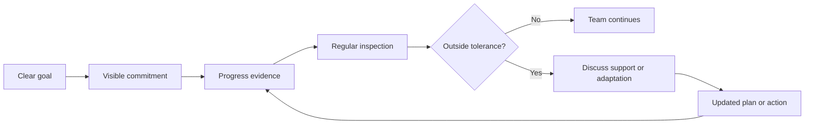

# Tracking Progress Without Micromanagement: How Managers Stay Informed Without Taking Over

| Metadata | Details |
|---|---|
| **Article Level** | Standard |
| **Publication Date** | 06 February 2026, 7:42 PM |
| **Article Category** | Management, Performance Visibility, and Team Effectiveness |
| **Target Audience** | Managers, project managers, product managers, service managers, Scrum Masters, team leads, and business professionals |
| **Prepared by** | Ahmed Safwat Gawady |
| **Estimated Reading Time** | 11 minutes |
| **Privacy Note** | The events, organization, characters, figures, and operational situations in this article are based on my experience to help the article deliver its value and are created only to explain the analytical concepts. They are not based on the author’s employer, colleagues, customers, systems, or actual projects. |

## Summary

Managers need visibility into progress, but visibility can easily turn into constant checking. When that happens, reporting consumes the time that should have been used to deliver the work, while teams learn to optimize for updates instead of outcomes. This article explores a simpler management model: make goals, commitments, progress, exceptions, and decisions visible at an agreed cadence, then intervene when evidence shows that support or correction is needed. The approach connects naturally to project monitoring, ITIL monitoring and reporting, and Scrum’s transparency, inspection, adaptation, and self-management. The aim is not less management. It is better-timed management based on evidence rather than proximity.

## When “Keep Me Updated” Becomes the Work

One of my situations started with a reasonable management request.

The manager wanted to know whether the work was progressing.

So the team sent an update in the morning.

Then another question came before lunch.

Later, someone was asked for the latest percentage. A team member prepared a small status table. Another colleague updated a slide because the numbers had changed. By the end of the day, several people had explained progress several times.

Nothing was wrong with the manager’s intention. The manager was trying to reduce uncertainty.

The problem was the method.

The team was becoming increasingly visible, but the work was not becoming proportionally clearer.

That is where tracking progress can quietly become micromanagement.

Micromanagement is not simply “asking questions.” A manager should ask questions. The problem appears when the management system depends on frequent personal checking because goals, progress, ownership, exceptions, and next decisions are not visible through a reliable shared mechanism.

## The Manager Needs Evidence, Not Constant Presence

A manager does not need to watch every activity to understand whether progress is healthy.

The manager needs evidence that answers a few practical questions:

What are we trying to achieve?

What did we commit to complete by this checkpoint?

What has actually been completed?

What is blocked or moving outside tolerance?

What decision or support is needed from management?

Those questions are stronger than asking, “What are you doing now?”

PMI material on project monitoring describes monitoring and controlling as tracking, reviewing, and regulating progress and performance, identifying where changes may be required, and using execution information to support management decisions. [PMI: How do you know the status of your project?](https://www.pmi.org/learning/library/know-status-project-monitoring-controlling-5982)

The important word is **progress**.

Progress is not the same as presence, activity, or message volume.

A person can attend many meetings and still produce little movement toward an objective. Another person can work quietly for two days and remove a major blocker.

A management system should make that distinction visible.

## Start with the Outcome

Before tracking activity, define what progress means.

Let’s assume a team is preparing a new operational report.

Weak tracking may focus on activity:

> “How many hours did we spend?”

> “How many meetings did we attend?”

> “Did everyone update the tracker today?”

Those measures may be useful for administration, but they do not automatically tell us whether the work is advancing.

A stronger view starts with outcomes:

> Source data validated.

> Business definitions agreed.

> First usable report completed.

> User review finished.

> Critical defects resolved.

Now the manager can inspect movement against meaningful checkpoints.

This is close to the logic used in project management: compare actual progress with the agreed plan or baseline, then decide whether action is required. The dashboard or tracker is simply the evidence layer supporting that conversation.

## Make the Work Visible Once

The easiest way to reduce repeated status requests is to create one trusted place where progress is visible.

It does not need to be complicated.

A simple progress view can show:

| Item | What the manager needs to see |
|---|---|
| **Goal** | The outcome the team is working toward |
| **Current commitment** | What should be completed by the next checkpoint |
| **Progress** | Completed versus planned work or milestone state |
| **Exception** | Blocker, delay, risk, or quality concern |
| **Owner** | Who is accountable for the next action |
| **Decision needed** | What management support is required, if any |

The design should reduce questions, not generate more of them.

Microsoft’s Power BI dashboard guidance recommends designing around the audience, highlighting the most important information, and keeping the overview uncluttered so readers can understand the current state at a glance. [Microsoft Learn: Tips for designing a great Power BI dashboard](https://learn.microsoft.com/en-us/power-bi/create-reports/service-dashboards-design-tips)

That principle applies even if the progress view is not built in Power BI.

One screen. One agreed source. One management language.

## Agree on the Cadence Before the Pressure Arrives

Micromanagement often increases when reporting cadence is unclear.

If a manager does not know when the next reliable update will arrive, the natural reaction is to ask early.

A predictable cadence reduces that uncertainty.

A fast-moving operational situation may need daily inspection. A project milestone may need weekly review. A strategic initiative may need a monthly checkpoint with more detailed exception reporting between meetings.

There is no universal cadence.

The cadence should reflect the speed at which the situation can materially change and the time available to respond.

ITIL offers a useful operational perspective. PeopleCert describes Monitoring and Event Management as systematically observing services and service components and responding to selected changes of state identified as events. [PeopleCert: ITIL 4 Practitioner — Monitoring and Event Management](https://www.peoplecert.org/browse-certifications/it-governance-and-service-management/ITIL-1/itil4-practices-monitoring-and-event-management-3686)

The phrase **selected changes of state** matters.

A useful monitoring system does not treat every movement as an escalation. It identifies the changes that deserve attention.

Managers can apply the same idea to team progress.

## Track Exceptions More Closely Than Normal Work

If everything is progressing normally, the manager should not need the same level of intervention as when something is blocked.

This is where exception-based management becomes practical.

A manager may agree that the team continues independently while work remains within normal expectations. More attention is triggered when an agreed condition appears, such as:

- a milestone moving beyond tolerance;
- a critical dependency becoming late;
- quality falling below the agreed level;
- a decision remaining unresolved beyond a due date; or
- a risk moving into a higher exposure state.

These conditions should be agreed before the problem happens whenever possible.

That changes the relationship.

The manager is no longer asking for constant reassurance.

The team knows when to escalate.

## Transparency Is Not Surveillance

Scrum makes this distinction especially clear.

The official Scrum Guide states that Scrum is built on transparency, inspection, and adaptation. It also describes Scrum Teams as self-managing and explains that transparency allows meaningful inspection, while adaptation follows when evidence shows that adjustment is needed. [The 2020 Scrum Guide](https://scrumguides.org/scrum-guide.html)

Transparency means the work and its important state are visible.

It does not mean the manager directs every task or checks every person continuously.

A transparent team can still be autonomous.

In fact, transparency should make autonomy safer because the manager can see when the system is healthy and when help is needed.

This idea also connects naturally to PSM I and PSM II. Scrum.org describes PSM I as evidence of a fundamental level of Scrum mastery and PSM II as an advanced level that includes deeper understanding of Scrum Master accountabilities and how Scrum Teams function. [Scrum.org: Professional Scrum Certifications](https://www.scrum.org/professional-scrum-certifications)

At the more mature level, the question is not “How do I get more control over the team?”

The better question is:

> “How do I create enough transparency and trust that the team can self-manage while important problems still become visible early?”

## A Simple Progress Flow

A healthy tracking system can be simple.

The manager is present in the system, but not inside every task.

The team works toward a clear goal. Progress evidence is visible. Inspection happens at an agreed cadence. Management attention increases when the evidence shows that intervention may add value.

## Ask Better Questions

Tracking becomes healthier when the manager changes the questions.

Instead of:

> “Why are you only 70% done?”

Try:

> “What remains between the current state and the outcome?”

Instead of:

> “Why did this person not update yesterday?”

Try:

> “Is our progress evidence still reliable enough to make a decision?”

Instead of:

> “Who caused the delay?”

Try:

> “What condition created the delay, and what can remove it?”

Instead of:

> “Can you send me another status?”

Try:

> “What information is missing from our shared view that forced me to ask?”

That last question is especially useful.

Every repeated status request may be evidence that the reporting system needs improvement.

## Do Not Turn Every Metric into Individual Performance

A progress dashboard should not automatically become an employee-ranking system.

Work is often interdependent. One person may appear slow because a dependency is late. Another may close many simple tasks while someone else handles fewer, harder items. A team may deliberately reduce output for a period to improve quality or remove technical debt.

Metrics need context.

This is why managers should be careful with simplistic measures such as tasks closed per person, messages sent, hours online, or tickets completed without considering complexity and outcome.

A team dashboard should first help manage the work system.

Individual performance conversations require a broader evidence base.

## Image Placeholder — Visibility Without Hovering

**Purpose:** Show a manager maintaining clear visibility of progress while the team works independently rather than being constantly interrupted for status updates.

**Image Prompt:** Create a professional editorial illustration of a manager reviewing a simple shared progress board from a short distance while a small team works independently. The board should show a clear goal, current progress, one blocker, and one decision needed. The manager should look informed and supportive, not controlling. The team should appear focused and autonomous. The composition should visually contrast structured visibility with intrusive hovering without using exaggerated body language.

**Aspect Ratio:** 16:9

**Required Labels:** “Goal”, “Progress”, “Blocker”, “Decision Needed”

**Style Guidance:** Calm professional editorial illustration, white and light gray background, restrained blue accents, clean shapes, modern business style, minimal interface detail.

**Avoid:** Company logos, real interfaces, surveillance imagery, cameras, threatening management posture, crowded dashboards, or identifiable people.

**Alt Text:** A manager reviews a shared progress board while the team works independently, with goal, progress, blocker, and decision-needed information visible.

**Suggested Caption:** Good visibility allows managers to support the work without becoming part of every task.

## What Improved, and What Still Needed Judgment

Returning to the situation, the solution was not to stop reporting.

We made reporting more predictable.

The team maintained one shared progress view. The manager knew when it would be updated. Exceptions were highlighted. Decisions requiring management attention were separated from normal work.

The number of repeated status requests reduced because the manager had a trusted way to understand the state of the work.

But the system did not remove management judgment.

Some delays still needed discussion. Some risks could not be represented by a simple status. A team member might need support even when the dashboard looked healthy. And sometimes management had to intervene quickly because the context changed faster than the normal review cadence.

The difference was that intervention became more intentional.

## The Professional Judgment

Tracking progress and micromanagement are not opposites.

The real distinction is **how visibility is created and how management responds to it**.

From a PMP perspective, managers need reliable evidence to compare progress with the plan and decide when corrective action is appropriate.

From an ITIL perspective, monitoring is useful when it identifies meaningful changes of state rather than treating every movement as an event requiring escalation.

From a Scrum and PSM perspective, transparency should enable inspection and adaptation while preserving self-management.

Put those ideas together and the management principle is simple:

> Make the goal clear. Make progress visible. Agree on the cadence. Escalate exceptions. Then give capable people enough space to do the work.
