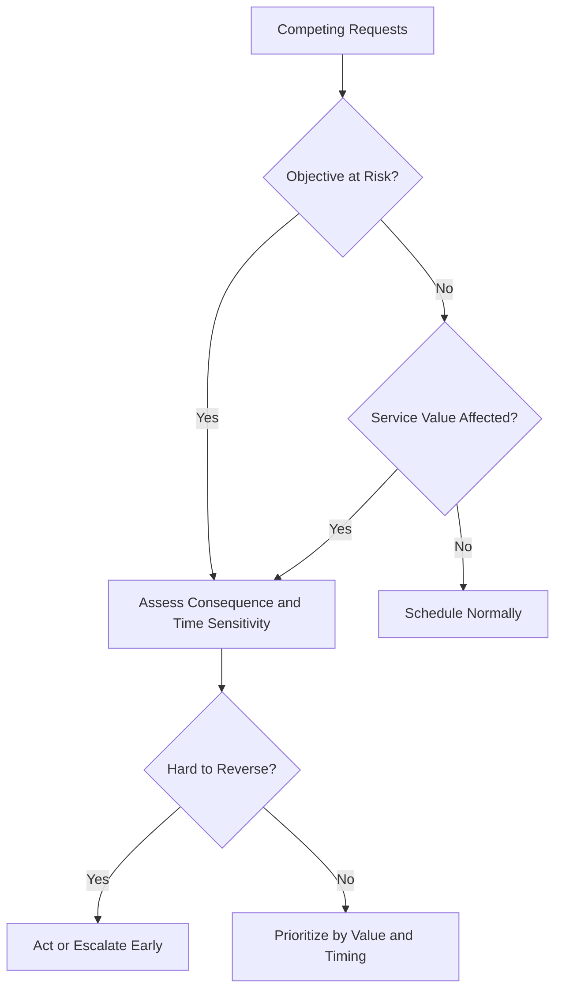

# When Priorities Compete: Using PMP Risk Thinking and ITIL Service Value to Decide What Managers Should Act on First

| Metadata | Value |
|---|---|
| **Article Level** | Standard |
| **Publication Date** | 07 Aug 2026, 09:40 PM |
| **Article Category** | Management, Project Delivery, Service Management |
| **Target Audience** | Project managers, service managers, team leads, product owners, and decision makers |
| **Prepared by** | Ahmed Safwat Gawady |
| **Privacy Note** | The events, organization, characters, figures, and operational situations in this article are based on my experience to help the article deliver its value and are created only to explain the analytical concepts. They are not based on the author’s employer, colleagues, customers, systems, or actual projects. |

## Summary

Managers rarely suffer from a shortage of work. The harder problem is deciding what deserves attention first when several items are all described as urgent. In one of my situations, a delayed project activity, a recurring service issue, and a senior stakeholder request arrived almost together. The temptation was to rank them by noise. A better approach was to combine project risk thinking with service-value thinking: ask what threatens objectives, what affects customers or users, what is time-sensitive, and what creates the greatest consequence if ignored. This article explains a practical way to turn priority from instinct into a more disciplined management judgment.

## Everything Was Important

One of my situations started with three messages arriving within a short period.

The first was about a project task that had slipped behind plan. The second was about a service issue that had appeared more than once during the week. The third came from a senior stakeholder asking for a report before the end of the day.

None of the requests was trivial. All three had an owner. All three had a reason. And, naturally, all three were described as urgent.

This is where management becomes more interesting than task tracking.

If I simply followed the loudest request, I might satisfy the most visible person while leaving a larger operational risk untouched. If I focused only on the project schedule, I might protect a milestone while users continued to experience a service problem. If I tried to do everything at once, I would probably create movement without creating much value.

Think with me for a moment. The real question was not, **“Which task came first?”** It was, **“Which situation creates the greatest reason to act now?”**

## Urgency and Importance Are Not the Same Thing

Managers often receive work through channels that distort priority. A direct message feels more urgent than an item in a risk register. A senior stakeholder request can feel more important than a recurring operational issue. A red indicator on a dashboard can attract attention even when its business impact is limited.

That is understandable. Human attention reacts to visibility.

But professional prioritization needs a stronger basis.

PMI describes project uncertainty as something that can create both threats and opportunities, and its project-management guidance treats uncertainty as something teams need to explore, assess, and respond to rather than simply observe. The practical point is simple: a manager should consider the effect of uncertainty on objectives, not only the amount of noise around it. [PMI Standards](https://www.pmi.org/standards) and PMI's material on the [Uncertainty Performance Domain](https://www.pmi.org/-/media/pmi/documents/public/pdf/pmbok-standards/pmi-project-performance-domains.pdf) provide the underlying project-management perspective.

ITIL approaches the same management problem from another direction. Current ITIL guidance centers digital product and service management on value creation for customers, users, and stakeholders. That means a priority decision should also ask what protects or improves value, experience, reliability, and outcomes—not just what closes the next ticket. See the official [ITIL overview](https://www.itil.com/) and [ITIL certifications framework](https://www.itil.com/certifications).

Put the two together and the manager gets a better lens.

## A Practical Four-Question Filter

I normally find that four questions are enough to improve the first decision dramatically.

**What objective is exposed?**

A delayed task may look operational, but perhaps it sits on the critical path of a larger delivery. A small defect may look technical, but perhaps it affects a control that the project cannot go live without. This is the project-risk side of the decision.

**What value is exposed?**

Who feels the consequence? A customer? An internal user? A service team? A business process? If the issue continues, what becomes harder, slower, less reliable, or more expensive? This is the service-value side.

**How quickly does the situation become worse?**

Some items can wait for two hours with almost no change in consequence. Others grow rapidly. A failed dependent activity close to a release window is different from a document that can be completed tomorrow morning without affecting anything else.

**How reversible is the decision?**

A manager can usually recover from sending a report late by thirty minutes. Recovering from a poorly controlled production change may be far more difficult. Reversibility matters because the cost of a wrong decision is not equal across all tasks.

These questions are not a new formal framework. They are a practical management filter built from project-risk and service-value thinking.

The diagram is intentionally simple. It does not calculate the decision for the manager. It forces the manager to look beyond urgency and ask what is actually at stake.

## The Loudest Request Was Not the First One

Let’s assume the delayed project activity had a one-day buffer and no downstream dependency would be affected until tomorrow.

Let’s also assume the recurring service issue affected a small number of users, but each recurrence required manual intervention and there was evidence that frequency was increasing.

The stakeholder report still mattered, but it was informational rather than operational.

Under that condition, I would not automatically place the senior stakeholder request first.

The service issue may deserve the earliest management attention because its pattern suggests increasing exposure. The project delay may come next because it still has a buffer but needs a recovery action before that buffer disappears. The report can remain committed for the same day, but perhaps after the higher-risk condition is stabilized.

Notice what changed. Nothing became “unimportant.” The sequence became more defensible.

This is an important distinction for managers. Prioritization is not rejection. It is sequencing attention according to consequence.

## Priority Is a Conversation, Not Just a Score

There is a temptation to convert every decision into a score: impact multiplied by probability, severity multiplied by urgency, value divided by effort.

Those methods can help, especially when the environment is large and repeatable. But a manager should not hide behind arithmetic.

If two items produce similar scores, context still matters. A regulatory dependency, customer commitment, contractual deadline, or technical recovery window can change the decision even when the numbers look close.

That is why stakeholder communication remains part of prioritization.

A useful management message is not simply, “I cannot do this now.” It is closer to: “I have two conditions ahead of this because one threatens a delivery objective and the other is affecting service reliability. Your request remains committed for today.”

That short explanation does two things. It makes the trade-off visible, and it shows that the sequence is based on business reasoning rather than personal preference.

## PMP Thinking Protects the Objective

Project-management thinking is useful here because it keeps the manager connected to objectives, uncertainty, dependencies, stakeholders, and the consequences of deviation.

PMI’s current public material continues to frame successful project management around clear purpose, measurement, stakeholders, and the ability to deal with uncertainty and changing conditions. PMI also describes adaptive approaches as appropriate when requirements are volatile and collaboration and change are expected. See [What Is Project Management?](https://www.pmi.org/about/what-is-project-management) and PMI's discussion of [project success](https://www.pmi.org/blog/project-success).

From the manager’s side, that means a delayed task is not automatically a high priority because it is late. Its priority depends on what that lateness threatens.

A two-day delay on a non-critical activity may matter less than a one-hour delay on an approval that blocks five downstream activities.

The task status is evidence. The objective gives that evidence meaning.

## ITIL Thinking Protects the Value

Service-management thinking adds another discipline: do not let internal work become disconnected from the experience and outcome it exists to support.

ITIL’s current official material emphasizes value creation and the management of digital products and services across their lifecycle. It also continues to emphasize governance, continual improvement, and evidence-based decisions. See [ITIL Service](https://www.itil.com/professionals/certifications/ITIL-Service-Version-5) and the official discussion of [ITIL and continual improvement](https://www.itil.com/Itil-News-and-Announcements/where-do-you-start-with-ITIL).

This matters because an apparently small service issue can have more management importance than a larger internal task if it repeatedly interrupts a customer journey or creates manual operational dependency.

The number of affected users is important, but it is not the whole story.

Think about a failure affecting only five users. If those five users are blocked from completing a high-value process and the service team has no workaround, the issue may deserve more attention than a cosmetic defect visible to five thousand users.

Again, context turns data into priority.

## What a Manager Should Actually Track

I would keep the operating view small.

For each significant competing item, I want to know the objective or service affected, the consequence if delayed, the time window before the consequence changes, who owns the next action, and whether escalation is required.

That is enough to support most daily priority discussions.

A dashboard can help, but only if it makes these conditions visible. Ten status charts do not improve management if none of them explains what requires action.

The manager’s job is not to create a more colorful queue. It is to reduce uncertainty around the next decision.

## Where This Approach Has Limits

This approach does not replace a formal project risk process, service management practice, incident process, change-control mechanism, or organizational governance model.

It is also not intended for safety-critical situations where predefined escalation and response rules must override discretionary prioritization.

And it will not eliminate disagreement. Two stakeholders can look at the same evidence and value different outcomes.

What it does is improve the quality of that disagreement. Instead of arguing that one item “feels more urgent,” the discussion can focus on objectives, value, time sensitivity, and consequence.

That is a much healthier management conversation.

## Final Professional Judgment

Managers will always face more demands than available attention.

The answer is not to move faster in every direction.

PMP-style risk thinking reminds us to protect objectives against uncertainty. ITIL-style service thinking reminds us to protect value and outcomes. Together, they create a useful management habit: before acting on the loudest request, ask what becomes materially worse if you do nothing.

That question changes priority from a reaction into a decision.
